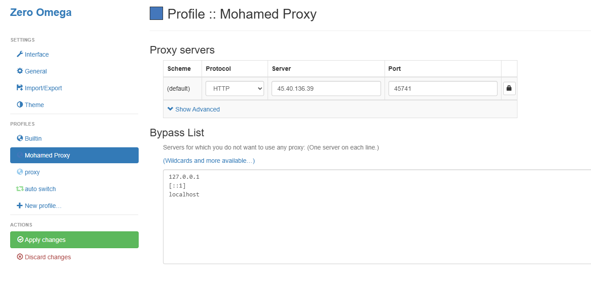
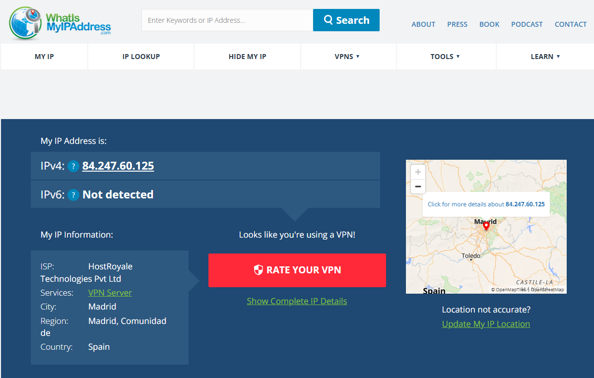

# Anonymization — Proxy Configuration with Zero Omega

A quick walkthrough of configuring a proxy server through the **Zero Omega** browser extension to mask a real IP address, and verifying the change with an IP-lookup service.

> ⚠️ **Disclaimer:** This document is for educational purposes covering anonymization/anti-forensics concepts within a penetration testing methodology. Using proxies to mask identity is legal for personal privacy, but using anonymization specifically to conceal unauthorized or malicious activity is not.

---

## 1. Configuring the Proxy

**Zero Omega** is a browser proxy-switching extension that lets you define profiles with custom proxy servers and bypass rules.



**Configuration used:**

| Field | Value |
|-------|-------|
| Profile Name | Mohamed Proxy |
| Scheme | (default) |
| Protocol | HTTP |
| Server | `45.40.136.39` |
| Port | `45741` |

**Bypass list** (traffic that skips the proxy and goes direct):
```
127.0.0.1
[::1]
localhost
```

Once configured, clicking **Apply changes** activates the profile, routing all matching browser traffic through the specified proxy server instead of the local network's direct connection.

---

## 2. Verifying the IP Change

After applying the proxy, a lookup on **whatismyipaddress.com** confirms the change took effect:



**Result:**

| Field | Value |
|-------|-------|
| IPv4 | `84.247.60.125` |
| ISP | HostRoyale Technologies Pvt Ltd |
| Service | VPN Server |
| City | Madrid |
| Region | Madrid, Comunidad de |
| Country | Spain |

The lookup tool even flags it directly: **"Looks like you're using a VPN!"** — confirming that outbound traffic is now appearing to originate from a datacenter/VPN provider in Madrid, Spain, rather than the original network.

---

## Why This Matters

- **Privacy:** Proxies and VPNs prevent websites and network observers from seeing your real IP and approximate location.
- **Penetration testing context:** Attackers use proxy chains (and more advanced tooling like Tor, or chained SOCKS proxies) during the **Clearing Tracks** phase of the hacking lifecycle, or earlier to make reconnaissance harder to trace back to them.
- **Defensive takeaway:** IP-based blocking/geofencing alone is not a reliable security control, since it can be trivially bypassed with a single proxy hop like this one.

## Repo Structure

Both images live in the **same directory** as this README:

```
.
├── README.md
├── 1786707788565_configure-proxy.png
└── 1786707788565_proxy-ip-changed.png
```
