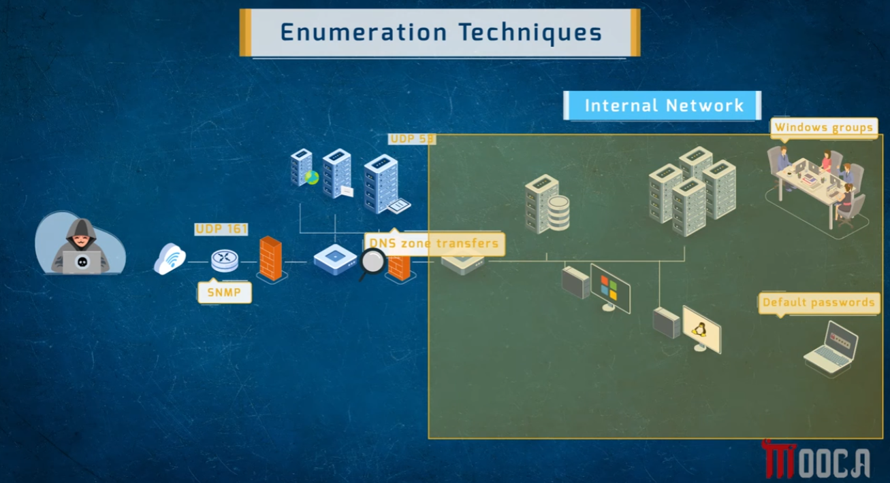
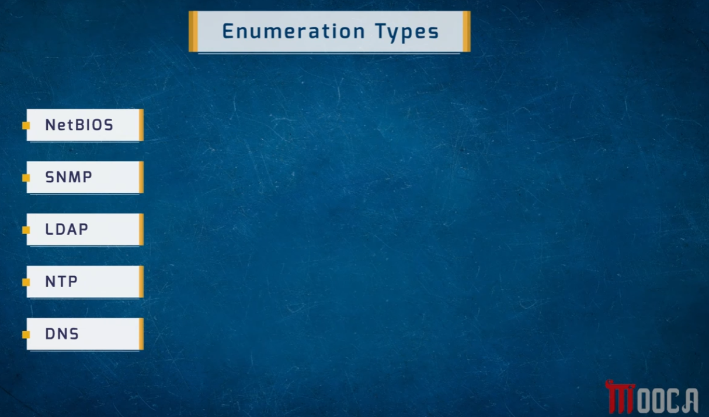
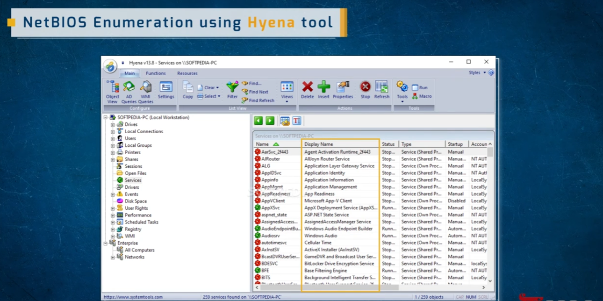
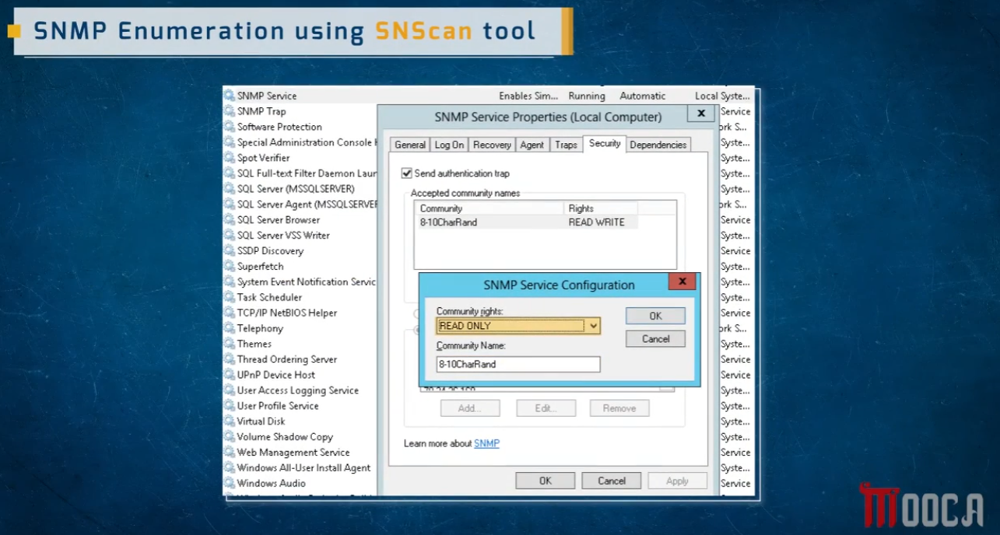

# Enumeration — Techniques & Types

A reference overview of **enumeration**, the phase of the hacking lifecycle where an attacker extracts detailed, actionable information from services already identified during scanning — usernames, shares, groups, configurations, and sometimes credentials.

> ⚠️ **Disclaimer:** This document is for educational purposes. Only perform enumeration against systems you own or have explicit written authorization to test.

---

## 1. Enumeration Techniques



This diagram shows how an attacker moves from the outside in:

- **SNMP (UDP 161)** — probing network devices (routers, firewalls) for management information
- **DNS zone transfers (UDP 53)** — attempting to pull a full copy of a DNS zone, which can reveal the internal server/host layout
- Once inside or adjacent to the **internal network**, further enumeration targets:
  - **Windows groups** — identifying user/group structure for later privilege targeting
  - **Default passwords** — checking devices and services still running factory-default credentials

The pattern: each protocol/service enumerated reveals structural information that narrows down where the next attack (password cracking, exploitation) should focus.

---

## 2. Enumeration Types



| Type | What It Reveals |
|------|------------------|
| **NetBIOS** | Shares, services, sessions, and user/group info on Windows hosts |
| **SNMP** | Device configuration, community strings, and management data on network hardware |
| **LDAP** | Directory service data — usernames, org structure, group memberships (Active Directory) |
| **NTP** | Time-sync service info that can leak connected hosts/peers on a network |
| **DNS** | Zone data, subdomains, mail servers, and internal hostnames (via zone transfers or brute-forcing) |

---

## 3. NetBIOS Enumeration — Hyena Tool



**Hyena** is a GUI tool for Windows network administration and enumeration. Once pointed at a target host, it can browse:

- Drives, shares, and local connections
- Users and local groups
- Running/stopped **services** (259 services enumerated in this example) with startup type and account context
- Sessions, open files, scheduled tasks, the registry, and more — all without needing direct shell access to the target

This kind of tooling is valuable both offensively (mapping out a target's internal Windows environment) and defensively (auditing what's exposed on your own network).

---

## 4. SNMP Enumeration — SNScan Tool



This example shows the **SNMP Service Properties** dialog on a Windows host, where **community strings** act as the "password" for SNMP access:

- A community named `8-10CharRand` is configured with **READ WRITE** rights in the accepted names list — and a second dialog shows it being set with **READ ONLY** rights.
- SNMP's biggest weakness historically: many devices ship with default community strings like `public` (read) and `private` (read-write), which if left unchanged let an attacker read — or even reconfigure — the device.
- **SNScan** (and similar tools like `snmpwalk`, `onesixtyone`) sweep a network range for hosts responding on UDP 161 and attempt common community strings to enumerate device data.

**Mitigation:** change default community strings, prefer SNMPv3 (which supports authentication and encryption) over v1/v2c, and restrict SNMP access to trusted management hosts only.

---

## Summary Table

| Enumeration Type | Port/Protocol | Tool Example | Risk if Misconfigured |
|-------------------|----------------|--------------|------------------------|
| NetBIOS | TCP 139/445 | Hyena | Exposes shares, users, groups, services |
| SNMP | UDP 161 | SNScan | Default community strings allow read/write device access |
| LDAP | TCP/UDP 389 | `ldapsearch`, JXplorer | Leaks directory structure, usernames |
| NTP | UDP 123 | `ntpdc`, `ntpq` | Reveals connected peers/hosts |
| DNS | TCP/UDP 53 | `dig`, `dnsrecon` | Zone transfers leak full internal DNS records |

## How This Fits the Hacking Lifecycle

Enumeration sits inside the **Scanning** phase (see the System Hacking Overview doc) — it's the deep-dive step after discovering open ports/services, and its output directly feeds the **Gaining Access** phase (e.g. a discovered default SNMP community string or enumerated username becomes the input to a password attack).

## Repo Structure

All images live in the **same directory** as this README:

```
.
├── README.md
├── 1786707628746_enumeration-techniques.png
├── 1786707628747_enumeration-types.png
├── 1786707628747_netbios-hyena-tool.png
└── 1786707628747_snmp-snscan-tool.png
```
