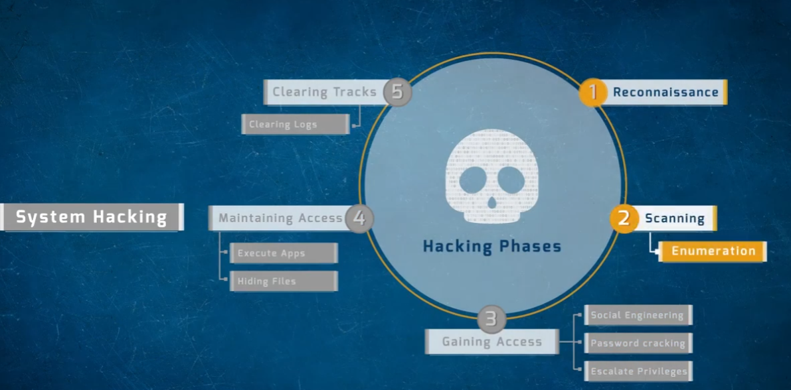

# System Hacking — The Five Hacking Phases

A reference overview of the standard five-phase model used to describe the system hacking lifecycle in ethical hacking / penetration testing methodology.

> ⚠️ **Disclaimer:** This document is for educational purposes as part of understanding attacker methodology to build better defenses. These phases should only be practiced against systems you own or have explicit written authorization to test.

---

## Hacking Phases Overview



---

## 1. Reconnaissance

The information-gathering phase — collecting as much data as possible about the target before any direct interaction (or with minimal footprint). This includes identifying domains, IP ranges, employee names, technologies in use, and other public-facing details (passive recon), as well as direct probing like ping sweeps (active recon).

## 2. Scanning

Actively probing the target to identify live hosts, open ports, and running services — and drilling further into **enumeration**, which extracts more detailed information from discovered services (usernames, shares, banners, etc.). This is the phase covered extensively in the banner-grabbing and nmap work earlier in this series.

## 3. Gaining Access

The phase where the attacker actually breaks into the system, typically through one or more of:

- **Social engineering** — manipulating people into revealing credentials or granting access
- **Password cracking** — brute-force, dictionary, hybrid, or rainbow-table attacks against captured hashes
- **Escalating privileges** — moving from a low-privilege foothold to admin/root level access

## 4. Maintaining Access

Once inside, the attacker works to preserve that access for future use:

- **Execute applications** — running additional payloads, backdoors, or tools on the compromised system
- **Hiding files** — concealing malicious tools or data from detection (e.g. via rootkits, alternate data streams, steganography)

## 5. Clearing Tracks

The final phase — removing evidence of the intrusion to avoid detection and attribution:

- **Clearing logs** — deleting or altering system, application, and security logs that would reveal the attacker's actions

---

## How This Maps to Earlier Labs in This Series

| Phase | Corresponding Lab Work |
|-------|------------------------|
| Reconnaissance | Banner grabbing (netcat, telnet, ID Serve) |
| Scanning | Nmap service/version scans, SMB protocol enumeration |
| Gaining Access | Metasploit exploitation (vsftpd backdoor, UnrealIRCd backdoor), password cracking (John the Ripper, Hashcat) |
| Maintaining Access | *(not yet covered — would include persistence mechanisms, backdoors)* |
| Clearing Tracks | *(not yet covered — would include log manipulation/anti-forensics)* |

## Repo Structure

The image lives in the **same directory** as this README:

```
.
├── README.md
└── 1786707499900_system-hacking-overview.png
```
