# Password Attacks — Concepts Overview

A study reference covering password-based authentication, the major categories of password attacks, and the corresponding countermeasures. Based on course slide material.

> ⚠️ **Disclaimer:** This document is for educational purposes — understanding these attack categories helps with defensive security work (e.g. password policy design, detection, and hardening). Do not use these techniques against systems you don't own or don't have explicit authorization to test.

---

## 1. Identification & Authentication Methods

Authentication generally relies on one or more of three factors:

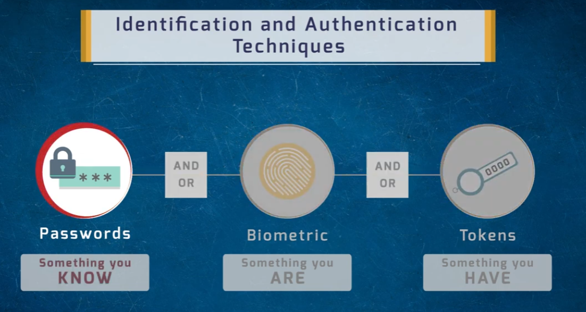

- **Something you know** — passwords
- **Something you are** — biometrics (fingerprint, face, etc.)
- **Something you have** — tokens (hardware keys, OTP devices)

Multi-factor authentication (MFA) combines two or more of these to reduce the risk of a single compromised factor leading to full account takeover.

---

## 2. Password Types

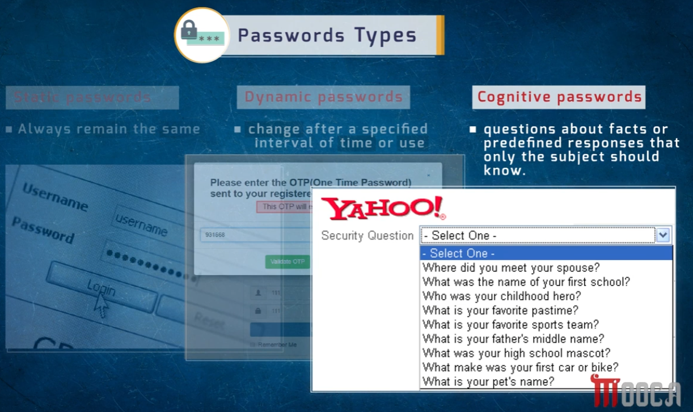

| Type | Description |
|------|-------------|
| **Static passwords** | Always remain the same until manually changed |
| **Dynamic passwords** | Change automatically after a specified time or use (e.g. OTPs) |
| **Cognitive passwords** | Based on facts or predefined responses only the subject should know (e.g. security questions) |

Cognitive passwords (security questions) are often weaker than they appear — answers like "your first school" or "pet's name" are frequently discoverable via social media or public records.

---

## 3. Categories of Password Attacks

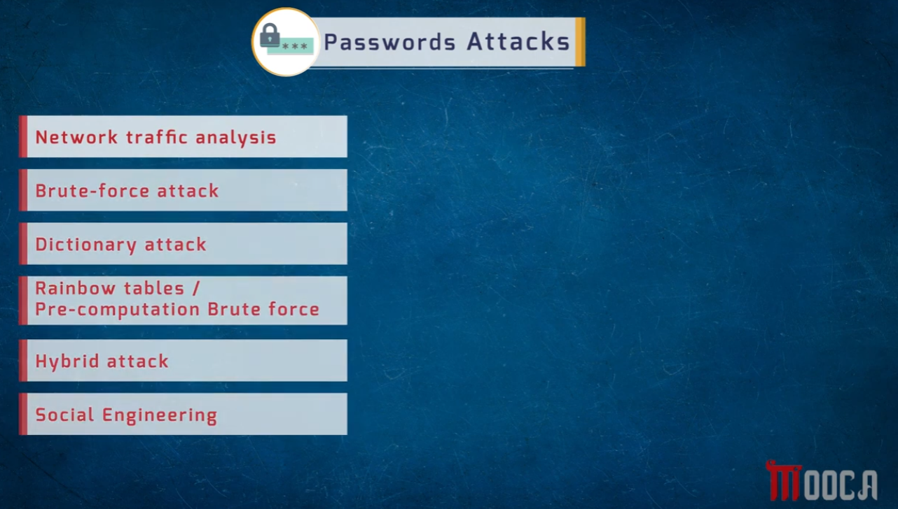

The six major categories covered:

1. Network traffic analysis
2. Brute-force attack
3. Dictionary attack
4. Rainbow tables / pre-computation brute force
5. Hybrid attack
6. Social engineering

---

### 3.1 Network Traffic Analysis Attack

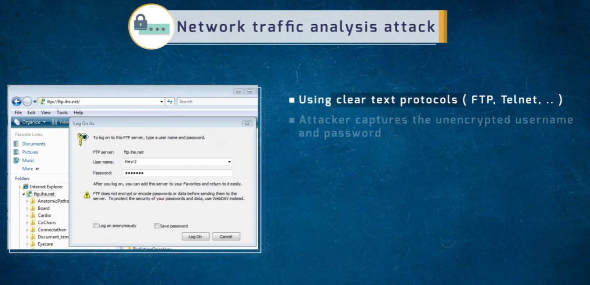

- Exploits **clear-text protocols** (FTP, Telnet, etc.) that transmit credentials unencrypted.
- An attacker sniffing network traffic captures the username and password directly, with no cracking required.
- **Mitigation:** use encrypted protocols (SFTP, SSH, HTTPS) instead of clear-text equivalents.

---

### 3.2 Brute-Force Attack

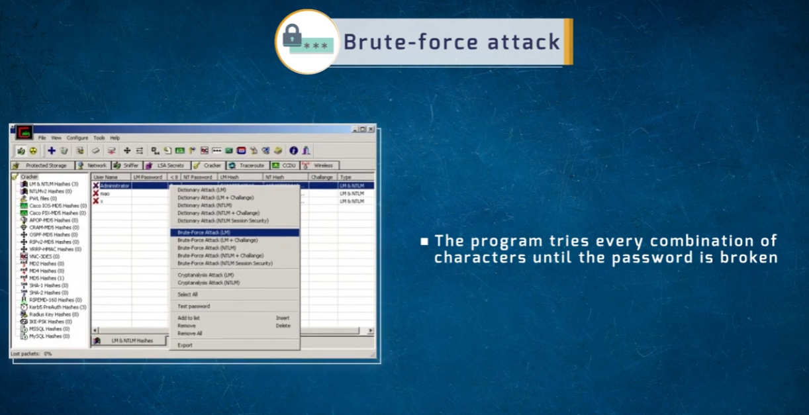

- The tool tries **every possible combination of characters** until the correct password is found.
- Guaranteed to succeed eventually, but time cost grows exponentially with password length and character-set complexity.
- Demonstrated here using **Cain & Abel** against captured LM/NTLM hashes.

---

### 3.3 Dictionary Attack

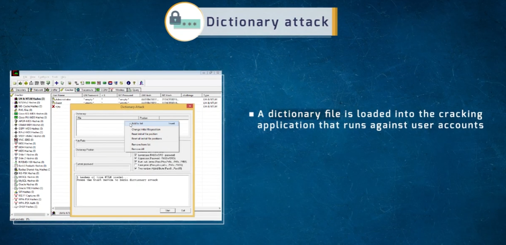

- A **precompiled wordlist** (dictionary file) is loaded into the cracking application and tested against captured hashes/accounts.
- Much faster than brute-force, but only effective if the real password happens to be in the list.
- Often combined with mangling rules (adding numbers, case variations) to expand coverage.

---

### 3.4 Hybrid Attack

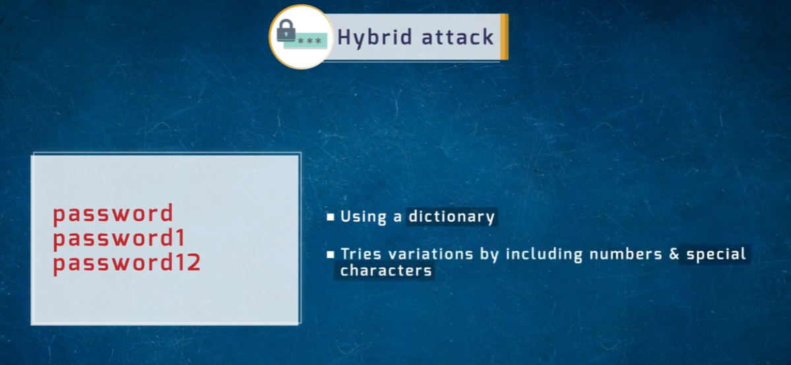

- Starts from a dictionary word and **tries variations** by appending/prepending numbers and special characters.
- Example progression: `password` → `password1` → `password12`
- Bridges the gap between pure dictionary attacks and full brute-force — catches the common human habit of appending digits to a base word.

---

### 3.5 Rainbow Tables / Pre-Computation Brute Force

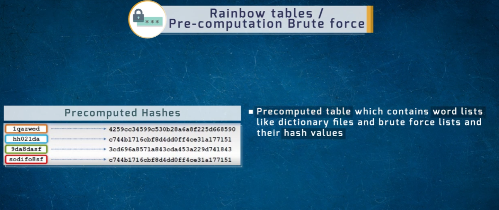

- A **precomputed table** mapping candidate passwords (from dictionaries or brute-force lists) to their hash values.
- Cracking becomes a fast lookup instead of a live computation — trading storage space for massive speed gains.
- Notice in the example that two different plaintexts (`hh021da` and `sodifo8sf`) map to the **same hash** — illustrating a hash collision, which is part of why rainbow tables can occasionally return a false-positive candidate.

---

### 3.6 Social Engineering Attack

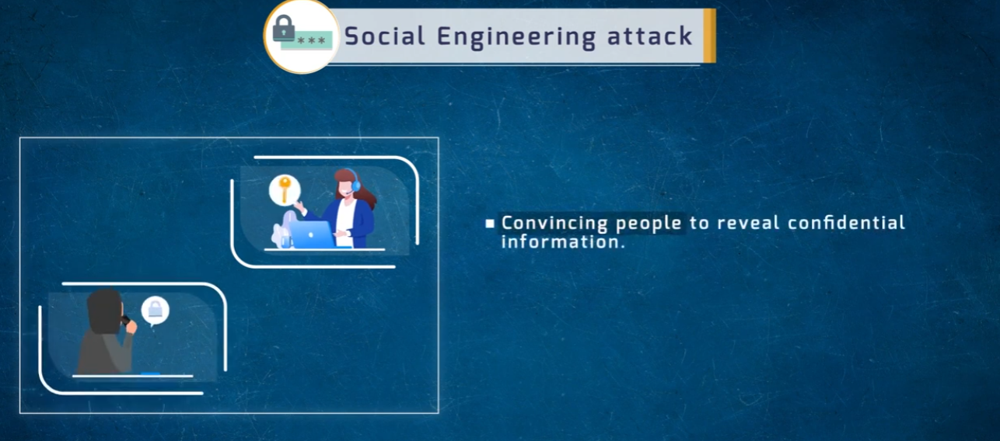

- Instead of technical cracking, the attacker **convinces a person directly** to reveal confidential information (passwords, PINs, etc.).
- Common vectors: phone pretexting, phishing emails, impersonating IT support.
- Often the most effective attack because it bypasses all technical controls entirely.

---

## 4. Password Cracking Tools

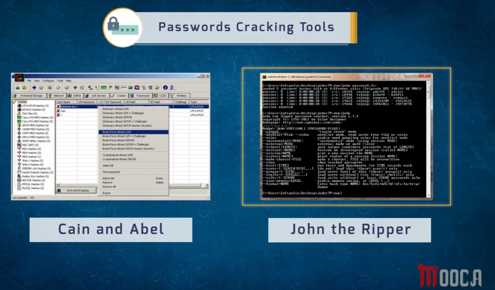

Two of the classic tools referenced across these attack types:

- **Cain & Abel** — GUI-based Windows tool supporting dictionary, brute-force, and cryptanalysis attacks against LM/NTLM hashes.
- **John the Ripper** — command-line cracking tool supporting single-crack mode, wordlist mode, incremental (brute-force) mode, and external mode.

---

## 5. Pre-Computation Attack Countermeasures

### 5.1 NTLM Authentication Process (Windows)

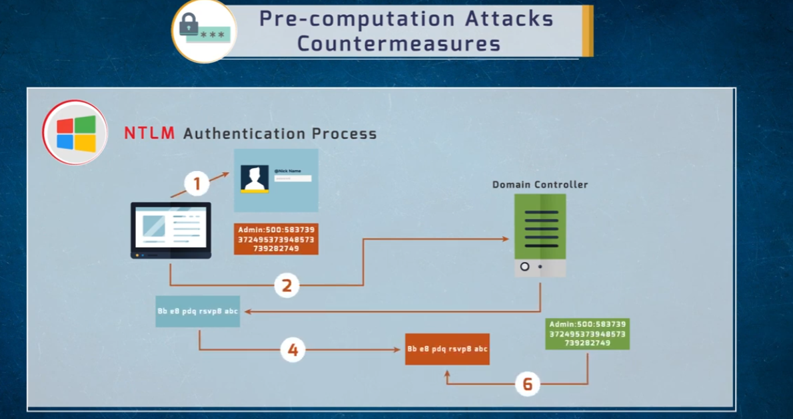

Understanding the NTLM challenge-response flow helps explain why weak or unsalted implementations were historically vulnerable to pre-computed hash attacks (e.g. pass-the-hash, rainbow tables against LM hashes).

### 5.2 Password Hash Salting

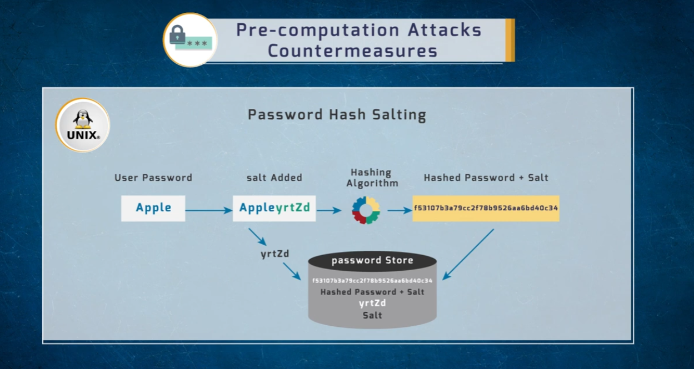

- A random **salt** is appended/prepended to the password *before* hashing.
- Because the salt is unique per user, identical passwords produce **different hash outputs** — defeating precomputed rainbow tables, since an attacker would need a separate table per salt value.
- Example: `Apple` + salt `yrtZd` → hashed to a unique value; the salt is stored alongside the hash so it can be reapplied during verification.

---

## 6. Increasing Password Security — Best Practices

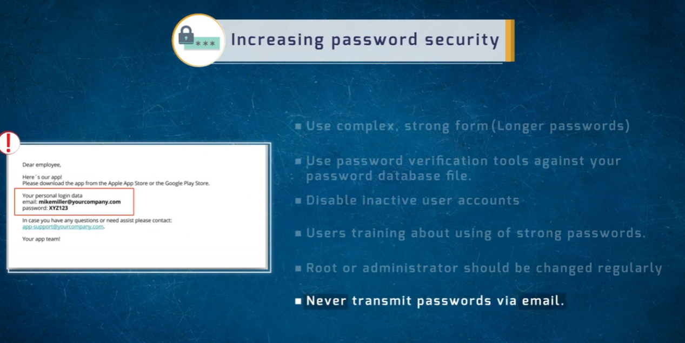

- Use complex, strong-form (longer) passwords.
- Run password verification tools against your own password database to catch weak credentials proactively.
- Disable inactive user accounts.
- Train users on strong password practices.
- Rotate root/administrator credentials regularly.
- **Never transmit passwords via email** — the example shown is a phishing-style email embedding a plaintext password, which should never be sent or requested this way.

---

## Summary Table

| Attack | Mechanism | Speed | Defeated By |
|--------|-----------|-------|-------------|
| Network traffic analysis | Sniffing clear-text credentials | Instant (if unencrypted) | Encrypted protocols (SSH, HTTPS, SFTP) |
| Brute-force | Try every character combination | Slow, but exhaustive | Long, complex passwords; account lockouts |
| Dictionary | Test known/common passwords | Fast | Passwords not in common wordlists |
| Hybrid | Dictionary + variations | Fast–medium | Avoiding predictable word+number patterns |
| Rainbow table | Precomputed hash lookup | Very fast | Salting |
| Social engineering | Human manipulation | Instant (if successful) | User training, verification procedures |

## Repo Structure

All images live in the **same directory** as this README:

```
.
├── README.md
├── 1786707228457_authentication-method.png
├── 1786707228458_brute-force-attack.png
├── 1786707228459_dictionary-attack.png
├── 1786707228459_hybrid-attack.png
├── 1786707228460_increase-password-security.png
├── 1786707228460_metigate-by-NTLM.png
├── 1786707228460_metigate-by-salting.png
├── 1786707228461_network-traffic-analysis.png
├── 1786707228461_password-attacks.png
├── 1786707228462_password-cracking-tools.png
├── 1786707228462_password-types.png
├── 1786707228462_rainbow-table-attack.png
└── 1786707228463_social-engineering-attack.png
```
