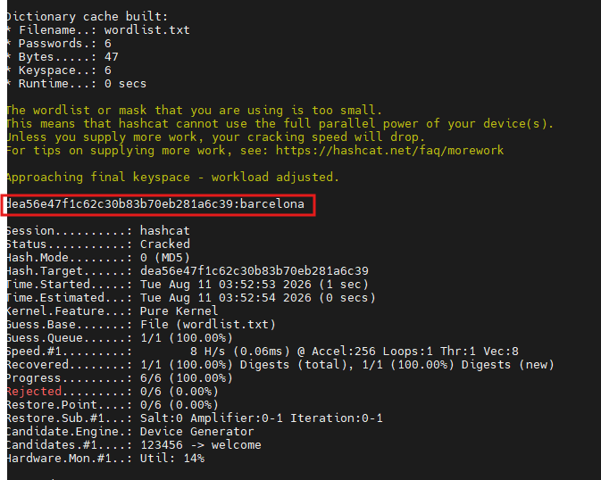

# Password Cracking Lab — John the Ripper & Hashcat

A hands-on comparison of two password-cracking tools — **John the Ripper** and **Hashcat** — against MD5 hashes, using both dictionary and brute-force attack modes.

> ⚠️ **Disclaimer:** These techniques are demonstrated against self-generated test hashes for learning purposes only. Never attempt to crack credentials you don't own or don't have explicit authorization to test.

---

## 1. John the Ripper — Dictionary Attack

**Setup:** an MD5 hash is generated from a known plaintext (`abc123`) and saved to `hash.txt`. A custom wordlist is built manually with `echo`.

```bash
echo -n 'abc123' | md5sum
echo 'e99a18c428cb38d5f260853678922e03' > hash.txt
john --format=raw-md5 --wordlist=wordlist.txt hash.txt
```


**First run:** the wordlist didn't yet contain the correct password — John correctly reported the candidates it had (`123456`, `password`, `admin`, `barcelona`, `qwerty`, `welcome`) with no match. After appending the real password (`abc123`) to the wordlist and re-running:

```bash
echo 'abc123' >> wordlist.txt
john --format=raw-md5 --wordlist=wordlist.txt hash.txt
```

**Result:** `abc123 (?)` cracked in `0:00:00:00`, confirming that a dictionary attack is only as good as the wordlist — if the correct password isn't in the list, John will exhaust every candidate and report nothing found.

---

## 2. Hashcat — Brute-Force (Mask) Attack

Rather than a wordlist, this attack generates every possible 4-character candidate from a mask (`?d?d?d?d` = 4 digits), targeting a hash of the plaintext `7391`.

```bash
echo -n '7391' | md5sum
echo '88cf91a1aef212f3c2cd12406983427d' > hash.txt
hashcat -m 0 -a 3 hash.txt '?d?d?d?d'
```

- `-m 0` → hash mode MD5
- `-a 3` → attack mode 3 (brute-force/mask)
- `?d?d?d?d` → mask for exactly four numeric digits (10,000 total candidates)


**Result — cracked instantly** (well within the 10,000-candidate keyspace):


```
Status...........: Cracked
Hash.Target......: 88cf91a1aef212f3c2cd12406983427d
Guess.Mask........: ?d?d?d?d [4]
Recovered.........: 1/1 (100.00%)
Speed.#1..........: 48729 H/s
88cf91a1aef212f3c2cd12406983427d:7391
```

Brute-force is exhaustive and guaranteed to succeed *if the mask correctly matches the password's structure* — the trade-off is that keyspace grows exponentially with length and character-set complexity, so this only stays fast for short, well-scoped patterns like "4 digits."

---

## 3. Hashcat — Dictionary Attack (rockyou.txt)

This attack switches to mode `-a 0` (dictionary) and targets a hash of the plaintext `barcelona` using the industry-standard `rockyou.txt` wordlist.

```bash
echo -n 'barcelona' | md5sum
echo 'dea56e47f1c62c30b83b70eb281a6c39' > hash.txt
hashcat -m 0 -a 0 hash.txt /usr/share/wordlists/rockyou.txt
```


**Result — cracked:**



```
Status...........: Cracked
Hash.Target......: dea56e47f1c62c30b83b70eb281a6c39
Guess.Base........: File (wordlist.txt)
Recovered.........: 1/1 (100.00%)
dea56e47f1c62c30b83b70eb281a6c39:barcelona
```

Since `barcelona` is a common word, it's present near the top of large real-world leaked-password wordlists like rockyou.txt — making dictionary attacks extremely effective against human-chosen passwords without needing to exhaust a full brute-force keyspace.

---

## Summary Table

| Attack | Tool | Mode | Target Plaintext | Wordlist/Mask | Outcome |
|--------|------|------|-------------------|----------------|---------|
| Dictionary (missed) | John the Ripper | `--wordlist` | `abc123` | Custom 6-word list | ❌ No match — password not in list |
| Dictionary (retry) | John the Ripper | `--wordlist` | `abc123` | Same list + password appended | ✅ Cracked instantly |
| Brute-force / mask | Hashcat | `-a 3` | `7391` | `?d?d?d?d` (4-digit mask) | ✅ Cracked, 10,000-candidate keyspace |
| Dictionary | Hashcat | `-a 0` | `barcelona` | `rockyou.txt` | ✅ Cracked, common word found quickly |

## Key Takeaways

- **Dictionary attacks are only as strong as the wordlist.** John's first run against `abc123` failed for no reason other than the password not being present — the tool itself worked correctly.
- **Brute-force guarantees a crack but doesn't scale.** A 4-digit mask (10,000 combinations) is trivial; adding letters or length grows the keyspace exponentially and can make brute-force impractical.
- **Real-world wordlists like rockyou.txt** (built from actual leaked credentials) are effective specifically because people tend to reuse common, guessable words and patterns — reinforcing why password complexity and uniqueness matter defensively.
- **Unsalted MD5 hashes** (used throughout this lab) crack fast regardless of tool, since there's no per-password randomization — a strong argument for using salted, slow hash algorithms (bcrypt, Argon2, PBKDF2) in real systems.

## Repo Structure

```
.
├── PASSWORD-CRACKING-LAB-README.md
└── cracking-images/
    ├── john-dictionary-attack.png
    ├── hashcat-brute-force-run.png
    ├── hashcat-brute-force-cracked.png
    ├── hashcat-dictionary-attack-run.png
    └── hashcat-dictionary-attack-cracked.png
```
