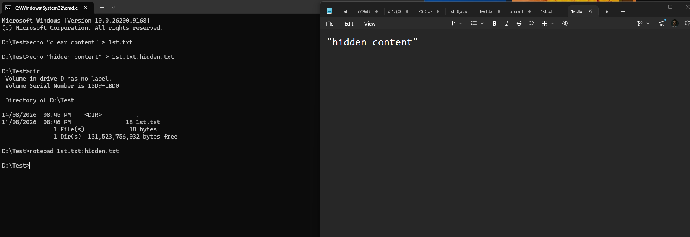
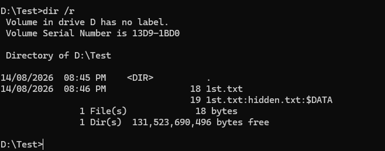
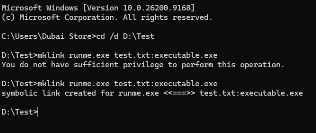

# Maintaining Access — Hiding Files with NTFS Alternate Data Streams

A hands-on look at **Alternate Data Streams (ADS)**, an NTFS feature that lets extra data be attached to a file without changing its visible size or appearing in a normal directory listing — a classic technique for the "Hiding Files" step of the **Maintaining Access** phase in the hacking lifecycle.

> ⚠️ **Disclaimer:** This document is for educational purposes covering anti-forensics/data-hiding concepts within a penetration testing methodology. Only use these techniques on systems you own or have explicit written authorization to test.

---

## 1. Hiding Data in an Alternate Data Stream

NTFS allows a file to have multiple **data streams** — the default (unnamed) stream holds the visible content, but additional named streams can be attached using a `filename:streamname` syntax, and they don't show up in a standard `dir` listing.

```cmd
echo "clear content" > 1st.txt
echo "hidden content" > 1st.txt:hidden.txt
dir
notepad 1st.txt:hidden.txt
```



**What happened:**
- `1st.txt` was created normally with visible content (`"clear content"`).
- A second stream, `1st.txt:hidden.txt`, was attached to the *same file* containing `"hidden content"`.
- Running `dir` afterward shows **only** `1st.txt` at 18 bytes — the hidden stream adds no visible size and doesn't appear as a separate file.
- Opening the hidden stream directly with `notepad 1st.txt:hidden.txt` reveals its actual content (`"hidden content"`), confirming the data exists but stays invisible to normal browsing.

---

## 2. Detecting Alternate Data Streams

Standard `dir` doesn't reveal ADS — but the `/r` switch does, which is exactly why ADS is a favorite anti-forensics/data-hiding trick unless an analyst knows to check for it specifically.

```cmd
dir /r
```



**Result:**
```
14/08/2026  08:46 PM                18 1st.txt
                                     19 1st.txt:hidden.txt:$DATA
```

The `:$DATA` suffix confirms this is a named data stream attached to `1st.txt`. Without the `/r` flag (or a dedicated ADS-scanning tool like Sysinternals' `streams.exe` or PowerShell's `Get-Item -Stream *`), this hidden data would go completely unnoticed during routine file review.

---

## 3. Symbolic Links Pointing to a Hidden Stream

Taking this further, a **symbolic link** can be created that points directly at a hidden ADS — effectively giving a disguised executable a legitimate-looking entry point.

```cmd
cd /d D:\Test
mklink runme.exe test.txt:executable.exe
```



**Note the first attempt failed** with `You do not have sufficient privilege to perform this operation` — creating symbolic links on Windows requires elevated (Administrator) privileges or the `SeCreateSymbolicLinkPrivilege` right. Re-running the same command from an elevated prompt succeeded:

```
symbolic link created for runme.exe <<===>> test.txt:executable.exe
```

**Why this matters offensively:** an attacker could stash an executable payload inside an innocent-looking file's ADS (e.g. `test.txt:executable.exe`), then create a normal-looking shortcut/symlink (`runme.exe`) that actually launches the hidden stream — evading casual inspection since `test.txt` still looks like a harmless text file in any standard listing.

---

## Summary Table

| Step | Command | Purpose |
|------|---------|---------|
| Create visible file | `echo "clear content" > 1st.txt` | Normal, visible file content |
| Attach hidden stream | `echo "hidden content" > 1st.txt:hidden.txt` | Data hidden inside the same file, invisible to `dir` |
| View hidden stream | `notepad 1st.txt:hidden.txt` | Directly open and confirm hidden content |
| Detect hidden streams | `dir /r` | Reveals ADS entries with `:$DATA` suffix |
| Link to a hidden stream | `mklink runme.exe test.txt:executable.exe` | Creates a disguised entry point to hidden/executable content (requires admin privilege) |

## Defensive Notes

- **Standard `dir` and Explorer views will never show ADS content** — defenders need tools that explicitly check for streams (`dir /r`, `Get-Item -Stream *` in PowerShell, or dedicated tools like Sysinternals `streams.exe`) as part of routine forensic review.
- **Files downloaded from the internet** often legitimately carry a `Zone.Identifier` ADS (marking them as downloaded) — so ADS itself isn't inherently malicious, but any *unexpected* or executable-named stream on a file warrants investigation.
- **Symbolic link creation requires elevated privileges by default** on Windows, which raises the bar for this specific technique — but should still be monitored, since privilege escalation earlier in an attack chain (see the "Gaining Access" phase) can remove that barrier.
- **Antivirus/EDR tooling with ADS-awareness** is essential, since many legacy or misconfigured security tools historically failed to scan alternate data streams at all.

## How This Fits the Hacking Lifecycle

This falls squarely under the **Maintaining Access** phase (see the System Hacking Overview doc) — specifically the "Hiding Files" sub-step, used after initial access has already been gained to conceal payloads or persistence mechanisms from casual discovery.

## Repo Structure

All images live in the **same directory** as this README:

```
.
├── README.md
├── 1786779514072_create-symbolic-link.png
├── 1786779514072_display-alternate-data-stream.png
└── 1786779514072_hide-file.png
```
