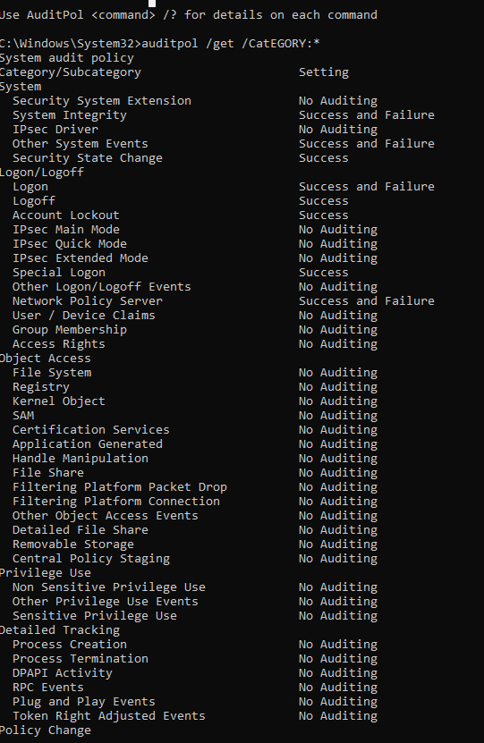
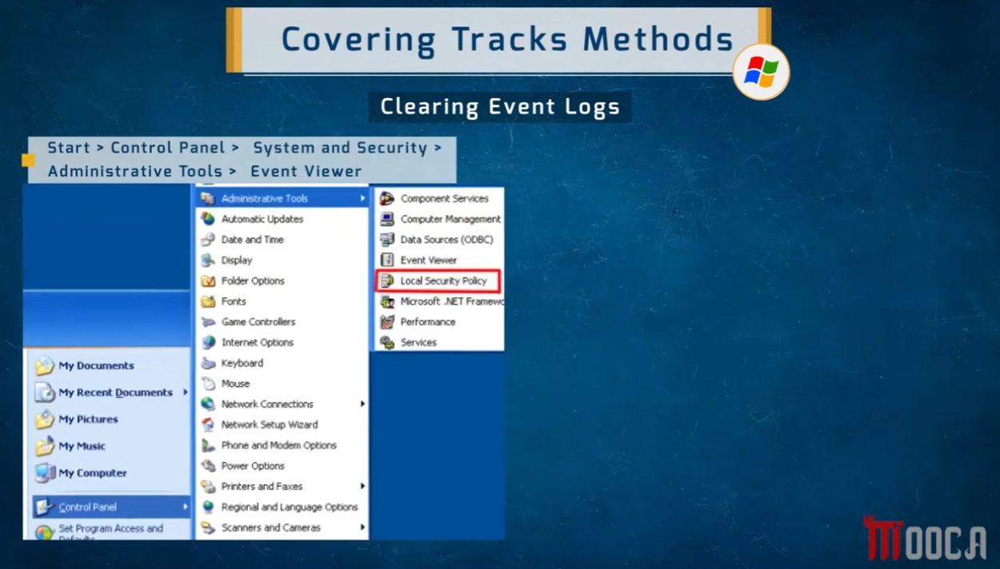
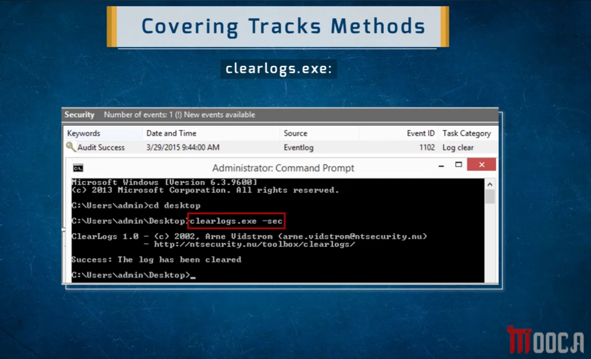
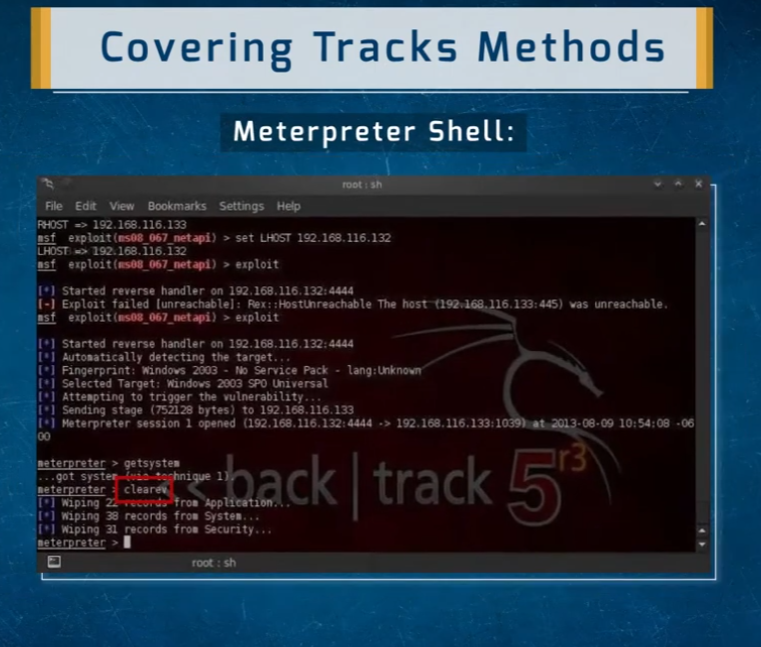
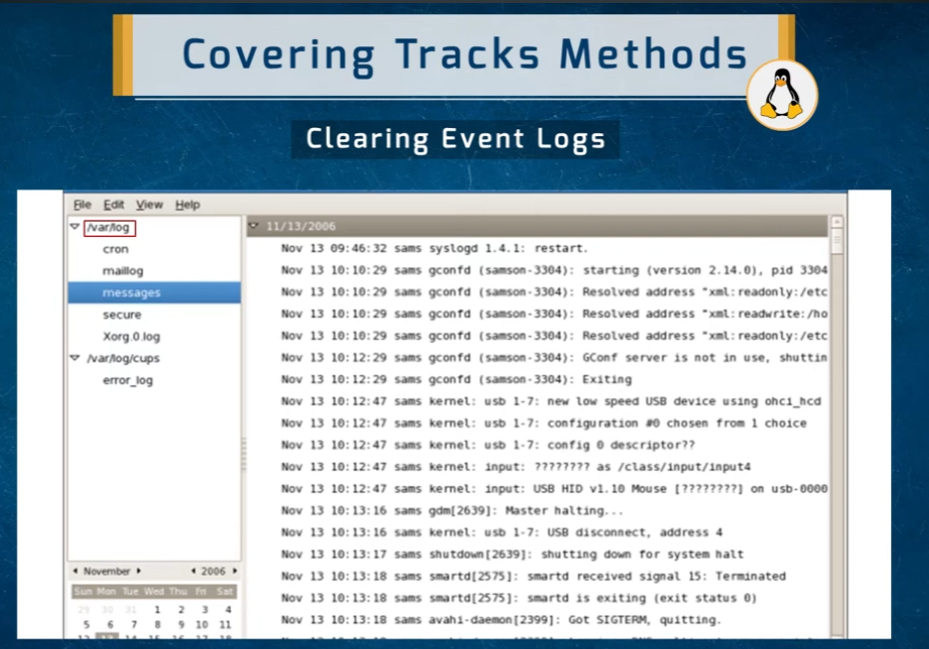
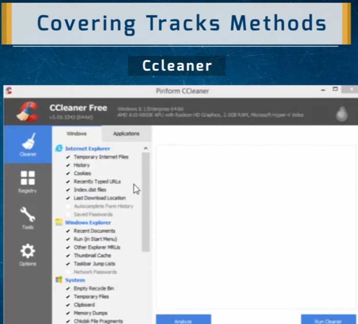
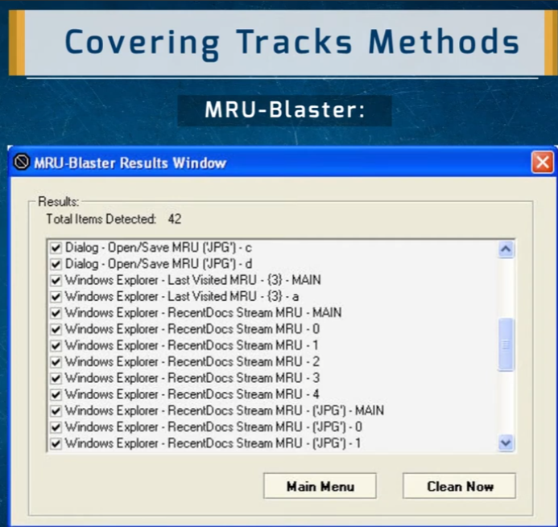

# Covering Tracks — Methods & Tools

A reference overview of the **Clearing Tracks** phase of the hacking lifecycle — the techniques and tools used to remove evidence of an intrusion from Windows and Linux systems after access has been gained.

> ⚠️ **Disclaimer:** This document is for educational purposes covering anti-forensics concepts within a penetration testing methodology. These techniques should only be practiced on systems you own or have explicit written authorization to test.

---

## 1. Auditpol — Disabling Windows Audit Policy

`auditpol.exe` is a built-in Windows command-line utility for viewing and modifying the system's audit policy — which controls what events get logged in the Windows Security Event Log.

**Viewing all available subcommands:**

```cmd
auditpol /?
```


Key subcommands from an attacker's perspective:

| Subcommand | Purpose |
|------------|---------|
| `/get` | Display the current audit policy |
| `/set` | Modify the audit policy |
| `/clear` | Clear the audit policy entirely |
| `/backup` | Save the current policy (useful to restore after an engagement) |

**Checking what's currently being audited:**

```cmd
auditpol /get /CatEGORY:*
```



This reveals what categories are being logged — in this example, most Object Access, Privilege Use, and Detailed Tracking categories are set to `No Auditing`, meaning those events generate no log entries at all. An attacker can use `/set` to turn off any remaining active categories before performing actions they don't want logged.

**Disabling all auditing (attacker's goal):**

```cmd
auditpol /set /category:* /success:disable /failure:disable
```

---

## 2. Clearing Windows Event Logs via Event Viewer

The Event Viewer GUI path to clear logs manually:

`Start > Control Panel > System and Security > Administrative Tools > Event Viewer`



Once in Event Viewer, right-clicking any log (Application, Security, System) and selecting **Clear Log** empties it. This is the most visible approach — clearing a log itself generates Event ID 1102 (Security log cleared), which is a detectable artifact if any SIEM/SYSLOG forwarding is in place.

---

## 3. clearlogs.exe — Command-Line Log Clearing

`clearlogs.exe` is a standalone tool for quickly clearing Windows event logs from the command line without opening a GUI:

```cmd
clearlogs.exe -sec
```



- The `-sec` flag targets the **Security** log specifically.
- **Result:** `The log has been cleared` — confirmed in the Security log pane above it with Event ID `1102` (`Log clear`) — an unavoidable artifact that this action generates in the Security log itself (if any of the log's entries are forwarded externally before clearing, the attacker's activity is still preserved).

---

## 4. Meterpreter — Clearing Logs from a Shell Session

From an active Meterpreter session, Windows event logs can be wiped with a single built-in command — no separate tool needed:

```
meterpreter > clearev
```



**Result:**
```
Wiping 22 records from Application...
Wiping 38 records from System...
Wiping 31 records from Security...
```

This is the most efficient approach during an active Metasploit post-exploitation session. Note also the `getsystem` call shown just before `clearev` — confirming privilege escalation to SYSTEM level occurred first (elevated privileges are required to clear Security logs).

---

## 5. Linux — Clearing Event Logs

On Linux systems, logs live in `/var/log/` and are plain text files — they can be inspected with any log viewer tool, or selectively wiped/truncated by an attacker with root access.



Key log files an attacker would target:

| File | Contents |
|------|----------|
| `/var/log/messages` | General system messages (syslog) |
| `/var/log/secure` | Authentication and privilege events |
| `/var/log/cron` | Cron job execution |
| `/var/log/maillog` | Mail server activity |
| `/var/log/cups/error_log` | Print service errors |

**Common clearing commands on Linux:**

```bash
# Completely clear a log file without deleting it (preserves the file's inode)
> /var/log/auth.log

# Or using truncate
truncate -s 0 /var/log/syslog

# Clear bash history for the current session
history -c
unset HISTFILE

# Or overwrite the history file
cat /dev/null > ~/.bash_history
```

---

## 6. CCleaner — Wiping MRU & Browser Artifacts

**CCleaner** is a widely-used system cleaning tool that can remove a large set of forensic artifacts from a Windows machine in one pass:



What CCleaner targets (relevant to covering tracks):

**Internet Explorer / Browser:**
- Temporary internet files, history, cookies
- Recently typed URLs
- Index.dat files, last download location

**Windows Explorer:**
- Recent Documents list
- Run (Start Menu) history
- Other Explorer MRUs (Most Recently Used lists)
- Thumbnail cache, Taskbar Jump Lists

**System:**
- Empty Recycle Bin
- Temporary files
- Clipboard contents
- Memory dumps
- Chkdsk file fragments

---

## 7. MRU-Blaster — Targeted MRU List Removal

**MRU-Blaster** is a more specialized tool focused specifically on **Most Recently Used (MRU) lists** — the registry keys and file system entries Windows uses to track recently opened files, dialogs, and locations.



**42 MRU entries detected** in this example, including:
- Dialog Open/Save MRU entries (JPG files)
- Windows Explorer Last Visited MRU
- RecentDocs Stream MRU (multiple entries per file type)

Clearing these removes forensic trails of what files were recently accessed — without needing to delete the files themselves.

---

## Summary Table

| Method | Target OS | Tool/Command | What It Removes |
|--------|-----------|-------------|-----------------|
| Disable auditing | Windows | `auditpol /set /category:* ...` | Prevents new events from being logged |
| Clear Event Viewer logs | Windows | GUI / right-click | Application, Security, System logs |
| clearlogs.exe | Windows | `clearlogs.exe -sec` | Security event log (generates Event ID 1102) |
| Meterpreter clearev | Windows | `clearev` | All three Windows event logs from an active session |
| Clear /var/log files | Linux | `> /var/log/auth.log`, `history -c` | Syslog, auth, cron, bash history |
| CCleaner | Windows | GUI | Browser history, MRUs, temp files, recycle bin |
| MRU-Blaster | Windows | GUI | Registry-based MRU lists across all applications |

## Defensive Notes

- **Log clearing itself is logged** — Event ID 1102 (Security log cleared) and 104 (System log cleared) are generated when logs are wiped. Centralized SYSLOG/SIEM forwarding is the primary defense: once log entries leave the system, local clearing can't touch them.
- **Auditpol changes are also auditable** — if audit policy changes are being forwarded, disabling auditing generates its own event before it takes effect.
- **MRU/artifact clearing is harder to detect** in real-time since it leaves no obvious event — timeline analysis and memory forensics are the primary countermeasures.
- **`clearev` in Meterpreter requires SYSTEM-level privileges** — if privilege escalation is detected and blocked, this step can't be completed.

## Repo Structure

All images live in the **same directory** as this README:

```
.
├── README.md
├── 1786779623560_auditpol.png
├── 1786779623560_auditpol-get.png
├── 1786779623561_ccleaner-mru.png
├── 1786779623561_clear-logs.png
├── 1786779623561_event-viewer.png
├── 1786779623562_Linux-logs.png
├── 1786779623562_meterpreter-clear-logs.png
└── 1786779623562_mru-blaster.png
```
