# Malware — Types, Distribution Techniques & Infection Vectors

A reference overview of **malware** — what it is, the major categories, and the techniques attackers use to deliver it to victim systems.

> ⚠️ **Disclaimer:** This document is for educational purposes as part of an ethical hacking / cybersecurity study series. Understanding malware distribution is foundational to building effective defenses.

---

## 1. What is Malware?

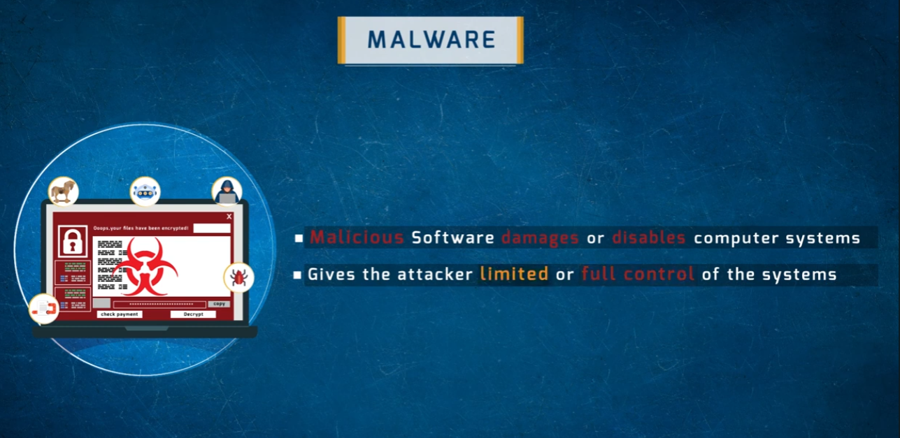

**Malware** (Malicious Software) is any program or code designed to:
- **Damage or disable** computer systems (data destruction, ransomware encryption, service disruption)
- Give the attacker **limited or full control** of the target system (remote access trojans, botnets, keyloggers)

Malware is the primary tool used in the **Gaining Access** and **Maintaining Access** phases of the hacking lifecycle — delivered first, then used to establish and preserve control.

---

## 2. Examples of Malware

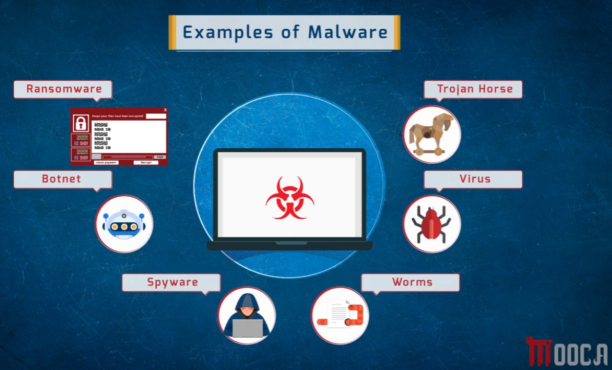

| Type | Description |
|------|-------------|
| **Ransomware** | Encrypts victim's files and demands payment for the decryption key |
| **Trojan Horse** | Disguises itself as legitimate software to trick users into installing it |
| **Virus** | Attaches to legitimate programs; spreads when infected programs are run |
| **Worms** | Self-replicating — spreads across networks without user interaction |
| **Spyware** | Silently monitors user activity, keystrokes, and credentials |
| **Botnet** | A network of compromised machines under attacker control (used for DDoS, spam, credential stuffing) |

---

## 3. Malware Distributing Techniques — Overview

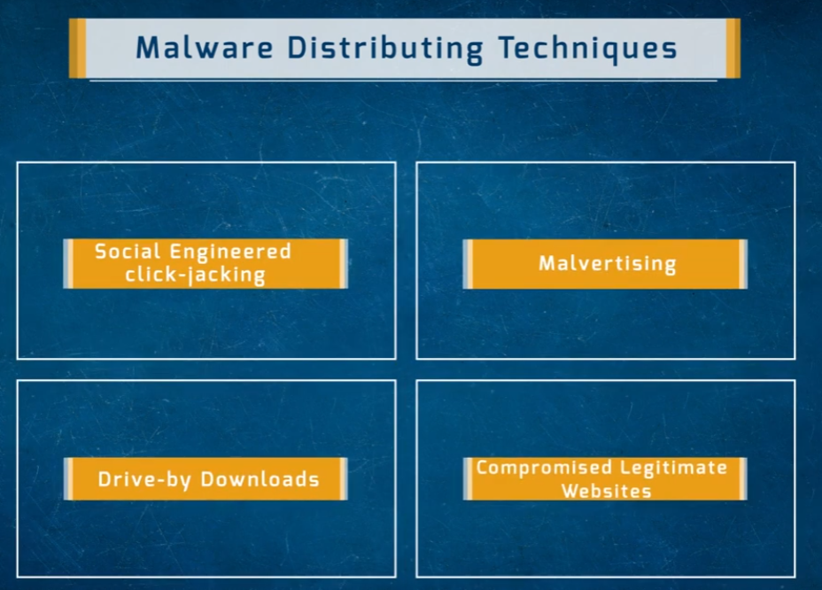

The four primary distribution/delivery categories:

1. **Social Engineered Click-jacking**
2. **Malvertising**
3. **Drive-by Downloads**
4. **Compromised Legitimate Websites**

---

### 3.1 Social Engineered Click-jacking

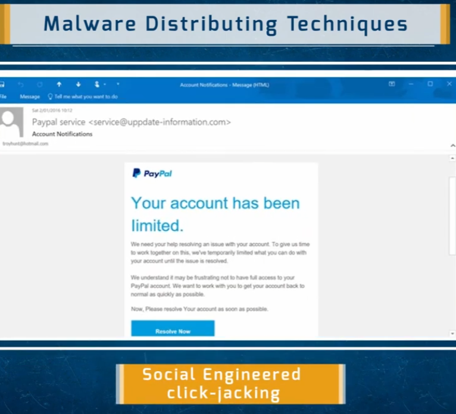

Tricking a user into clicking something they believe is legitimate. The example shows a phishing email impersonating PayPal ("Your account has been limited. Resolve Now.") sent from `service@uppdate-information.com` — a spoofed-looking domain designed to appear official. Clicking "Resolve Now" would either steal credentials or deliver a payload.

**Key indicator:** the sender domain doesn't match the claimed service (`uppdate-information.com` ≠ `paypal.com`).

---

### 3.2 Malvertising

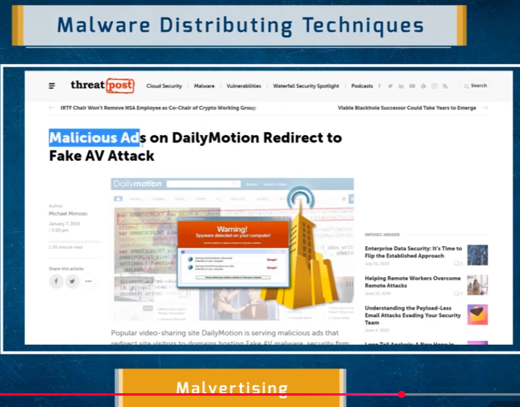

**Malvertising** = malicious advertising — injecting malicious code into legitimate ad networks so it gets served on real, trusted websites without the site owner's knowledge. The example shows a 2014 case where DailyMotion served ads that redirected visitors to a Fake Antivirus (scareware) attack.

The dangerous aspect: **users don't need to click anything on a compromised ad** if the ad network's scripts execute automatically on page load.

---

### 3.3 Drive-by Downloads

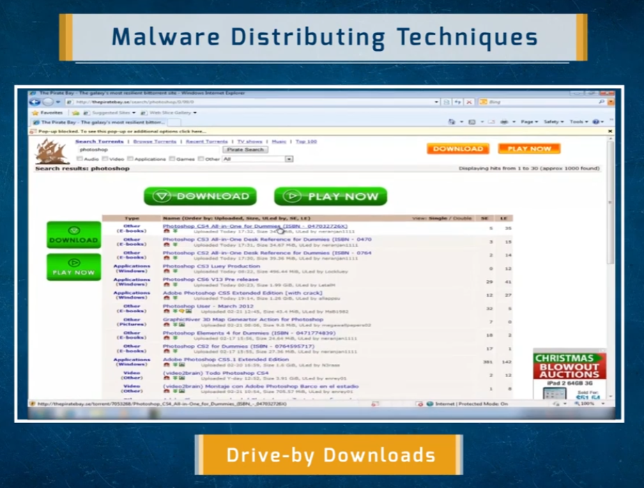

Files downloaded from untrusted sources (torrent/piracy sites, unofficial mirrors) are frequently trojanized — legitimate-looking software bundles with malware inside. The example shows a popular torrent site offering "Photoshop CS4" — the download could be the real application, or bundled with a keylogger/backdoor, or entirely fake.

**Drive-by downloads** also include completely passive attacks where simply visiting a page with a malicious exploit kit causes a download to execute without any user click.

---

### 3.4 Compromised Legitimate Websites

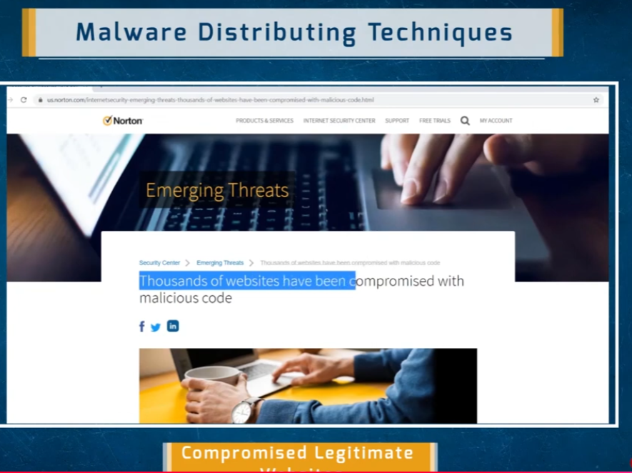

Attackers inject malicious scripts into legitimate, trusted websites (via SQL injection, CMS vulnerabilities, stolen FTP credentials, etc.). Visitors to those sites then unknowingly receive the malicious code alongside the real content — making this particularly dangerous because standard user warnings ("only visit trusted sites") offer no protection.

---

## 4. Ways Malware Gets Into a System

Beyond the distribution techniques above, several additional infection vectors are covered:

---

### 4.1 Browser & Email Software Bugs

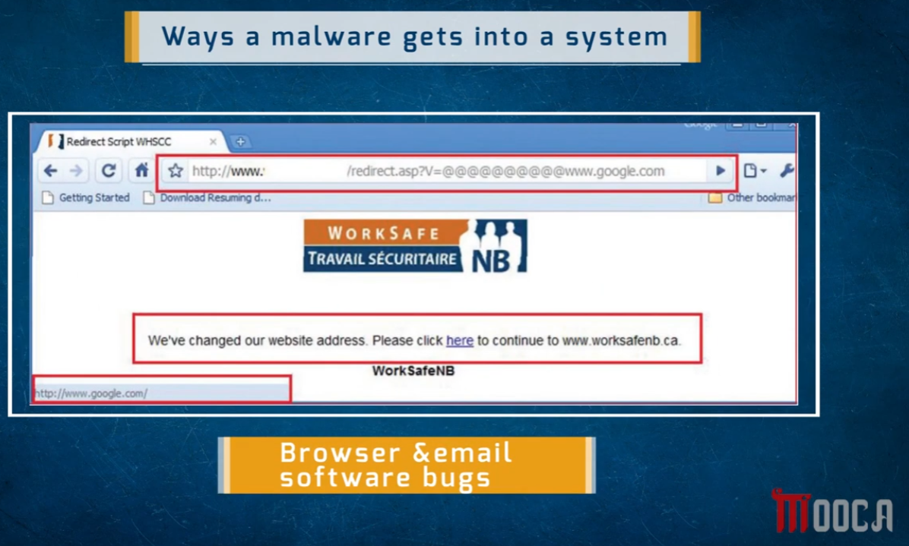

Unpatched vulnerabilities in browsers, email clients, and their plugins (PDF readers, media players, scripting engines) allow malware to execute just by visiting a page or opening an email. The example shows a redirect script in the browser URL bar — a bug that redirects through a script to an unintended destination, potentially delivering a payload.

---

### 4.2 Fake Programs

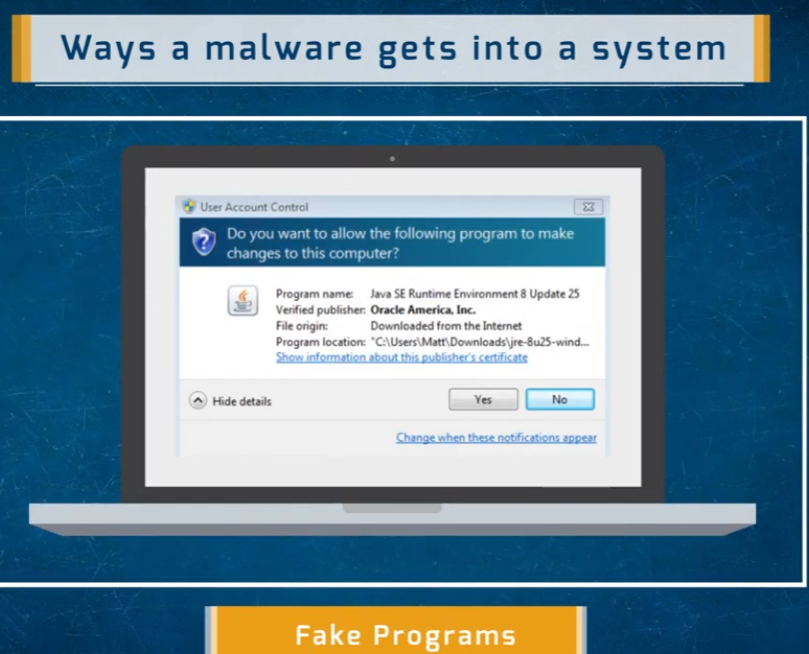

Malware disguised as legitimate software installations. The example shows a User Account Control (UAC) dialog for "Java SE Runtime Environment 8 Update 25, Verified publisher: Oracle America, Inc." — a convincing fake prompt. Users seeing a trusted-looking installer with a plausible publisher name frequently click "Yes," granting the malware administrator-level execution.

---

### 4.3 Instant Messages & SMS

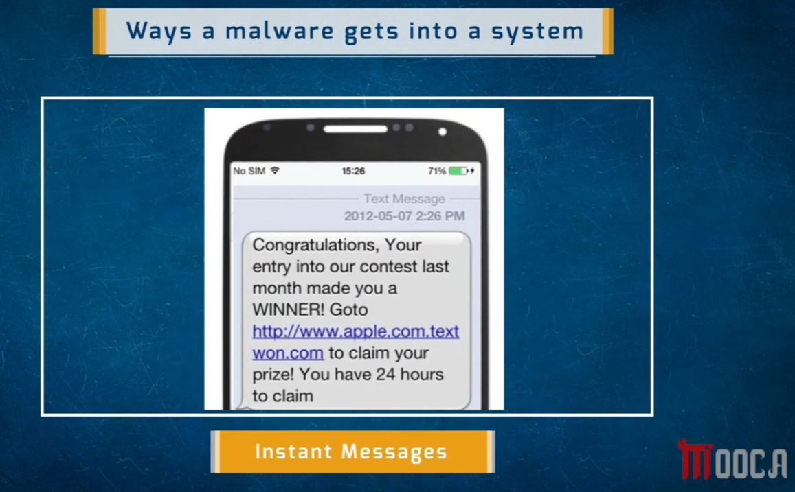

Malware links delivered via SMS, WhatsApp, iMessage, or other messaging platforms. The example shows a classic smishing (SMS phishing) message: "Congratulations, your entry... made you a WINNER! Goto http://www.apple.com.textwon.com" — a domain crafted to look like it belongs to Apple but is actually `textwon.com`. The urgency ("24 hours to claim") is a social engineering pressure tactic.

---

### 4.4 Removable Devices

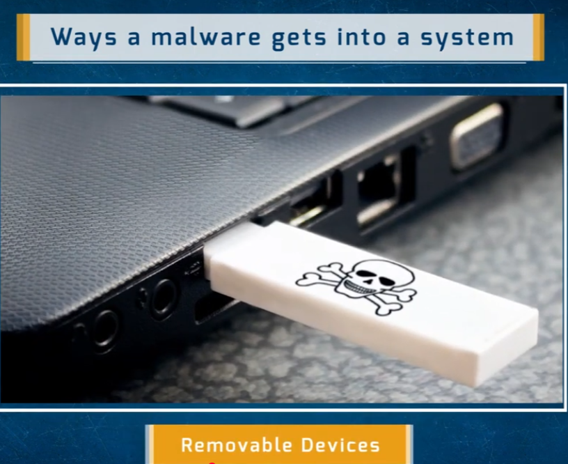

USB drives and other removable media can carry malware that auto-executes when plugged in (via AutoRun/AutoPlay features) or when a user opens what appears to be a legitimate file on the drive. This vector is famously used in air-gapped environment attacks (e.g. the Stuxnet worm spreading via USB into isolated industrial networks).

---

## Summary Table

| Technique / Vector | Requires User Action? | Trust Exploited |
|--------------------|-----------------------|-----------------|
| Social engineered click-jacking | Yes (click) | Brand impersonation |
| Malvertising | Sometimes (can be passive) | Trusted ad networks / websites |
| Drive-by downloads | Sometimes (passive exploit kits) | Trusted-looking download sources |
| Compromised legitimate websites | No (passive) | Real, trusted website domain |
| Browser/email software bugs | No (passive on visit/open) | Software vendor trust |
| Fake programs | Yes (approve installer) | Fake publisher/brand name |
| Instant messages / SMS | Yes (click link) | Urgency + brand spoofing |
| Removable devices | Sometimes (auto-execute) | Physical access / found drive |

## Defensive Countermeasures

- Keep browsers, email clients, and plugins **fully patched** — most drive-by and browser-bug attacks target known, patchable vulnerabilities.
- Use **ad blocking** and script-blocking browser extensions to reduce malvertising exposure.
- **Disable AutoRun/AutoPlay** for removable media on all endpoints.
- Always verify **sender domains** in emails before clicking links or attachments — display name ≠ actual sending address.
- Never install software from **unofficial sources** (torrent sites, random download mirrors).
- Check **UAC publisher details** carefully; if the publisher is "Unknown" or unexpected, deny the request.

## Repo Structure

All images live in the **same directory** as this README:

```
.
├── README.md
├── 1786779899790_browser-email-spftware-bugs.png
├── 1786779899791_compormised-legitmitae-websites.png
├── 1786779899791_drive-by-download.png
├── 1786779899791_fake-program.png
├── 1786779899792_instant-messages-way.png
├── 1786779899792_malvertising.png
├── 1786779899792_malware.png
├── 1786779899793_malware-distributing-techniques.png
├── 1786779899793_malware-examples.png
├── 1786779899793_removable-device.png
└── 1786779899794_social-engineer-click-jacking.png
```
