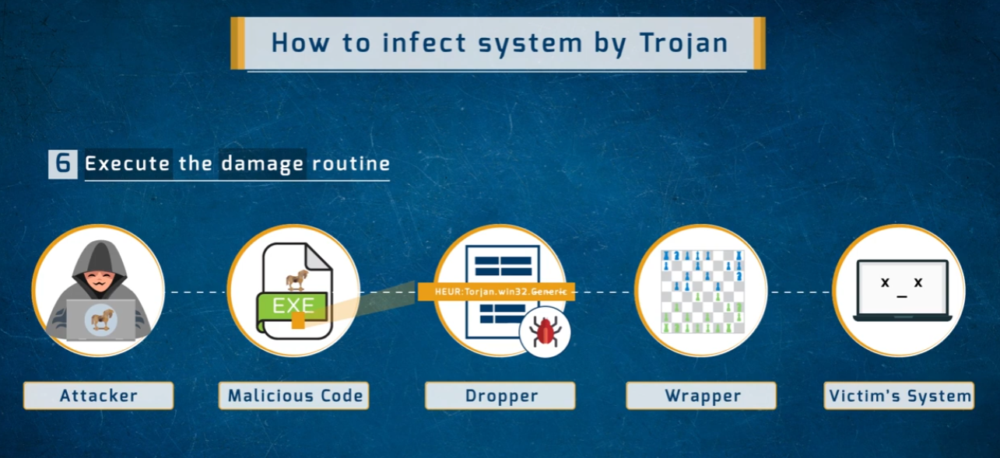
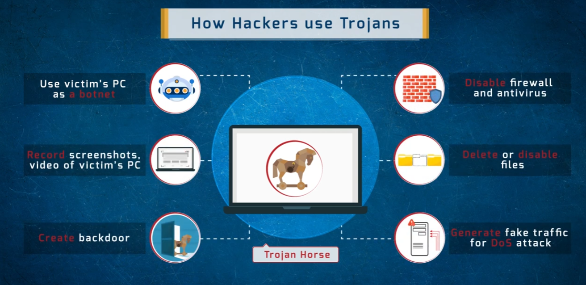
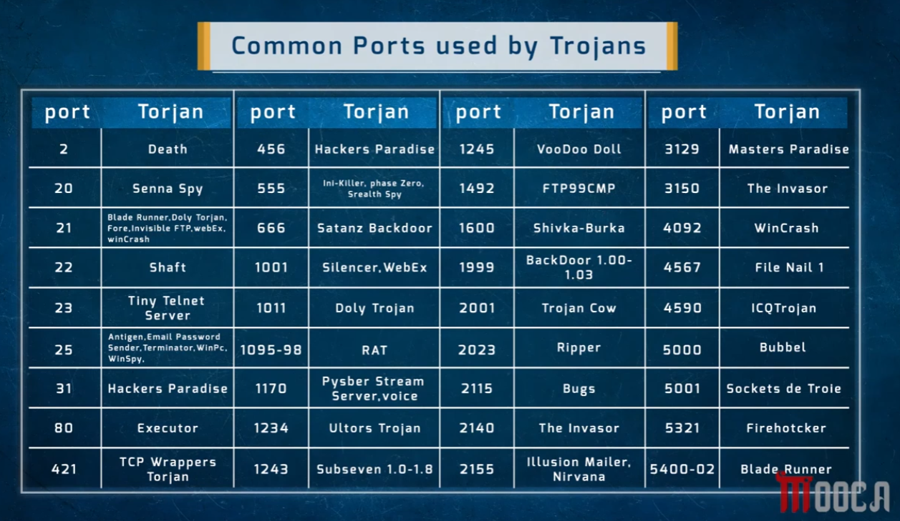

# Trojan Horse — Mechanics, Usage & Common Ports

A deep-dive reference on **Trojan Horse** malware — how it infects a system, what attackers use it for, and which ports are commonly associated with known Trojans.

> ⚠️ **Disclaimer:** This document is for educational purposes within an ethical hacking / cybersecurity study series. Knowledge of Trojan mechanics is essential for defensive security work (detection, incident response, network monitoring).

---

## 1. How a Trojan Infects a System



The infection chain follows six steps, with the diagram showing the final and most critical — **Step 6: Execute the damage routine**:

| Step | Component | Role |
|------|-----------|------|
| 1 | **Attacker** | Creates or obtains the malicious payload |
| 2 | **Malicious Code** | The actual harmful executable (`.exe`) carrying the Trojan logic |
| 3 | **Dropper** | Delivers and installs the malicious code on the target — often the initial infection vehicle (e.g. a malicious installer, email attachment). The dropper itself may be flagged by AV (`HEUR:Trojan.win32.Generic`) but is engineered to drop and execute the payload before being detected |
| 4 | **Wrapper** | Binds the malicious code inside a legitimate-looking host program (a game, PDF viewer, utility, etc.) — the victim sees and runs the wrapper thinking it's benign |
| 5 | **Victim's System** | Where the damage routine executes after the user runs the wrapped/dropped program |
| 6 | **Execute the damage routine** | The final step — the Trojan's payload runs, establishing the attacker's intended foothold or performing its destructive/surveillance function |

---

## 2. How Hackers Use Trojans



Once a Trojan is active on a victim's system, it gives the attacker a range of capabilities:

| Capability | Description |
|-----------|-------------|
| **Use victim's PC as a botnet** | Enlist the compromised machine into a botnet for DDoS attacks, spam campaigns, or cryptocurrency mining |
| **Disable firewall and antivirus** | Kill defensive software to prevent detection and removal, and to open the system to further exploitation |
| **Record screenshots / video** | Capture screen activity, webcam feeds, or keystrokes for espionage or credential theft |
| **Delete or disable files** | Sabotage the system, destroy data, or disable recovery tools |
| **Create a backdoor** | Install a persistent remote access mechanism so the attacker can return to the system even after a reboot or password change |
| **Generate fake traffic for DoS attack** | Use the victim's bandwidth and network connection as part of a Distributed Denial of Service campaign against other targets |

---

## 3. Common Ports Used by Trojans



Knowing which ports are associated with known Trojans is valuable for both network monitoring and firewall rule-writing. Unexpected traffic on these ports during a network scan or packet capture is a strong indicator of compromise.

| Port | Trojan(s) |
|------|-----------|
| 2 | Death |
| 20 | Senna Spy |
| 21 | Blade Runner, Doly Trojan, Fore, Invisible FTP, webEx, winCrash |
| 22 | Shaft |
| 23 | Tiny Telnet Server |
| 25 | Antigen, Email Password Sender, Terminator, WinPc, WinSpy |
| 31 | Hackers Paradise |
| 80 | Executor |
| 421 | TCP Wrappers Trojan |
| 456 | Hackers Paradise |
| 555 | Ini-Killer, Phase Zero, Stealth Spy |
| 666 | Satanz Backdoor |
| 1001 | Silencer, WebEx |
| 1011 | Doly Trojan |
| 1095–98 | RAT |
| 1170 | Pysber Stream Server, Voice |
| 1234 | Ultors Trojan |
| 1243 | Subseven 1.0–1.8 |
| 1245 | VooDoo Doll |
| 1492 | FTP99CMP |
| 1600 | Shivka-Burka |
| 1999 | BackDoor 1.00–1.03 |
| 2001 | Trojan Cow |
| 2023 | Ripper |
| 2115 | Bugs |
| 2140 | The Invasor |
| 2155 | Illusion Mailer, Nirvana |
| 3129 | Masters Paradise |
| 3150 | The Invasor |
| 4092 | WinCrash |
| 4567 | File Nail 1 |
| 4590 | ICQTrojan |
| 5000 | Bubbel |
| 5001 | Sockets de Trole |
| 5321 | Firehotcker |
| 5400–02 | Blade Runner |

> **Note:** Some of these Trojans overlap with legitimate well-known ports (e.g. port 21 = FTP, port 22 = SSH, port 23 = Telnet, port 25 = SMTP, port 80 = HTTP). This is intentional — Trojans often masquerade as legitimate services on standard ports to blend into normal traffic and evade firewall rules that only block unknown/high-numbered ports.

---

## Summary

Trojans are one of the most versatile malware types precisely because they combine deception (wrapper/dropper hiding the payload) with post-infection control (backdoors, firewall disabling, botnet enlistment). Key defensive takeaways:

- **Monitor outbound traffic** — Trojans phone home to attacker C2 servers; unusual outbound connections on uncommon ports, or unexpected traffic on standard ports from unexpected processes, are red flags.
- **Endpoint security** that monitors process behavior (not just file signatures) is necessary to catch Trojans that successfully wrap themselves inside legitimate-looking programs.
- **Disable AutoRun**, verify installer sources, and enforce application whitelisting to reduce the dropper/wrapper attack surface.
- **Firewall egress filtering** on the port list above can block C2 communication for many known Trojans.

## Repo Structure

All images live in the **same directory** as this README:

```
.
├── README.md
├── 1786780125552_infect-trojan-steps.png
├── 1786780125553_trojan-horse.png
└── 1786780125553_trojans-common-ports.png
```
