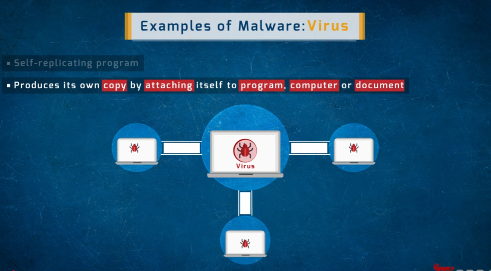
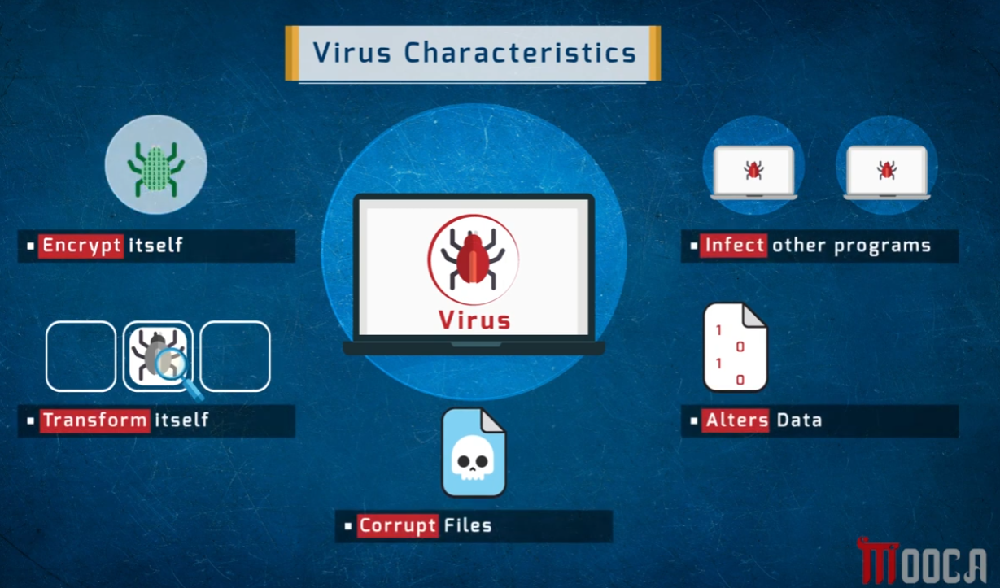
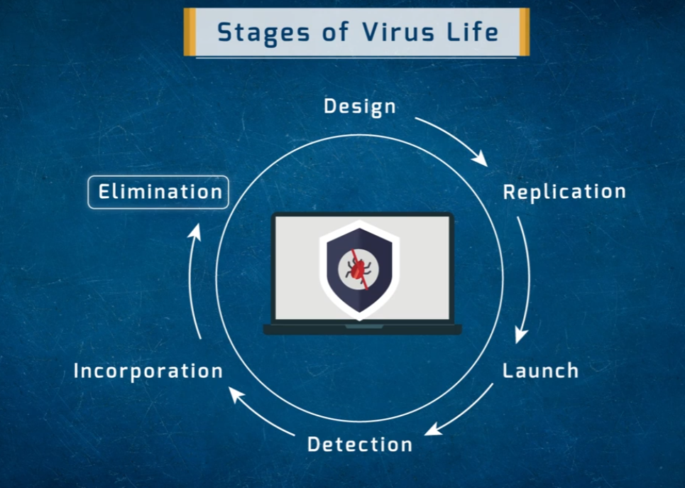
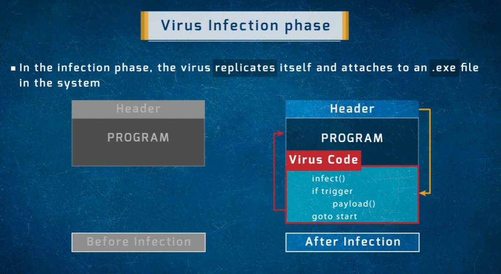
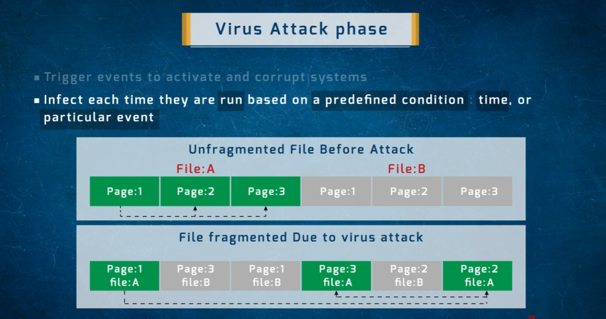
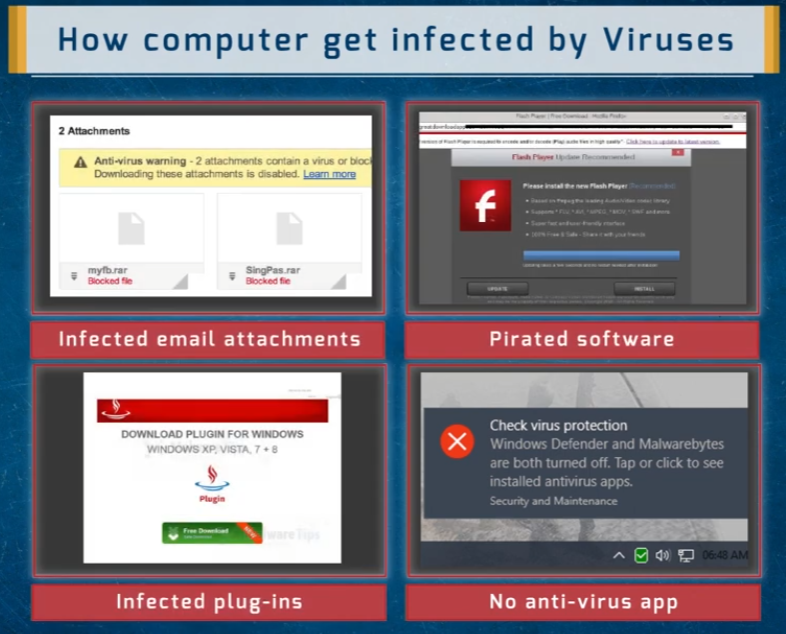
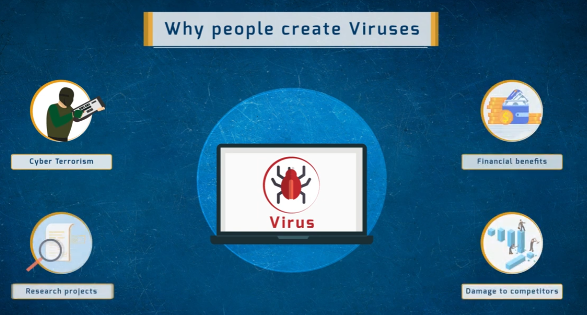
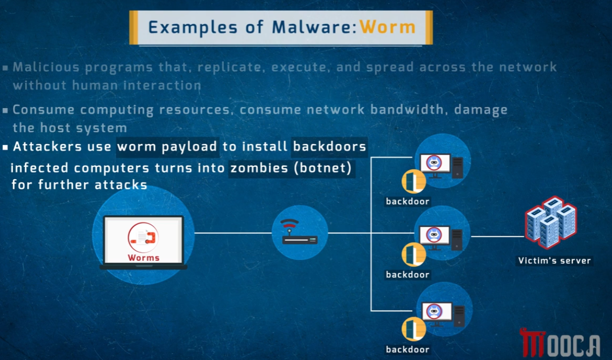
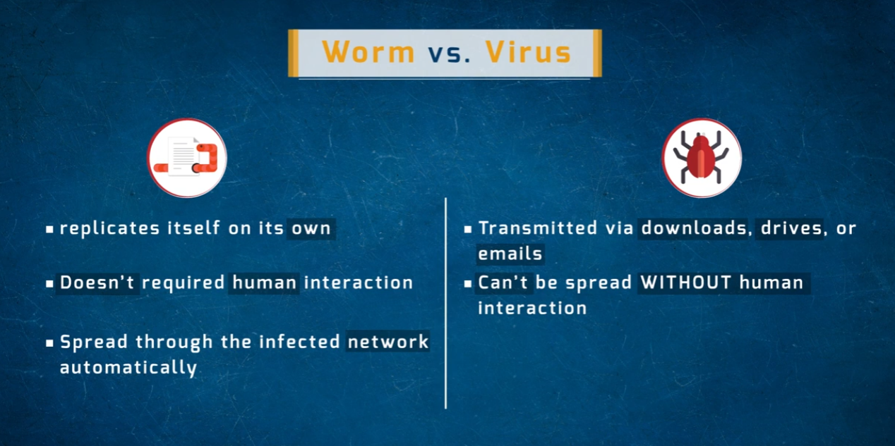
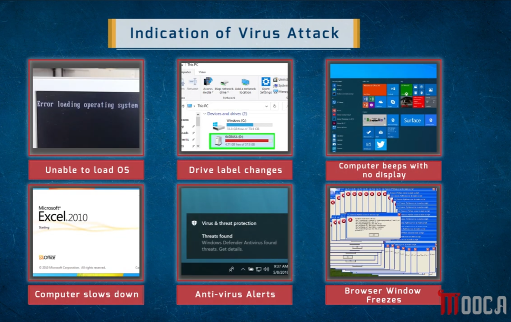

# Virus & Worm — Malware Deep Dive

A comprehensive reference on **computer viruses** and **worms** — how they work, how they spread, their lifecycle, and how to recognize an infection.

> ⚠️ **Disclaimer:** This document is for educational purposes within an ethical hacking / cybersecurity study series. Understanding virus and worm mechanics is fundamental to effective malware defense, incident response, and AV/EDR tuning.

---

## 1. What is a Virus?



A **computer virus** is a self-replicating program that:
- Produces its own copy by **attaching itself** to a host program, computer, or document
- Spreads to other systems when infected files are shared or executed
- **Requires human interaction** to propagate — unlike a worm, it can't spread across a network on its own

---

## 2. Virus Characteristics



| Characteristic | Description |
|---------------|-------------|
| **Encrypt itself** | Encodes its own code to evade signature-based AV detection |
| **Transform itself** | Polymorphic/metamorphic behavior — changes its structure each replication cycle to avoid detection |
| **Infect other programs** | Attaches to and propagates through additional executables on the same system |
| **Alters data** | Modifies files, registry entries, or system data as part of its payload |
| **Corrupt files** | Damages or destroys files, rendering applications or the OS inoperable |

---

## 3. Virus Lifecycle



The virus lifecycle follows six stages:

| Stage | Description |
|-------|-------------|
| **Design** | The virus is created — its replication logic, payload, and evasion techniques are coded |
| **Replication** | The virus copies itself into other programs, files, or sectors and begins spreading |
| **Launch** | The payload activates — triggered by a condition (time, event, user action) |
| **Detection** | AV vendors or security researchers identify and analyze the virus |
| **Incorporation** | Detection signatures are added to AV databases and security tools |
| **Elimination** | Infected systems are cleaned; the virus is removed from circulation |

---

## 4. Virus Infection Phase



During the **infection phase**, the virus:
- **Replicates itself** and attaches its code to a host `.exe` file
- Modifies the program so it now contains both the original code and the injected virus code

The injected code structure follows a simple pattern:
```
infect()       → find and attach to other files
if trigger     → check whether the activation condition is met
  payload()    → execute the destructive/surveillance function
goto start     → loop back to keep spreading
```

This loop explains why a virus can silently spread across a system for a long time before its payload triggers.

---

## 5. Virus Attack Phase



During the **attack phase**, the virus:
- **Triggers based on a predefined condition** — a specific time, date, or event (e.g. a certain number of replications, a calendar date, or a specific file being opened)
- **Infects each time it runs**, continuing to spread as long as the trigger condition isn't met

The diagram illustrates a visible side-effect: files become **fragmented due to the virus** inserting itself into and across file pages. `File A` and `File B`, originally stored as contiguous pages, become interleaved and scrambled — causing performance degradation and potential data corruption.

---

## 6. How a Computer Gets Infected by a Virus



| Infection Method | Example |
|-----------------|---------|
| **Infected email attachments** | `.rar` files flagged as blocked (e.g. `myfb.rar`, `SingPas.rar`) containing malicious payloads |
| **Pirated software** | Fake Flash Player update page — malware disguised as a legitimate update |
| **Infected plug-ins** | Fake "Download Plugin for Windows" prompt triggering a malicious download |
| **No antivirus app** | System running with Windows Defender and Malwarebytes both disabled — leaving it completely unprotected |

---

## 7. Why People Create Viruses



| Motivation | Description |
|-----------|-------------|
| **Cyber Terrorism** | Disrupting critical infrastructure, government systems, or causing mass damage for ideological goals |
| **Financial benefits** | Ransomware payments, credential theft, banking fraud, cryptomining |
| **Research projects** | Proof-of-concept malware created for academic or security research (sometimes escapes into the wild) |
| **Damage to competitors** | Corporate espionage or sabotage — destroying a competitor's data or operational capability |

---

## 8. What is a Worm?



A **worm** is a malicious program that:
- **Replicates, executes, and spreads across a network without human interaction**
- Consumes computing resources and network bandwidth
- Damages the host system through resource exhaustion or payload execution
- Is commonly used by attackers to **install backdoors** on infected machines
- Turns infected computers into **zombies** (botnet nodes) for further attacks against other targets

The diagram shows the typical worm-to-botnet pipeline: one infected machine spreads through the network, each newly-infected machine gets a backdoor installed, and the entire group is then used for coordinated attacks (DDoS, spam, credential stuffing) against a victim's server.

---

## 9. Worm vs. Virus



| Property | Worm | Virus |
|---------|------|-------|
| **Replication** | Replicates itself autonomously | Requires attaching to a host file |
| **Human interaction required?** | No — spreads automatically | Yes — needs a user to share/run infected files |
| **Propagation** | Spreads across networks automatically | Transmitted via downloads, drives, or emails |
| **Speed of spread** | Very fast (autonomous, network-wide) | Slower (depends on human file-sharing behavior) |

---

## 10. Indications of a Virus Attack



Common symptoms that indicate a system may be infected:

| Indicator | What It Suggests |
|-----------|-----------------|
| **Unable to load OS** | Virus has infected the boot sector or corrupted system files |
| **Drive label changes** | Virus has altered filesystem metadata |
| **Computer beeps with no display** | Virus or malware has corrupted BIOS/hardware settings or critical OS components |
| **Computer slows down** | Virus consuming CPU/RAM resources for replication or payload execution |
| **Antivirus alerts** | AV has detected a threat (e.g. Windows Defender "Threats found") |
| **Browser window freezes** | Adware/virus interfering with browser processes; excessive popup activity |

---

## Summary

| Malware | Self-Replicates | Needs Human Action | Primary Goal |
|---------|----------------|---------------------|--------------|
| **Virus** | Yes (via host file) | Yes | Infect/corrupt files, spread through shared media |
| **Worm** | Yes (autonomous) | No | Network propagation, backdoor installation, botnet building |

## Repo Structure

All images live in the **same directory** as this README:

```
.
├── README.md
├── 1786783526560_virus-attack-phase.png
├── 1786783526560_virus-characterestics.png
├── 1786783526561_virus-infection-methods.png
├── 1786783526561_virus-infection-phase.png
├── 1786783526562_virus-lifecycle.png
├── 1786783526562_why-people-create-virus.png
├── 1786783526563_virus.png
├── 1786783526563_worm.png
├── 1786783526563_worm-vs-virus.png
└── 1786783526564_virus-attack-indication.png
```
