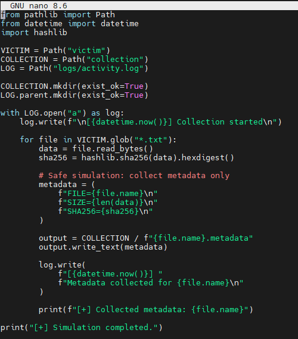
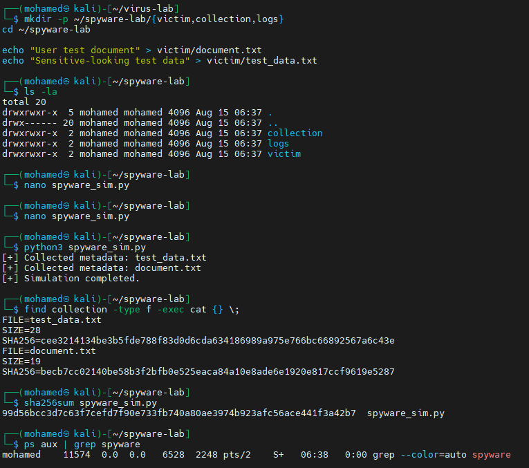
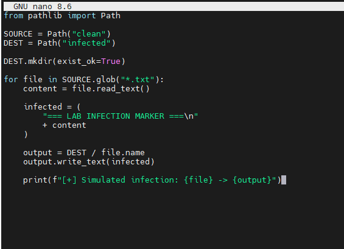
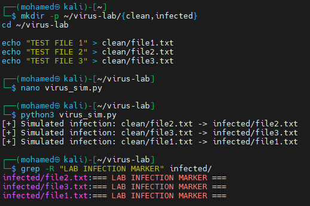
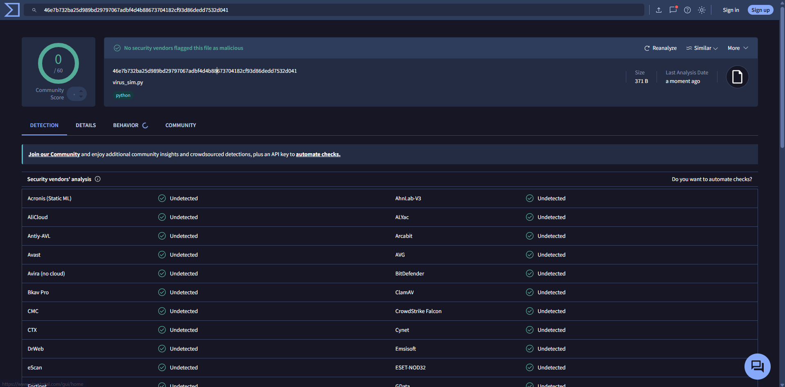

# Spyware & Virus Simulation Lab

A hands-on lab demonstrating the **behavior** of spyware and viruses using safe Python simulations — no real malware involved. Both scripts are designed to illustrate what malicious code *does* conceptually (file metadata collection, file infection markers) without causing any actual harm, making them suitable for controlled lab environments and VirusTotal analysis.

> ⚠️ **Disclaimer:** These are educational simulations only. The scripts do not exfiltrate data, replicate across systems, or perform any destructive action. They are designed to demonstrate malware behavior concepts in an isolated lab environment.

---

## Lab Structure

### Spyware Lab
```
~/spyware-lab/
├── victim/          ← target files the "spyware" scans
│   ├── document.txt
│   └── test_data.txt
├── collection/      ← metadata output (simulated "exfiltration")
├── logs/
│   └── activity.log ← timestamped activity log
└── spyware_sim.py   ← the simulation script
```

### Virus Lab
```
~/virus-lab/
├── clean/           ← original uninfected files
│   ├── file1.txt
│   ├── file2.txt
│   └── file3.txt
├── infected/        ← copies with infection marker prepended
└── virus_sim.py     ← the simulation script
```

---

## 1. Spyware Simulation

### Code



```python
from pathlib import import Path
from datetime import datetime
import hashlib

VICTIM = Path("victim")
COLLECTION = Path("collection")
LOG = Path("logs/activity.log")

COLLECTION.mkdir(exist_ok=True)
LOG.parent.mkdir(exist_ok=True)

with LOG.open("a") as log:
    log.write(f"\n[{datetime.now()}] Collection started\n")

    for file in VICTIM.glob("*.txt"):
        data = file.read_bytes()
        sha256 = hashlib.sha256(data).hexdigest()

        # Safe simulation: collect metadata only
        metadata = (
            f"FILE={file.name}\n"
            f"SIZE={len(data)}\n"
            f"SHA256={sha256}\n"
        )

        output = COLLECTION / f"{file.name}.metadata"
        output.write_text(metadata)

        log.write(
            f"[{datetime.now()}] "
            f"Metadata collected for {file.name}\n"
        )

        print(f"[+] Collected metadata: {file.name}")

print("[+] Simulation completed.")
```

**What it simulates:** a spyware module that scans a victim's directory for files, computes a SHA-256 fingerprint of each one, and writes the filename/size/hash to a "collection" folder — mimicking how real spyware exfiltrates file metadata or prepares to stage files for transmission.

**What it does NOT do:** read actual sensitive content, send data over the network, persist between reboots, or hide itself.

---

### Running the Spyware Lab



```bash
# Setup
mkdir -p ~/spyware-lab/{victim,collection,logs}
cd ~/spyware-lab

# Create victim files
echo "User test document" > victim/document.txt
echo "Sensitive-looking test data" > victim/test_data.txt

# Write and run the script
nano spyware_sim.py
python3 spyware_sim.py
```

**Output:**
```
[+] Collected metadata: test_data.txt
[+] Collected metadata: document.txt
[+] Simulation completed.
```

**Verify collected metadata:**
```bash
find collection -type f -exec cat {} \;
```

```
FILE=test_data.txt
SIZE=28
SHA256=cee3214134be3b5fde788f83d0d6cda634186989a975e766bc66892567a6c43e

FILE=document.txt
SIZE=19
SHA256=becb7cc02140be58b3f2bfb0e525eaca84a10e8ade6e1920e817ccf9619e5287
```

**Check the script's own hash (integrity verification):**
```bash
sha256sum spyware_sim.py
```
```
99d56bcc3d7c63f7cefd7f90e733fb740a80ae3974b923afc56ace441f3a42b7  spyware_sim.py
```

---

## 2. Virus Simulation

### Code



```python
from pathlib import Path

SOURCE = Path("clean")
DEST = Path("infected")

DEST.mkdir(exist_ok=True)

for file in SOURCE.glob("*.txt"):
    content = file.read_text()

    infected = (
        "=== LAB INFECTION MARKER ===\n"
        + content
    )

    output = DEST / file.name
    output.write_text(infected)

    print(f"[+] Simulated infection: {file} -> {output}")
```

**What it simulates:** a virus's **infection phase** — reading a clean host file, prepending a marker (representing injected virus code), and writing the modified version to a new location. This mirrors how real file-infecting viruses attach their code to the beginning of executable files before the original program content.

**What it does NOT do:** modify actual system files, replicate itself, execute on next boot, or spread to other machines.

---

### Running the Virus Lab



```bash
# Setup
mkdir -p ~/virus-lab/{clean,infected}
cd ~/virus-lab

# Create clean files
echo "TEST FILE 1" > clean/file1.txt
echo "TEST FILE 2" > clean/file2.txt
echo "TEST FILE 3" > clean/file3.txt

# Write and run the script
nano virus_sim.py
python3 virus_sim.py
```

**Output:**
```
[+] Simulated infection: clean/file2.txt -> infected/file2.txt
[+] Simulated infection: clean/file3.txt -> infected/file3.txt
[+] Simulated infection: clean/file1.txt -> infected/file1.txt
```

**Verify infection markers were injected:**
```bash
grep -R "LAB INFECTION MARKER" infected/
```
```
infected/file2.txt:=== LAB INFECTION MARKER ===
infected/file3.txt:=== LAB INFECTION MARKER ===
infected/file1.txt:=== LAB INFECTION MARKER ===
```

All three files were "infected" — the marker was successfully prepended to each one, exactly as a real virus prepends its code to a host program.

---

## 3. VirusTotal Analysis

The virus simulation script (`virus_sim.py`) was uploaded to **VirusTotal** to verify it is correctly identified as benign by all major security vendors:



| Field | Value |
|-------|-------|
| File | `virus_sim.py` |
| SHA256 | `46e7b732ba25d989bd29797067adbf4d4b88673704182cf93d86dedd7532d041` |
| Size | 371 B |
| Detections | **0 / 60** |
| Result | No security vendors flagged this file as malicious |

**What this confirms:**
- The simulation is genuinely safe — no obfuscation, no network calls, no system manipulation that would trigger behavioral or signature-based detection.
- It also demonstrates that **static file analysis alone** (what most AV tools do on VirusTotal) isn't sufficient to understand what a script *represents conceptually* — only behavioral/dynamic analysis would flag that this script models malware behavior patterns.

---

## Key Concepts Demonstrated

| Concept | How It Was Shown |
|---------|-----------------|
| **Spyware data collection** | Script scanned victim directory, computed SHA-256 hashes, wrote metadata to collection folder |
| **Activity logging** | Timestamped log written to `logs/activity.log` during collection |
| **Virus infection phase** | Marker prepended to clean files, written to infected copies |
| **File integrity verification** | `sha256sum` run against the script itself to demonstrate hash-based integrity checking |
| **AV evasion concept** | VirusTotal 0/60 result shows that pure-Python simulation code evades all signature-based detection |

## Repo Structure

All images live in the **same directory** as this README:

```
.
├── README.md
├── spyware-code.png
├── virus-code.png
├── run-spyware.png
├── run-virus.png
└── virustotal-detection.png
```
