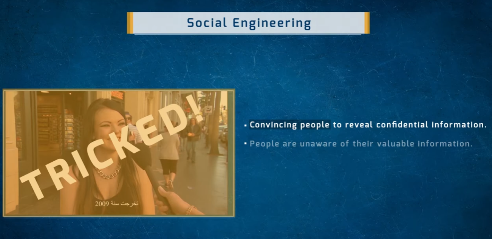
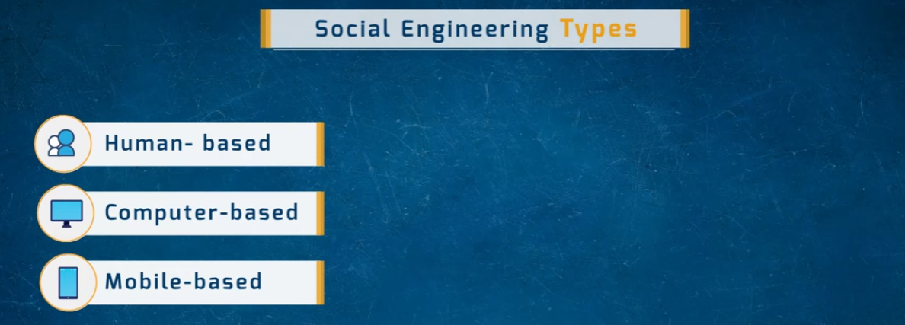
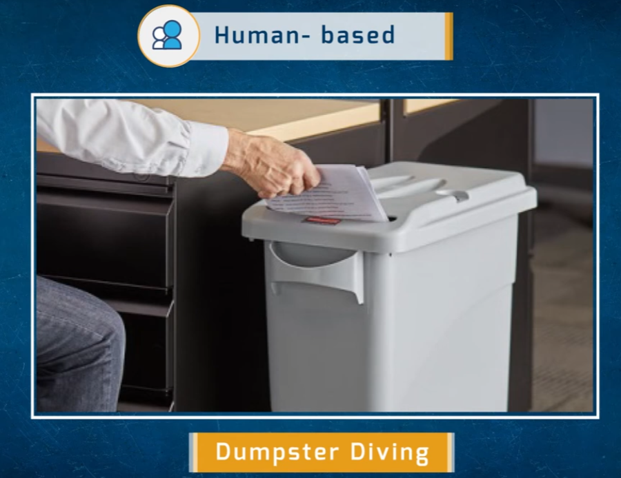
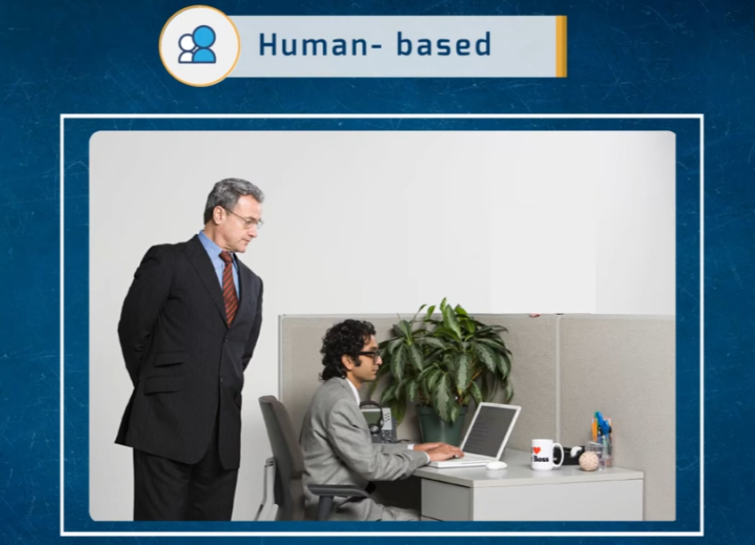
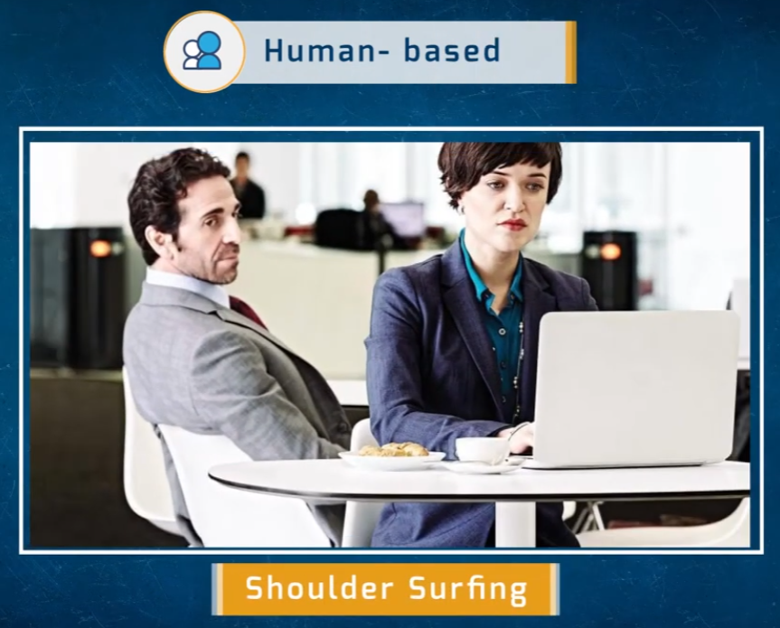
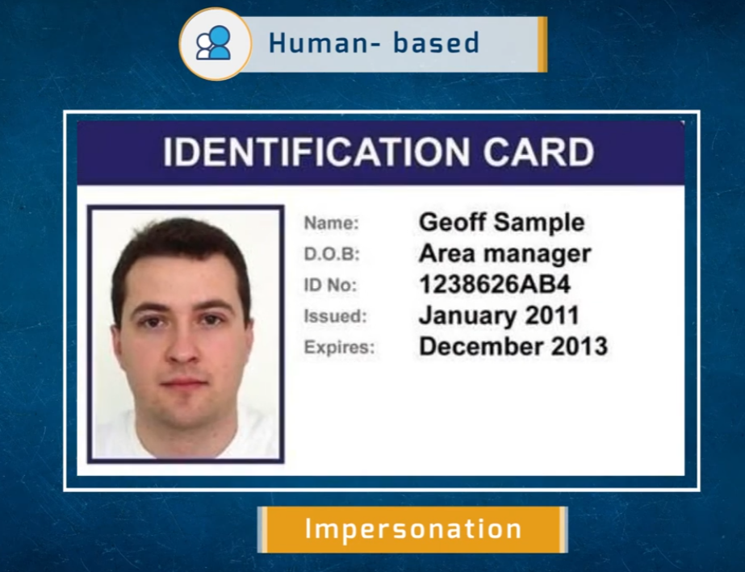
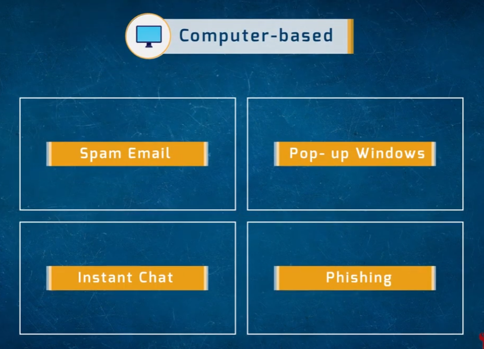
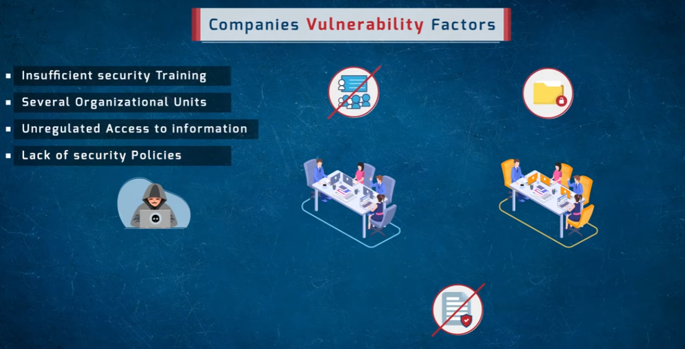
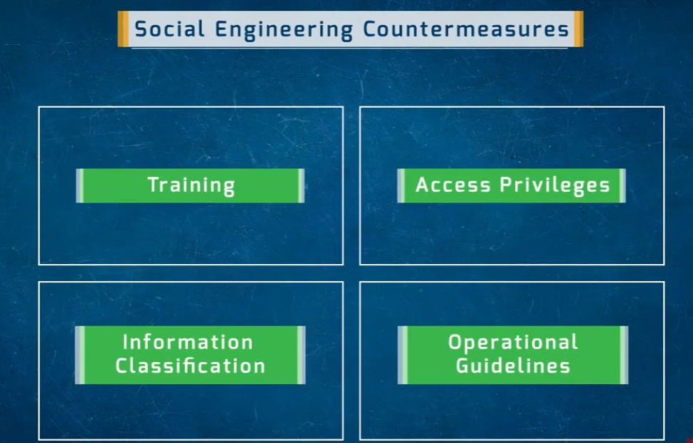

# Social Engineering

A visual overview of social engineering attacks — how attackers exploit human trust rather than technical vulnerabilities to gain unauthorized access to information.

- Convincing people to reveal confidential information.
- People are unaware of the value of the information they hold.

## Social Engineering Types

Social engineering attacks fall into three broad categories:

- **Human-based** — direct interaction with people (in person or by phone/impersonation)
- **Computer-based** — attacks delivered through a computer/software
- **Mobile-based** — attacks delivered through mobile devices/apps

---

## Human-Based Attacks

### Dumpster Diving
Searching through trash for discarded documents, printouts, or drafts that contain sensitive information.

### Eavesdropping
Secretly listening in on private conversations or observing someone's screen/activity to capture confidential information.

### Shoulder Surfing
Looking over someone's shoulder to observe passwords, PINs, or other sensitive data as they're typed or viewed.

### Impersonation
Posing as a trusted individual (e.g., an employee, manager, or vendor) using a fake or forged ID to gain physical or informational access.

---

## Computer-Based Attacks

Attacks delivered through digital channels rather than face-to-face interaction:

- **Spam Email** — bulk unsolicited messages used to spread malicious links or requests
- **Pop-up Windows** — fake alerts prompting users to enter credentials or download malware
- **Instant Chat** — messaging platforms used to build trust and extract information
- **Phishing** — fraudulent messages designed to trick users into revealing credentials or clicking malicious links

---

## Companies' Vulnerability Factors

Organizations become easier targets for social engineering when they have:

- Insufficient security training
- Several organizational units (fragmented oversight)
- Unregulated access to information
- Lack of security policies

---

## Social Engineering Countermeasures

Key defenses organizations can put in place to reduce social engineering risk:

- **Training** — regular security-awareness education for all staff
- **Access Privileges** — enforce least-privilege access to sensitive systems and data
- **Information Classification** — label and handle data according to its sensitivity
- **Operational Guidelines** — documented policies and procedures for verifying identity and handling requests for information

---

## Repository Contents

| File | Description |
|---|---|
| `social-engineering.png` | Intro slide — what social engineering is |
| `social-engineering-types.png` | Overview of the three attack categories |
| `dumpster-diving.png` | Human-based: dumpster diving |
| `eavesdropping.png` | Human-based: eavesdropping |
| `shoulder-surffing.png` | Human-based: shoulder surfing |
| `impersonate.png` | Human-based: impersonation |
| `computer-based-social-engineering.png` | Computer-based attack methods |
| `compines-vulnerable-factors.png` | Factors that make companies vulnerable |
| `countermeasures.png` | Recommended countermeasures |
