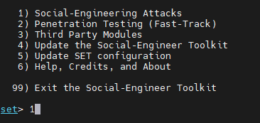
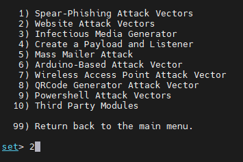
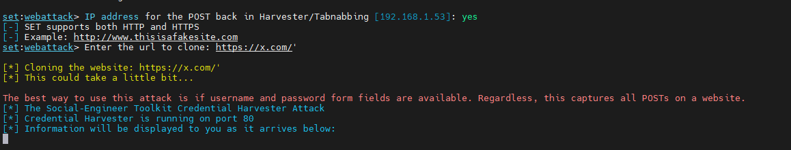
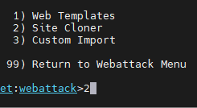
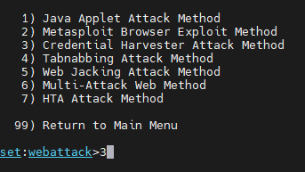

## Phishing Lab: Social-Engineer Toolkit (SET) Walkthrough

This lab exercise uses the **Social-Engineer Toolkit (SET)**, an open-source penetration-testing framework, to demonstrate how phishing-style credential harvesting works in a controlled environment. The goal of the lab is to help participants recognize and defend against this attack, not to target real users or systems. The screenshots below trace the tool's menu flow as used during the lab.

**Lab scope:** run only against systems/domains you own or have written authorization to test (e.g., a local test site or an intentionally vulnerable lab target) — never against real third-party sites or unsuspecting users.

### 1. Main Menu
SET's main menu offers several assessment categories.

- Social-Engineering Attacks
- Penetration Testing (Fast-Track)
- Third Party Modules
- Update the Social-Engineer Toolkit
- Update SET configuration
- Help, Credits, and About

### 2. Website Attack Vectors
Selecting "Social-Engineering Attacks" leads to a submenu of vector types, including the website-based option used for this demo.

- Spear-Phishing Attack Vectors
- **Website Attack Vectors**
- Infectious Media Generator
- Create a Payload and Listener
- Mass Mailer Attack
- Arduino-Based Attack Vector
- Wireless Access Point Attack Vector
- QRCode Generator Attack Vector
- Powershell Attack Vectors
- Third Party Modules

### 3. Credential Harvester Attack Method
Within Website Attack Vectors, the assessor chooses the method for capturing submitted form data.

- Java Applet Attack Method
- Metasploit Browser Exploit Method
- **Credential Harvester Attack Method**
- Tabnabbing Attack Method
- Web Jacking Attack Method
- Multi-Attack Web Method
- HTA Attack Method

### 4. Site Cloner
The Credential Harvester method needs a webpage to present to the target. SET can clone an existing site's look and feel for realism during the authorized test.

- Web Templates
- **Site Cloner**
- Custom Import

### 5. Cloning and Harvesting in Progress
The assessor supplies the local IP address to receive submitted form data and the URL of the page to clone. SET then serves the cloned page and logs any credentials entered by a test participant.

- SET prompts for the IP address that will receive POST data.
- The tester provides the URL of the site being cloned.
- SET clones the page and starts a listener (port 80 by default).
- Any form submissions against the cloned page are captured and displayed to the tester in real time.

> ⚠️ **Note:** This lab is only lawful and ethical when run against systems you own, a designated lab/test environment, or targets you're explicitly authorized to assess. Pointing SET's credential harvester at real users or third-party sites without consent is illegal credential theft/fraud.

---

## Repository Contents

| File | Description |
|---|---|
| `social-engineering.png` | Intro slide — what social engineering is |
| `social-engineering-types.png` | Overview of the three attack categories |
| `dumpster-diving.png` | Human-based: dumpster diving |
| `eavesdropping.png` | Human-based: eavesdropping |
| `shoulder-surffing.png` | Human-based: shoulder surfing |
| `impersonate.png` | Human-based: impersonation |
| `computer-based-social-engineering.png` | Computer-based attack methods |
| `compines-vulnerable-factors.png` | Factors that make companies vulnerable |
| `countermeasures.png` | Recommended countermeasures |
| `setoolkit-attacks.png` | SET main menu / credential harvester method submenu |
| `website-attack-vector.png` | SET social-engineering attack vector submenu |
| `site-cloner.png` | SET website attack vectors submenu (site cloner option) |
| `clone-website.png` | SET credential harvester attack method submenu |
| `credential-harvesting.png` | SET credential harvester running against a cloned page |
