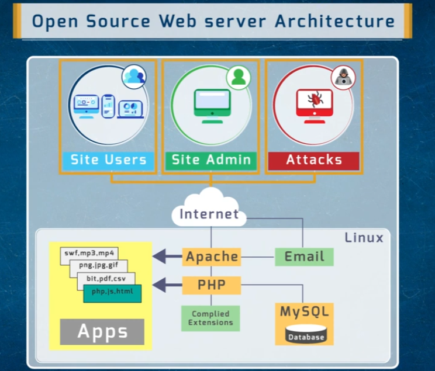
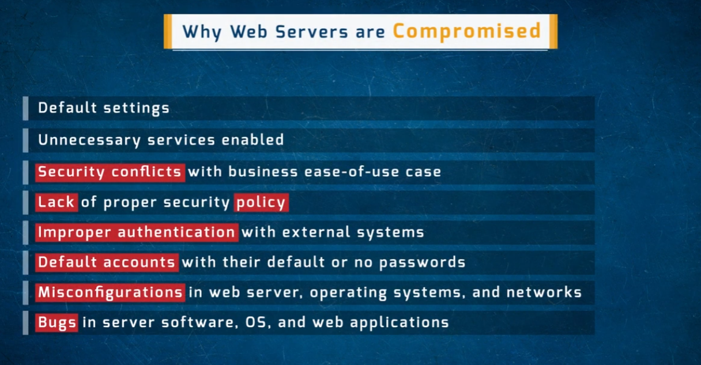
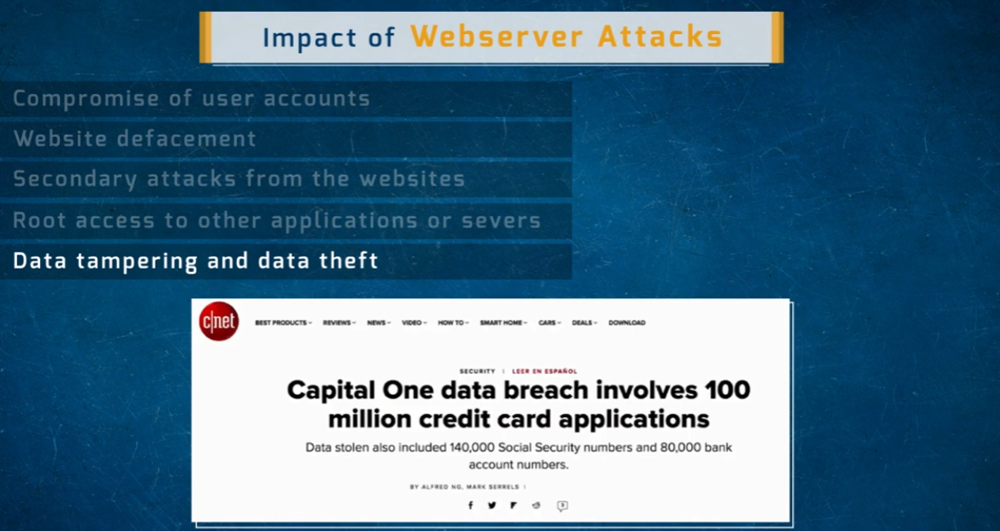
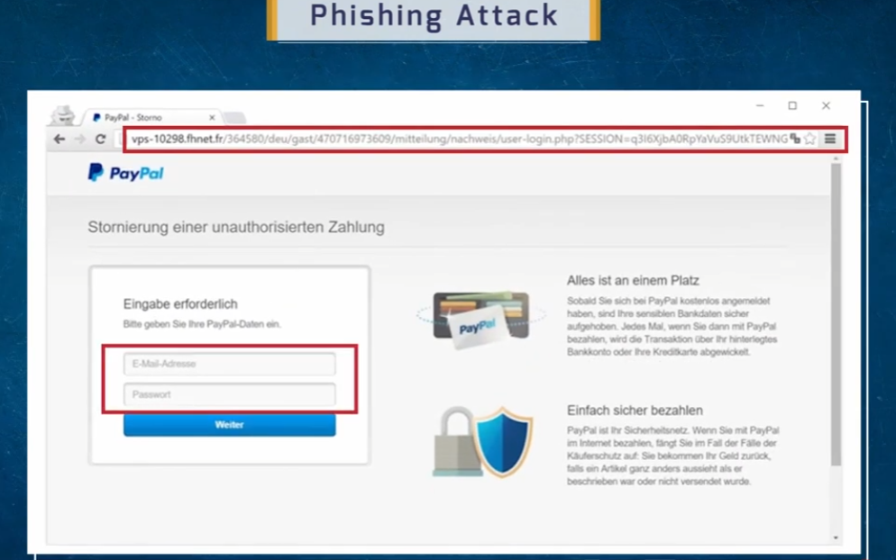
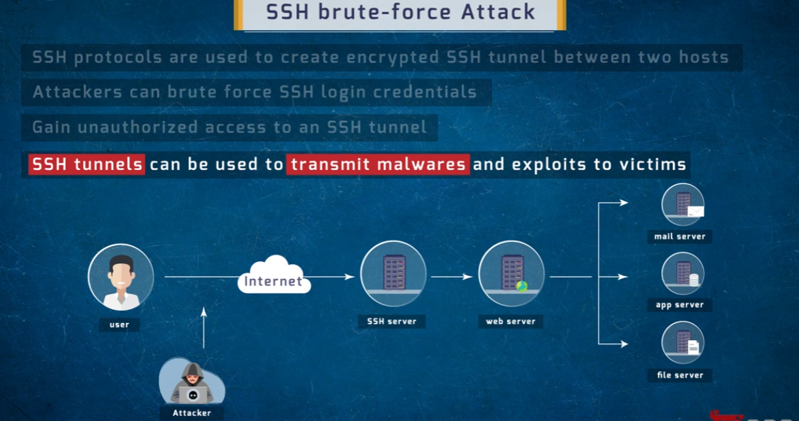
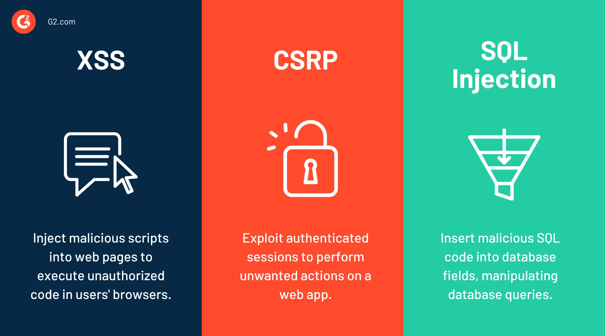
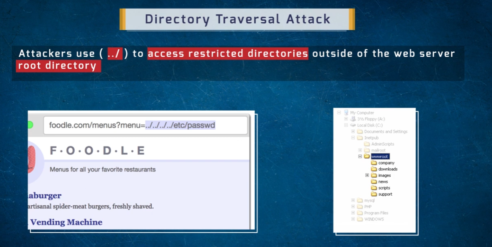
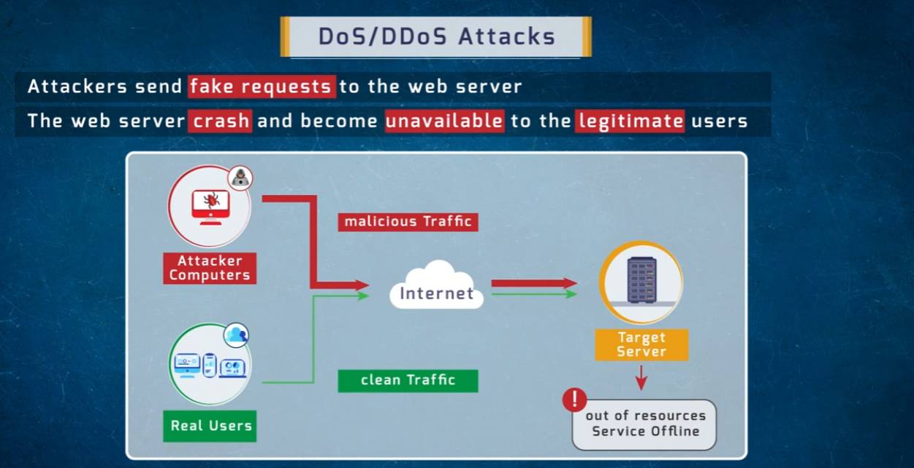
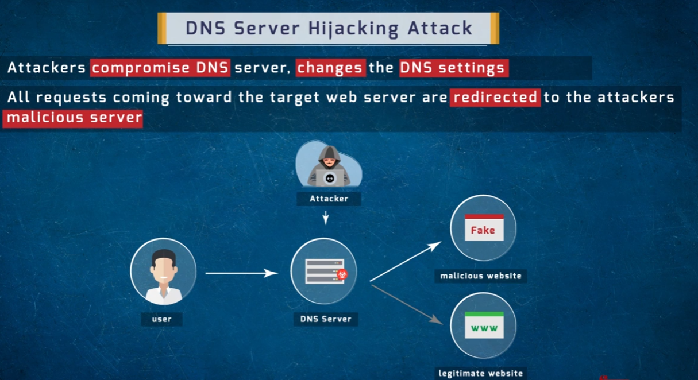
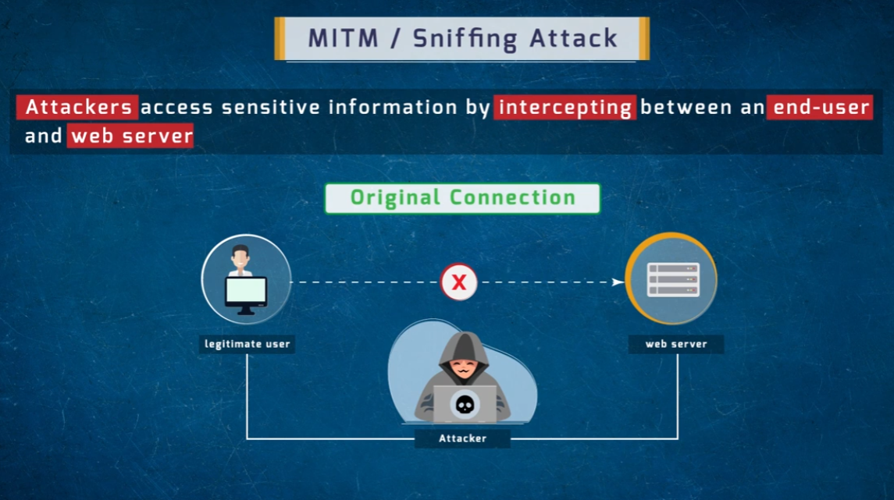

## Web Server Attacks

An overview of how open-source web server stacks are put together, why they get compromised, and the common attack techniques used against them.

### Open Source Web Server Architecture
A typical open-source stack (e.g., Linux, Apache, PHP, MySQL) serves site users and admins over the internet, but the same exposed surface is reachable by attackers.

- **Site Users / Site Admin / Attacks** — all reach the server over the internet
- **Apache** — handles web/email requests, serves static and compiled content
- **PHP** — processes compiled extensions and dynamic content
- **MySQL** — backing database for application data

### Why Web Servers Are Compromised
Most web server breaches trace back to a small set of recurring root causes rather than novel exploits:

- Default settings left unchanged
- Unnecessary services enabled
- Security conflicts with business ease-of-use
- Lack of proper security policy
- Improper authentication with external systems
- Default accounts with default or no passwords
- Misconfigurations in the web server, OS, and network
- Bugs in server software, OS, and web applications

### Impact of Webserver Attacks
When a web server is compromised, the consequences can cascade well beyond the server itself:

- Compromise of user accounts
- Website defacement
- Secondary attacks launched from the website
- Root access to other applications or servers
- Data tampering and data theft — real-world breaches at this scale (e.g., the Capital One incident referenced in the slide) have exposed tens of millions of records

### Phishing Attack
Attackers set up a fake login page — often mimicking a trusted brand — to trick users into submitting their credentials or payment details.

- The fake page is hosted on a look-alike or unrelated domain rather than the real service's domain
- Form fields prompt the victim for credentials or payment info under a false pretext (e.g., a bogus "refund" or "verify your account" flow)
- Submitted data is captured by the attacker instead of the legitimate service

### SSH Brute-Force Attack
SSH is meant to create a secure, encrypted tunnel between hosts — but weak or reused credentials let attackers force their way in.

- Attackers repeatedly guess SSH login credentials until one succeeds
- A successful guess grants unauthorized access to the SSH tunnel
- That tunnel can then be used to reach connected mail, app, and file servers
- Once inside, attackers can use the tunnel to deliver malware or exploits further into the network

### XSS, CSRF & SQL Injection
Three of the most common web application vulnerabilities:

- **XSS (Cross-Site Scripting)** — injecting malicious scripts into web pages so they execute in other users' browsers
- **CSRF (Cross-Site Request Forgery)** — exploiting an authenticated session to perform unwanted actions on a web app on the victim's behalf
- **SQL Injection** — inserting malicious SQL into database-facing fields to manipulate or extract data from the underlying database

### Directory Traversal Attack
By manipulating file paths in a URL, attackers can escape the intended web root and reach files they shouldn't have access to.

- Attackers use sequences like `../` in request parameters to move up out of the web server's root directory
- This can expose sensitive OS files (e.g., password files) that live outside the intended `wwwroot` folder
- The vulnerability stems from an application trusting user-supplied file paths without properly sanitizing them

### DoS / DDoS Attacks
Denial-of-Service attacks aim to overwhelm a server so it can no longer serve legitimate traffic.

- Attacker-controlled computers flood the target server with fake/malicious requests
- This traffic mixes with legitimate ("clean") traffic from real users headed to the same server
- The server runs out of resources and its service goes offline, denying access to everyone — including legitimate users

### DNS Server Hijacking Attack
Instead of attacking the target server directly, attackers compromise the DNS infrastructure that points users toward it.

- Attackers compromise a DNS server and alter its DNS settings
- Requests that should resolve to the legitimate site are redirected to the attacker's malicious server instead
- Users believe they're reaching the real site while actually interacting with a fake one

### MITM / Sniffing Attack
A Man-in-the-Middle attack positions the attacker between a user and the web server to intercept traffic that should be private.

- Under normal conditions, a legitimate user connects directly to the web server
- An attacker inserts themselves into that connection path
- The attacker intercepts sensitive information passing between the user and server that neither party intended to expose

---

## Repository Contents

| File | Description |
|---|---|
| `social-engineering.png` | Intro slide — what social engineering is |
| `social-engineering-types.png` | Overview of the three attack categories |
| `dumpster-diving.png` | Human-based: dumpster diving |
| `eavesdropping.png` | Human-based: eavesdropping |
| `shoulder-surffing.png` | Human-based: shoulder surfing |
| `impersonate.png` | Human-based: impersonation |
| `computer-based-social-engineering.png` | Computer-based attack methods |
| `compines-vulnerable-factors.png` | Factors that make companies vulnerable |
| `countermeasures.png` | Recommended countermeasures |
| `setoolkit-attacks.png` | SET main menu / credential harvester method submenu |
| `website-attack-vector.png` | SET social-engineering attack vector submenu |
| `site-cloner.png` | SET website attack vectors submenu (site cloner option) |
| `clone-website.png` | SET credential harvester attack method submenu |
| `credential-harvesting.png` | SET credential harvester running against a cloned page |
| `web-server-arch.png` | Open source web server architecture (Apache/PHP/MySQL) |
| `why-web-server-compromised.png` | Common root causes of web server compromise |
| `webserver-attacks-impact.png` | Impact/consequences of web server attacks |
| `phishing-attack.png` | Example fake login page used in a phishing attack |
| `ssh-brute-force-attack.png` | SSH brute-force attack flow |
| `xss-csrp-sql.webp` | XSS, CSRF, and SQL Injection overview |
| `directory-traversal-attack.png` | Directory traversal (`../`) attack example |
| `DOS-DDOS-attack.png` | DoS/DDoS attack flow |
| `hijack-dns-server.png` | DNS server hijacking attack flow |
| `MITM-phishing-attack.png` | MITM/sniffing attack flow |
