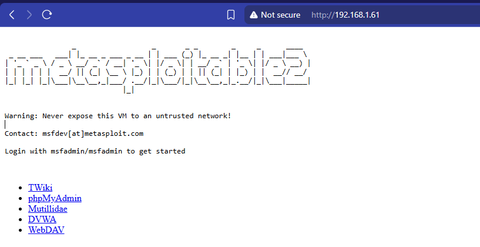
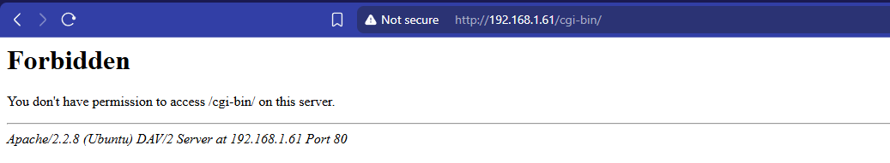
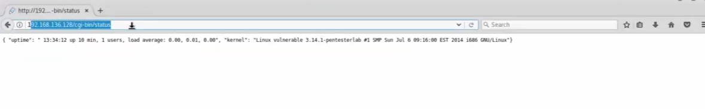
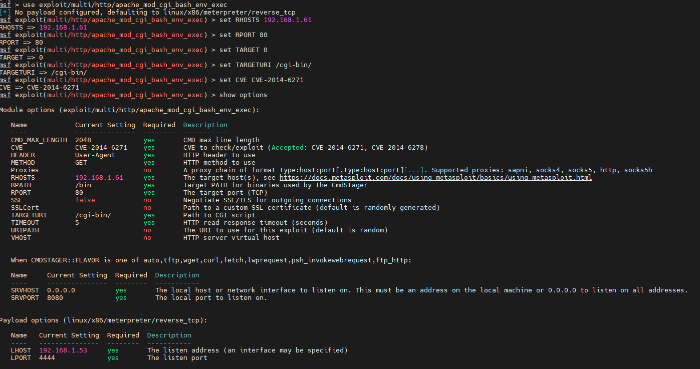
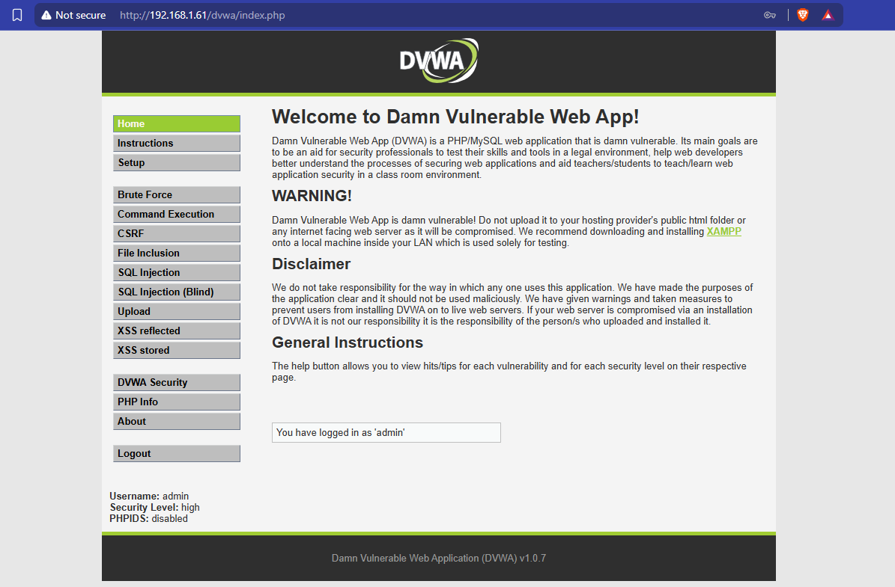
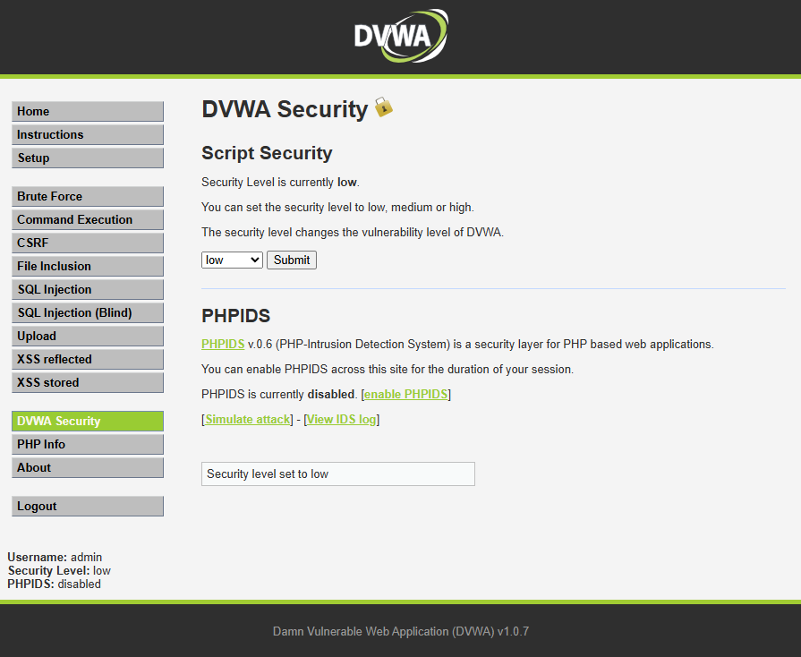
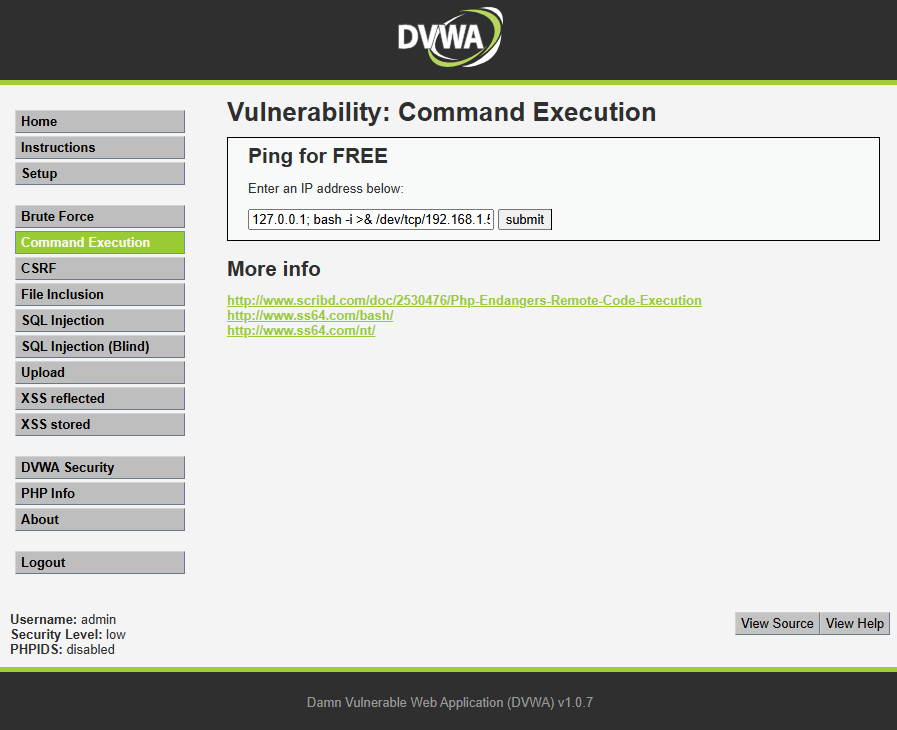

# Lab: Metasploitable / DVWA — Apache Shellshock & Command Injection

This lab walkthrough uses **Metasploitable 2** (an intentionally vulnerable target VM) and **DVWA** (Damn Vulnerable Web Application) to demonstrate a real CGI-based remote code execution vulnerability (Shellshock, CVE-2014-6271) and a web-app command injection flaw. Both targets are purpose-built training environments, not production systems.

**Lab scope:** only run this against the intentionally vulnerable target VM/app in an isolated lab network (as the target itself warns) — never against production systems, third-party hosts, or systems you don't own/have authorization to test.

### 1. Target Environment
The target is Metasploitable 2, a deliberately vulnerable Linux VM built for practicing exploitation techniques. Its landing page explicitly warns not to expose it to any network.

- Banner text warns: *"Never expose this VM to an untrusted network!"*
- Default credentials are provided for training purposes (`msfadmin`/`msfadmin`)
- Links to bundled vulnerable apps: TWiki, phpMyAdmin, Mutillidae, DVWA, WebDAV

### 2. CGI-bin Directory Enumeration
Before exploiting Shellshock, the tester checks whether the target's `/cgi-bin/` directory is reachable and what's exposed there.

- A direct request to `/cgi-bin/` on one host returns a `403 Forbidden` — directory listing is blocked, but the path (and the Apache version) is confirmed to exist

- On another host, a specific script under `/cgi-bin/status` is reachable and returns system info (uptime, load average, kernel version) — confirming CGI scripts are being executed by the server and giving the tester OS/kernel fingerprinting data

### 3. Exploiting Shellshock via Metasploit
With a CGI endpoint confirmed, the tester uses Metasploit's Apache `mod_cgi` Bash environment-variable exploit module targeting the Shellshock vulnerability (CVE-2014-6271).

- Module used: `exploit/multi/http/apache_mod_cgi_bash_env_exec`
- Key options set: target host/port, `TARGETURI` (`/cgi-bin/`), and `CVE` (`CVE-2014-6271`)
- Payload: `linux/x86/meterpreter/reverse_tcp`, with a local listener host/port configured to catch the resulting session
- This module works by sending a crafted HTTP header that abuses a flaw in how Bash parses environment variables, letting the attacker run arbitrary commands via the CGI script

### 4. DVWA — Vulnerable Web App
Separately, the lab also uses DVWA, a PHP/MySQL web app intentionally built with common vulnerabilities for training purposes.

- DVWA's own home page states its purpose plainly: help security professionals practice, and explicitly disclaims responsibility if it's ever exposed on a live/public server
- Modules available include Brute Force, Command Execution, CSRF, File Inclusion, SQL Injection, Upload, and XSS

### 5. Setting DVWA's Security Level
DVWA lets the tester dial the difficulty up or down to see how mitigations change exploitability.

- Security Level is set to **low**, which disables most input sanitization
- PHPIDS (an intrusion detection layer for PHP apps) is disabled for this session

### 6. Command Injection in DVWA
With security set to low, the "Command Execution" module's ping feature is abused to inject arbitrary shell commands.

- The intended input is an IP address for a ping test
- The tester appends a command-injection payload after the expected input to spawn an interactive reverse shell back to an attacker-controlled host
- Because low security performs no input validation, the appended shell command executes alongside the ping

---

## Repository Contents

| File | Description |
|---|---|
| `web-server.png` | Metasploitable 2 landing page and warning banner |
| `cgi-bin-forbidden.png` | `/cgi-bin/` directory returning 403 Forbidden |
| `cgi-bin-webserver.png` | Reachable CGI script leaking system info |
| `apache-exploit.png` | Metasploit Apache Shellshock (CVE-2014-6271) module configuration |
| `dvwa-vulnerable-web-app.png` | DVWA home page and module list |
| `dvwa-low-security.png` | DVWA security level set to low, PHPIDS disabled |
| `dvwa-command-injection.png` | Command injection via DVWA's ping/Command Execution module |
