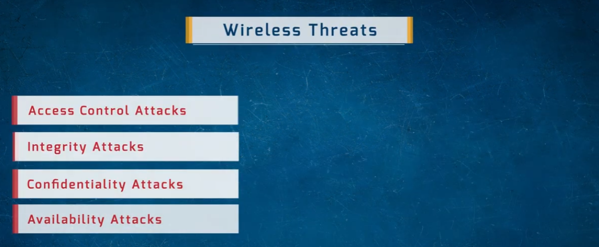
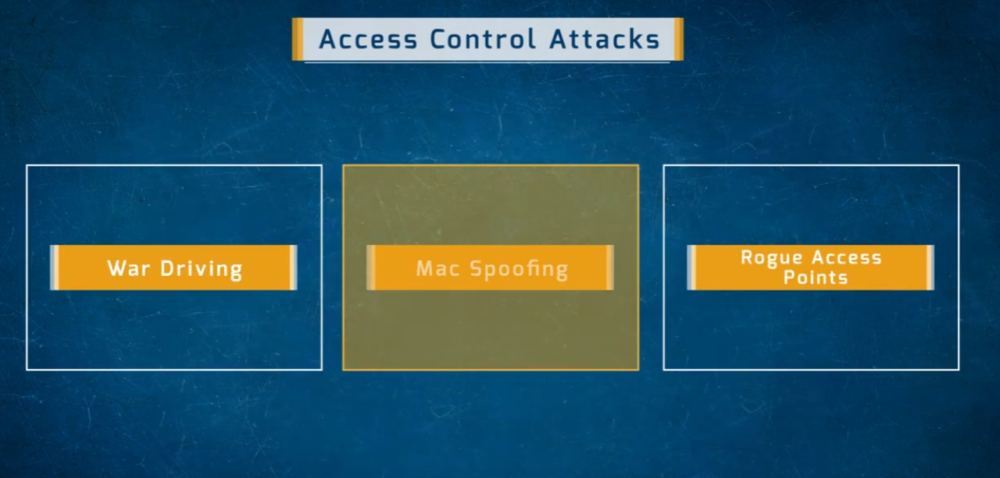
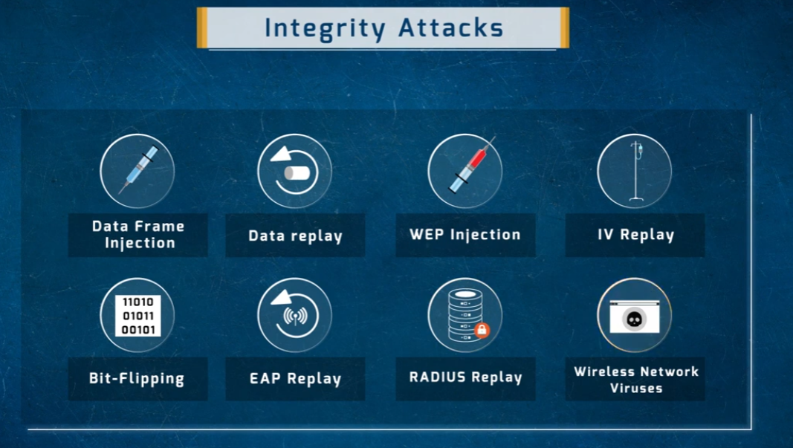
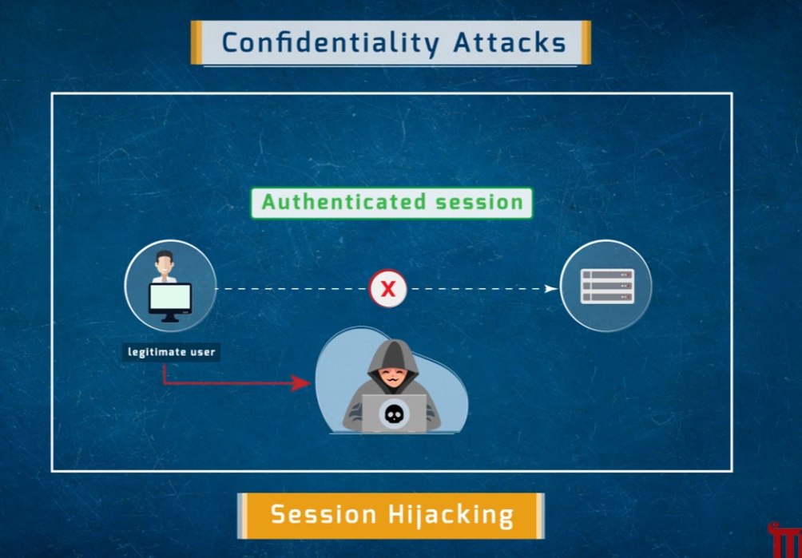
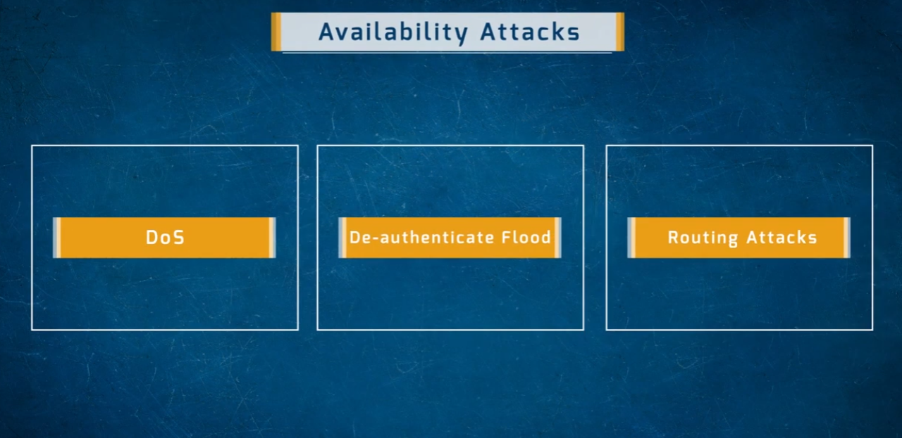

# Wireless Threats

An overview of attack categories that target wireless networks, organized by which security property (access control, integrity, confidentiality, or availability) they undermine.

- **Access Control Attacks**
- **Integrity Attacks**
- **Confidentiality Attacks**
- **Availability Attacks**

---

## Access Control Attacks
Attacks aimed at bypassing the mechanisms that decide who is allowed onto the wireless network.

- **War Driving** — searching for and mapping accessible wireless networks, often while physically moving around an area
- **MAC Spoofing** — impersonating an authorized device's MAC address to bypass MAC-based access filtering
- **Rogue Access Points** — unauthorized access points set up (or introduced) to provide an illegitimate entry point into the network

---

## Integrity Attacks
Attacks that tamper with or forge wireless data/frames rather than simply reading them.

- **Data Frame Injection** — crafting and injecting forged wireless frames into the network
- **Data Replay** — capturing legitimate traffic and resending it later to produce an unintended effect
- **WEP Injection** — injecting traffic into a WEP-protected network to exploit its weak encryption
- **IV Replay** — reusing captured initialization vectors to help break weak encryption schemes
- **Bit-Flipping** — altering specific bits in captured/encrypted data to manipulate its content
- **EAP Replay** — replaying captured EAP authentication exchanges
- **RADIUS Replay** — replaying captured RADIUS authentication traffic
- **Wireless Network Viruses** — malware designed to propagate over wireless network connections

---

## Confidentiality Attacks

### Session Hijacking
Attackers take over an already-authenticated session between a legitimate user and a server, rather than needing to steal credentials directly.

- A legitimate user has an authenticated session with a server
- An attacker inserts themselves into that trust relationship
- The original authenticated connection is broken/intercepted, letting the attacker act as the legitimate user

---

## Availability Attacks
Attacks intended to disrupt or deny wireless service to legitimate users.

- **DoS (Denial of Service)** — flooding or overwhelming the wireless network so it can't serve legitimate clients
- **De-authenticate Flood** — repeatedly sending forged de-authentication frames to disconnect clients from an access point
- **Routing Attacks** — manipulating routing information/protocols to disrupt or redirect wireless network traffic

---

## Repository Contents

| File | Description |
|---|---|
| `wireless-threats.png` | Overview of the four wireless threat categories |
| `access-control-attack.png` | Access control attacks: war driving, MAC spoofing, rogue APs |
| `integrity-attacks.png` | Integrity attacks: frame injection, replay attacks, viruses, etc. |
| `session-hijacking.png` | Confidentiality attack: session hijacking |
| `availability-attack.png` | Availability attacks: DoS, de-auth flood, routing attacks |
