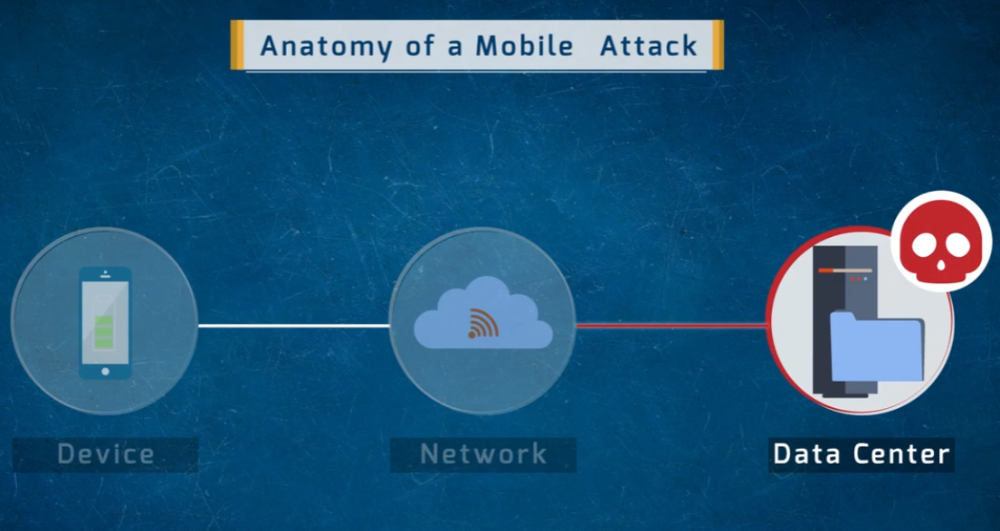
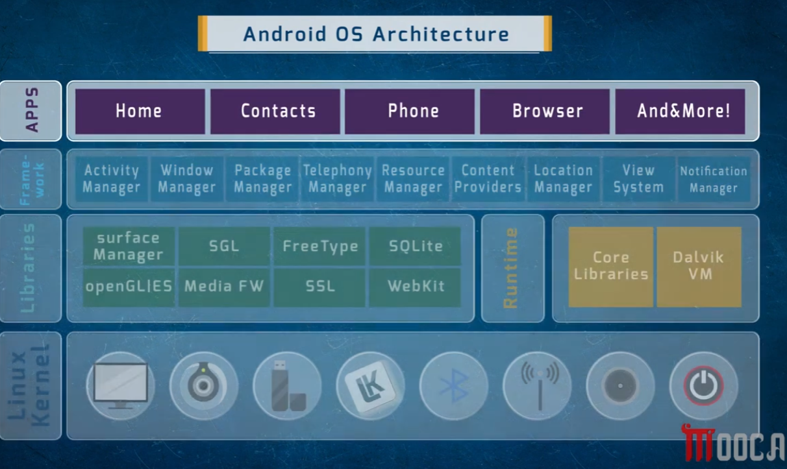
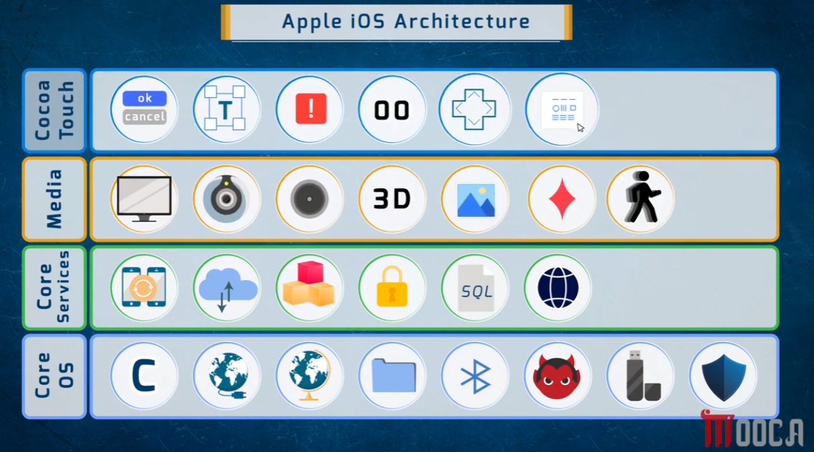

# Mobile Security

An overview of how mobile attacks unfold, the underlying OS architectures they target, and practical steps users can take to secure their devices.

## Anatomy of a Mobile Attack
Mobile attacks typically progress across three stages, moving from the device itself out to backend infrastructure.

- **Device** — the attack originates on or targets the mobile device itself
- **Network** — the device's network/wireless connection is used as the transport for the attack
- **Data Center** — the attack ultimately reaches back-end servers/data, where the real damage (data theft, compromise) occurs

## Mobile Device Attack Vectors: Android Rooting
Rooting (or side-loading untrusted profiles/certificates) can open the door to malicious software gaining deep control over a device.

- Installing an untrusted configuration profile or root certificate (as shown by an "Install Profile" prompt from an untrusted CA) can let malicious software run with elevated privileges
- This can **collapse the system** and cause **loss or leakage of confidential information** stored on the device

## Android OS Architecture
Understanding Android's layered architecture helps explain where mobile vulnerabilities tend to surface.

- **Apps** — Home, Contacts, Phone, Browser, and other user-facing apps
- **Framework** — system managers (Activity, Window, Package, Telephony, Resource, Content Providers, Location, View System, Notification)
- **Libraries & Runtime** — native libraries (Surface Manager, SGL, FreeType, SQLite, openGL|ES, Media FW, SSL, WebKit) plus the Core Libraries and Dalvik VM runtime
- **Linux Kernel** — the base layer handling drivers for display, camera, USB, keylock, Bluetooth, wireless, audio, and power management

## Apple iOS Architecture
iOS uses a similarly layered architecture, from developer-facing frameworks down to the core operating system.

- **Cocoa Touch** — UI-facing frameworks for alerts, text, gestures, and UI controls
- **Media** — frameworks for graphics, audio, video, 3D, images, and animation
- **Core Services** — cloud sync, in-app purchases, security/keychain, SQLite, and networking services
- **Core OS** — the lowest layer, covering the C-based core, networking, file system access, Bluetooth, security, and external accessory support

## Tips to Secure Your Mobile Devices
Practical, user-facing steps to reduce the risk of the attack vectors described above.

- Use official app stores
- Use screen locks and biometrics
- Update your software regularly
- Create strong passwords and use 2FA
- Replace unsupported phones
- Back up your data
- Use a VPN
- Install security software

---

## Repository Contents

| File | Description |
|---|---|
| `mobile-attacks-anatomy.png` | Stages of a mobile attack: device → network → data center |
| `mobile_os-attack-vectors.png` | Android rooting attack vector example |
| `android-os-architecture.png` | Android OS layered architecture |
| `apple-ios-architecture.png` | Apple iOS layered architecture |
| `secure-phone-devices.png` | Practical tips for securing mobile devices |
