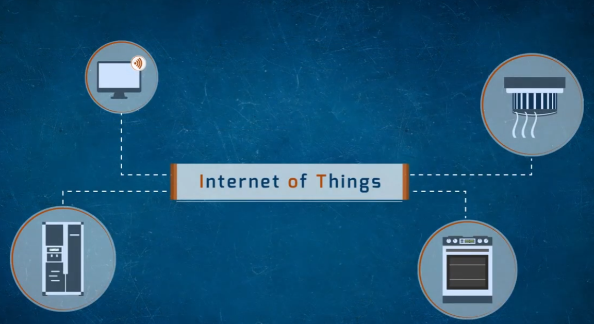
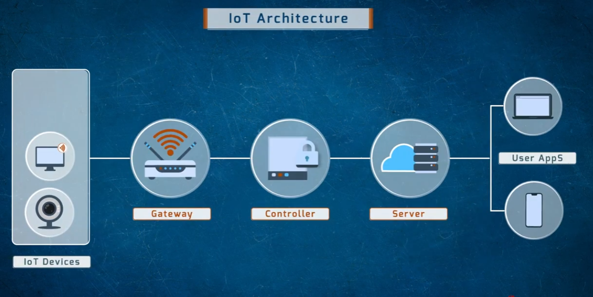
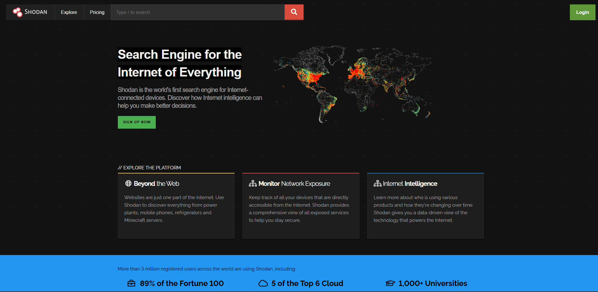

# IoT Security Overview

A visual overview of what the Internet of Things (IoT) is, how a typical IoT system is architected, and how exposed IoT devices can be discovered on the internet.

## What Is the Internet of Things?
IoT refers to everyday devices — beyond traditional computers — that are connected to the internet and can communicate data.

- Devices like desktops/monitors, servers, ovens, and HVAC/vents can all be networked together
- Each device typically has its own sensors or connectivity (e.g., wireless) enabling it to send and receive data
- This connectivity is what enables remote monitoring and control, but it also expands the attack surface beyond conventional IT equipment

## IoT Architecture
A typical IoT deployment moves data through several layers before it reaches an end user.

- **IoT Devices** — sensors and embedded devices (e.g., smart monitors, cameras) that collect data
- **Gateway** — a local wireless hub that aggregates data from nearby devices
- **Controller** — a local system that manages and secures the data flow (often includes access control)
- **Server** — cloud/backend infrastructure that stores and processes data at scale
- **User Apps** — laptops, phones, and other clients that let users view/manage the system

Each hop in this chain — device, gateway, controller, server, and app — is a potential point of failure or attack if not properly secured.

## Discovering Exposed IoT Devices: Shodan
Shodan is a publicly available search engine that indexes internet-connected devices, including many IoT and industrial systems.

- Shodan describes itself as a search engine for "the Internet of Everything," indexing devices like power plants, mobile phones, refrigerators, and more
- It's used defensively to **monitor network exposure** — organizations can search for their own devices to see what's publicly reachable and lock down anything that shouldn't be
- The same visibility is why unsecured or default-configured IoT devices (default passwords, open management ports, no authentication) are easy for anyone — defenders or attackers — to find
- Takeaway for defenders: regularly check whether your own IoT/industrial devices show up on services like Shodan, and remediate any that are unnecessarily exposed

---

## Repository Contents

| File | Description |
|---|---|
| `IOT.png` | What the Internet of Things is — example connected devices |
| `iot-architecture.png` | IoT system architecture: device → gateway → controller → server → apps |
| `iot-shadon.png` | Shodan, a search engine for internet-connected/IoT devices |
