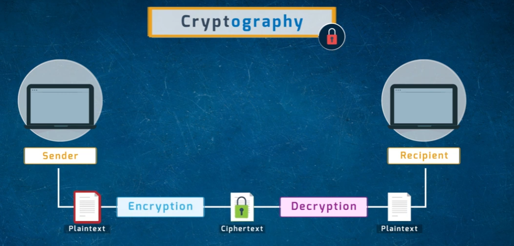
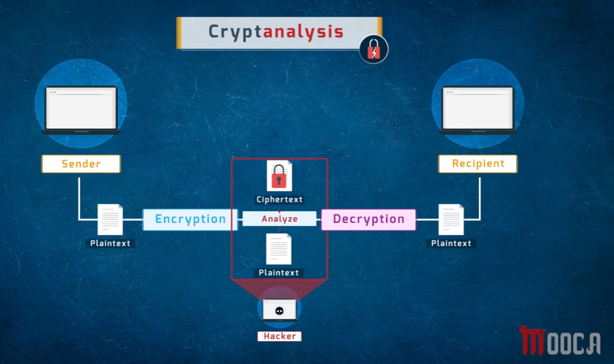
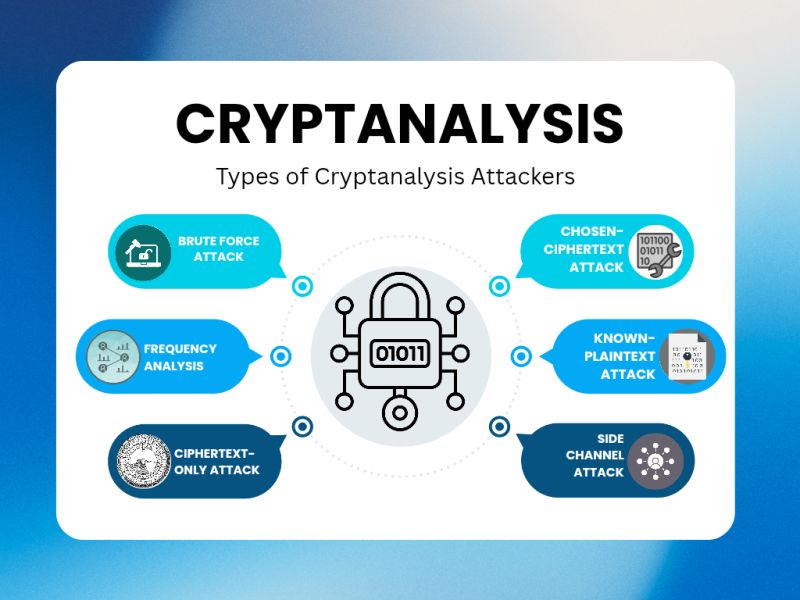
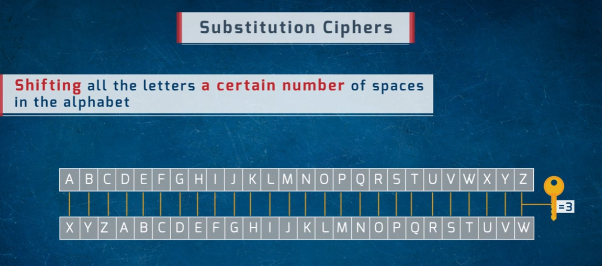
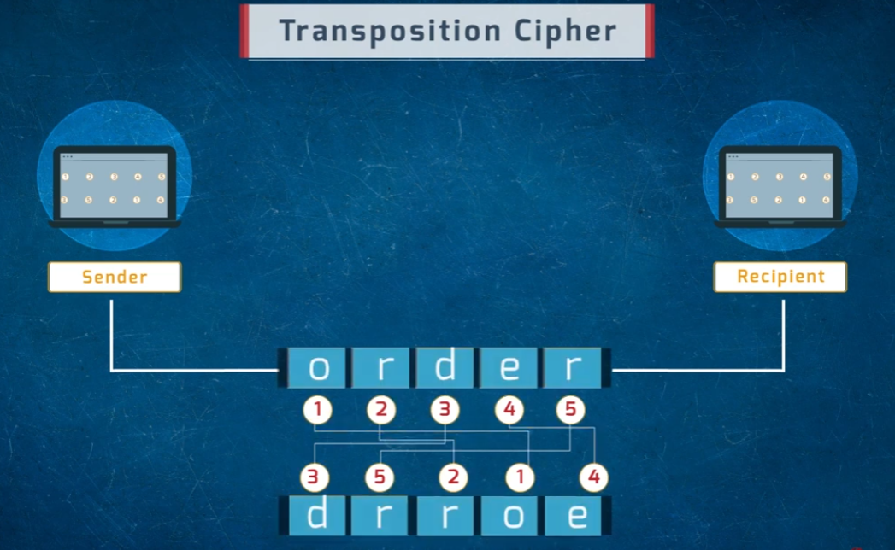
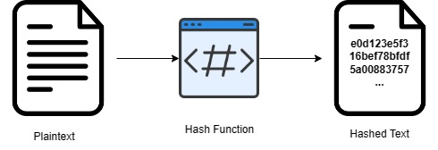
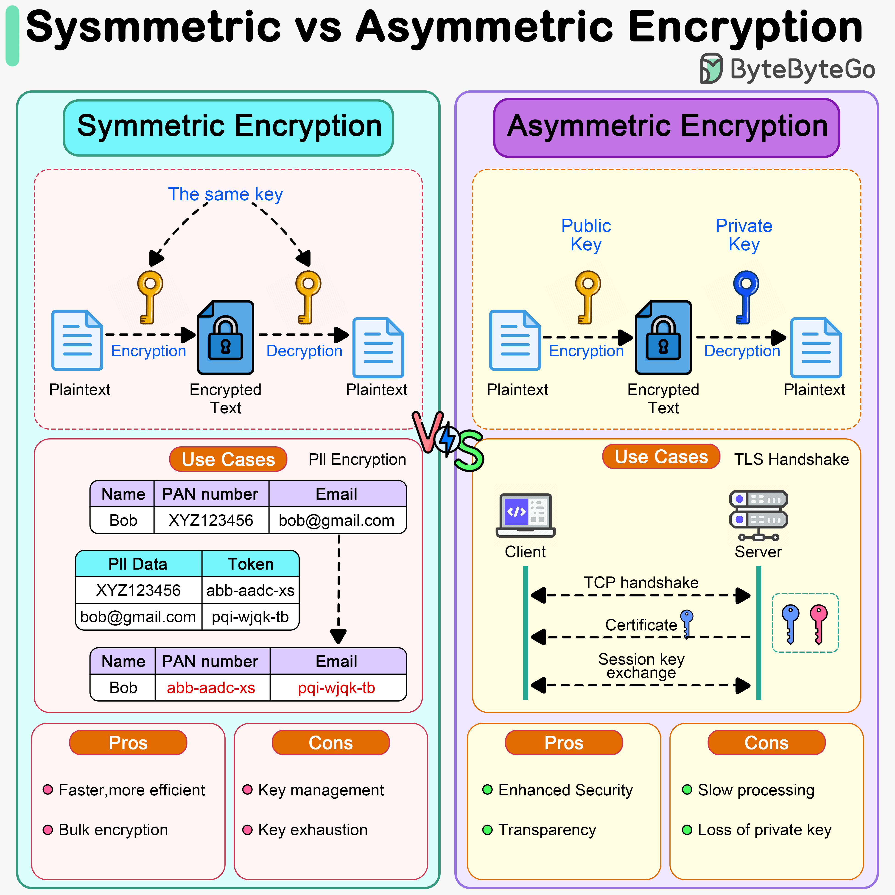

# Cryptography Fundamentals

A visual overview of core cryptography concepts: how encryption protects data, how it can be attacked, common cipher types, hashing, and the symmetric vs. asymmetric encryption trade-off.

## Cryptography Basics
Cryptography protects a message as it travels from sender to recipient by transforming it into an unreadable form and back again.

- **Plaintext** — the original, readable message
- **Encryption** — transforms plaintext into unreadable ciphertext using a key
- **Ciphertext** — the encrypted, unreadable form of the message
- **Decryption** — transforms ciphertext back into the original plaintext using a key

## Cryptanalysis
Cryptanalysis is the practice of studying encrypted communications to recover the original plaintext or the key, typically performed by an attacker without authorized access to the key.

- An attacker intercepts the ciphertext exchanged between sender and recipient
- They analyze the ciphertext (and any known plaintext) to try to break the encryption
- If successful, they recover the original plaintext without ever having the legitimate key

### Types of Cryptanalysis Attacks
Different cryptanalysis techniques rely on different assumptions about what the attacker already has access to:

- **Brute Force Attack** — trying every possible key until the correct one is found
- **Frequency Analysis** — using the statistical frequency of letters/symbols to deduce a substitution cipher's mapping
- **Ciphertext-Only Attack** — analyzing ciphertext alone, with no known plaintext
- **Known-Plaintext Attack** — using known plaintext/ciphertext pairs to deduce the key
- **Chosen-Ciphertext Attack** — submitting chosen ciphertexts for decryption to learn about the key
- **Side Channel Attack** — exploiting information leaked by the physical implementation (timing, power usage, etc.) rather than the algorithm itself

## Classic Ciphers

### Substitution Cipher (Caesar Cipher)
Each letter in the plaintext is replaced with a different letter, shifted a fixed number of positions in the alphabet.

- The example shifts the entire alphabet by 3 positions (the "key" is `3`)
- `A → X`, `B → Y`, `C → Z`, `D → A`, and so on
- This is a simple historical cipher, easily broken today via frequency analysis or brute force since there are only 25 possible shifts

### Transposition Cipher
Rather than substituting characters, a transposition cipher rearranges the position of the characters in the message according to a fixed pattern.

- The word `order` is reordered according to a key sequence (3, 5, 2, 1, 4)
- The result is the scrambled text `drroe`
- The recipient reverses the same positional mapping to recover the original message

## Hashing
Hashing is a one-way transformation: it produces a fixed-length "fingerprint" of data that (unlike encryption) is not meant to be reversed.

- Plaintext is passed through a hash function
- The output is a fixed-length hashed value (e.g., a hex digest)
- Hashing is used for integrity checks and password storage — the same input always produces the same hash, but the hash can't practically be reversed back to the original input

## Symmetric vs. Asymmetric Encryption
The two major families of encryption differ in how many keys are used and who holds them.

### Symmetric Encryption
- Uses **the same key** for both encryption and decryption
- **Use case:** bulk/PII encryption — e.g., tokenizing sensitive fields like a PAN number or email so the same key can encrypt and later decrypt them
- **Pros:** faster and more efficient; well suited to bulk encryption
- **Cons:** key management is harder (the key must be shared securely), and key exhaustion/reuse is a risk

### Asymmetric Encryption
- Uses a **key pair** — a public key for encryption and a private key for decryption
- **Use case:** TLS handshakes — a client and server perform a TCP handshake, the server presents a certificate containing its public key, and a session key is exchanged
- **Pros:** enhanced security (the private key never needs to be shared) and transparency (public keys can be freely distributed)
- **Cons:** slower processing than symmetric encryption, and losing the private key is catastrophic since it can't be recovered or reissued the same way a symmetric key can

---

## Repository Contents

| File | Description |
|---|---|
| `cryptography.png` | Cryptography basics: plaintext, encryption, ciphertext, decryption |
| `cryptanalysis.png` | How a cryptanalysis attack intercepts and analyzes ciphertext |
| `cryptoanalysis-attack.jpg` | Types of cryptanalysis attacks |
| `ceaser-cipher.png` | Caesar/substitution cipher example |
| `transportation-cipher.png` | Transposition cipher example |
| `hashing.webp` | How a hash function transforms plaintext into a fixed hash |
| `symmetric-encryption-vs-asymmetric-encryption.png` | Symmetric vs. asymmetric encryption comparison |
