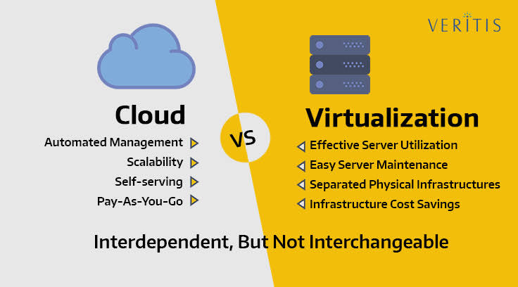
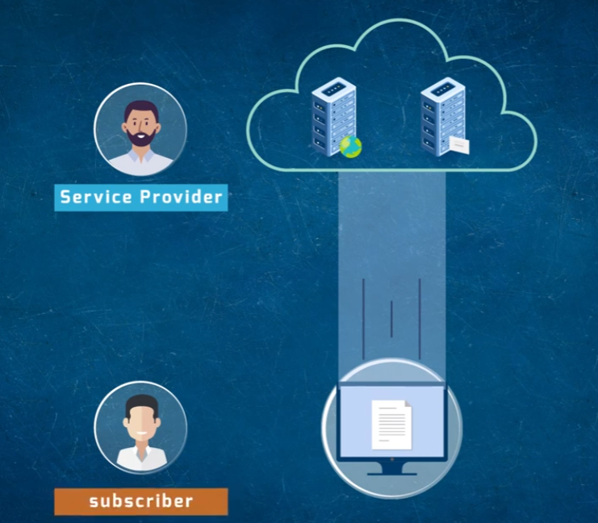
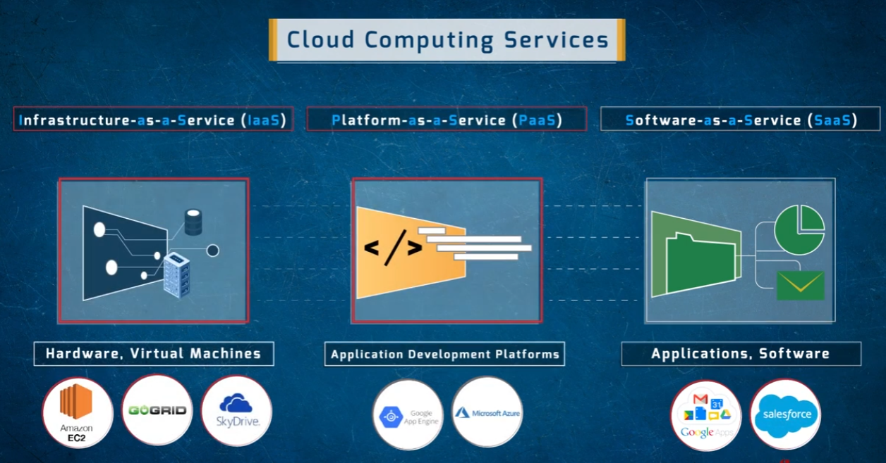
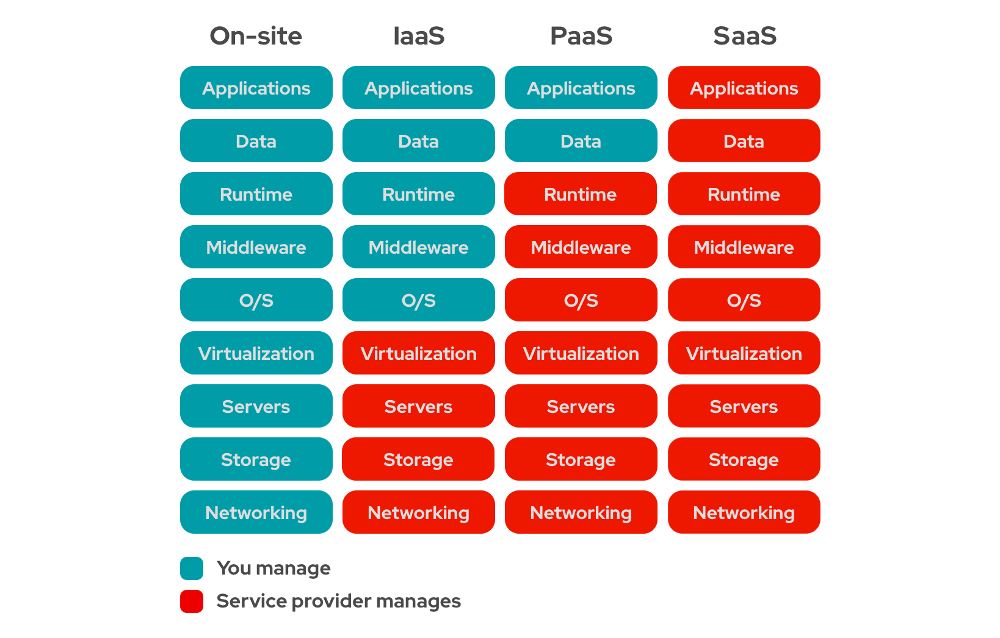
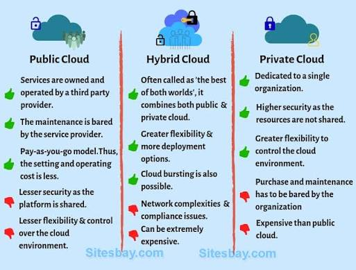
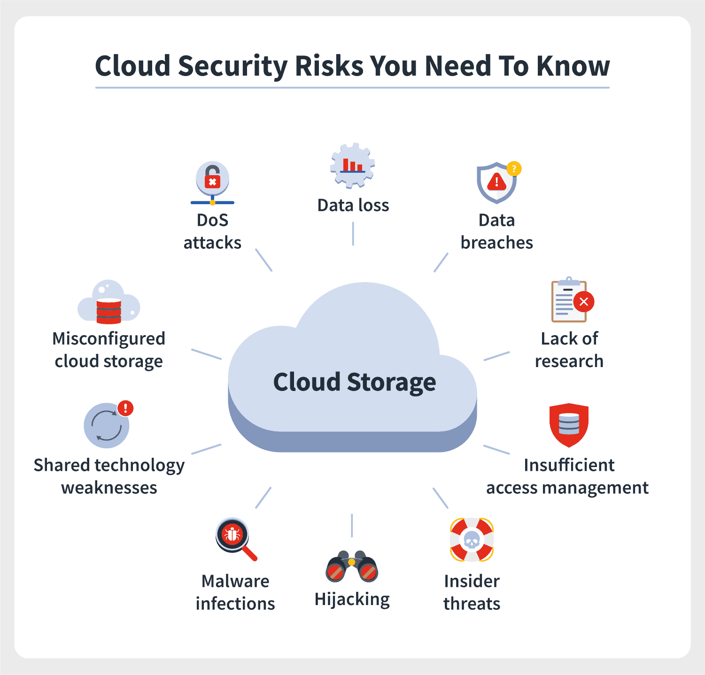

# Cloud Computing Overview

A visual overview of core cloud computing concepts: how cloud differs from virtualization, the service models, deployment models, key roles, benefits, and security risks.

## Cloud vs. Virtualization
Cloud and virtualization are closely related but not the same thing — they're interdependent, not interchangeable.

- **Cloud** — automated management, scalability, self-service, pay-as-you-go pricing
- **Virtualization** — effective server utilization, easier server maintenance, separated physical infrastructures, infrastructure cost savings
- Virtualization is a technology that clouds are often built on top of, but cloud adds automation, self-service, and elastic billing on top of virtualized infrastructure

## Cloud Roles: Service Provider & Subscriber
Cloud computing involves a basic relationship between whoever operates the infrastructure and whoever consumes it.

- The **service provider** owns and operates the cloud infrastructure (servers, storage, networking)
- The **subscriber** accesses and uses services/data delivered from that infrastructure over the internet
- This separation of ownership from usage is what enables pay-as-you-go, on-demand consumption

## Cloud Computing Service Models
Cloud services are typically categorized by how much of the stack the provider manages versus the customer.

- **IaaS (Infrastructure-as-a-Service)** — hardware and virtual machines (e.g., Amazon EC2, GoGrid, SkyDrive)
- **PaaS (Platform-as-a-Service)** — application development platforms (e.g., Google App Engine, Microsoft Azure)
- **SaaS (Software-as-a-Service)** — ready-to-use applications and software (e.g., Google Apps/Gmail, Salesforce)

### Shared Responsibility Across Models
As you move from on-site infrastructure toward SaaS, the provider takes on more of the management burden:

| Layer | On-site | IaaS | PaaS | SaaS |
|---|---|---|---|---|
| Applications | You | You | You | Provider |
| Data | You | You | You | Provider |
| Runtime | You | You | Provider | Provider |
| Middleware | You | You | Provider | Provider |
| O/S | You | You | Provider | Provider |
| Virtualization | You | Provider | Provider | Provider |
| Servers | You | Provider | Provider | Provider |
| Storage | You | Provider | Provider | Provider |
| Networking | You | Provider | Provider | Provider |

- Moving right shifts more operational and security responsibility onto the provider — but the customer is always responsible for at least their own applications and data

## Cloud Deployment Models
Beyond service model, clouds also differ by who they're deployed for and how resources are shared.

- **Public Cloud** — owned/operated by a third party; lower maintenance and cost (pay-as-you-go), but less security and control since the platform is shared
- **Private Cloud** — dedicated to a single organization; higher security since resources aren't shared, and more control, but the organization bears the cost and maintenance and it's more expensive than public cloud
- **Hybrid Cloud** — combines public and private ("best of both worlds"); offers more flexibility and deployment options and supports cloud bursting, but introduces network complexity, compliance issues, and can get expensive

## Benefits of Cloud Computing
Common advantages organizations look for when adopting cloud infrastructure:

- Agility and speed
- Elasticity
- Cost savings
- Global reach
- Performance
- Security
- Productivity
- Reliability

## Cloud Security Risks
Along with its benefits, cloud storage introduces a distinct set of security risks to plan for:

- DoS attacks
- Data loss
- Data breaches
- Lack of research (adopting cloud services without understanding their security posture)
- Insufficient access management
- Insider threats
- Hijacking (of accounts or sessions)
- Malware infections
- Shared technology weaknesses (multi-tenant infrastructure risk)
- Misconfigured cloud storage

---

## Repository Contents

| File | Description |
|---|---|
| `cloud-vs-virtualization.jpg` | Cloud vs. virtualization comparison |
| `cloud.png` | Cloud service provider and subscriber relationship |
| `iaas-paas-saas.png` | IaaS, PaaS, and SaaS service models with example providers |
| `iaas-paas-saas-diagram.png` | Shared responsibility across on-site/IaaS/PaaS/SaaS |
| `private-public-hybrid-cloud.jpg` | Public, private, and hybrid cloud deployment models |
| `cloud-benefits.png` | Benefits of cloud computing (rendered from `cloud-benefits.svg`) |
| `cloud-security-risk-you-need-to-know.png` | Cloud security risks overview |
