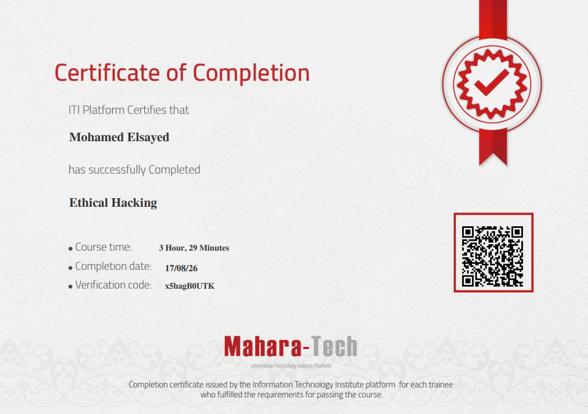

# Ethical Hacking Course — Notes & Walkthroughs

Personal notes, screenshots, and lab walkthroughs from an **Ethical Hacking** course completed on the ITI (Information Technology Institute) **Mahara-Tech** platform.

- **Trainee:** Mohamed Elsayed
- **Course:** Ethical Hacking
- **Platform:** Mahara-Tech (ITI)
- **Course time:** 3 Hours, 29 Minutes
- **Completion date:** 17/08/26
- **Verification code:** `x5hagB0UTK`

---

## Course Modules

The course is organized into 40 topic folders, tracking the standard ethical hacking methodology from foundations through to specialized domains (mobile, IoT, cryptography, cloud):

01. Ethics and Hacking
02. Key Terminology and Concepts in Cybersecurity and Hacking
03. Core Concepts and Fundamentals of Information Security
04. Comprehensive Overview of Cyber Attack Vectors and Threat Categories
05. The Five-Step Hacking Methodology Explained
06. Understanding the Reconnaissance (Footprinting) Phase in Cybersecurity
07. Fundamentals of Reconnaissance in Ethical Hacking
08. Mastering Reconnaissance with Google Operators and Shodan.io
09. Extracting and Analyzing Website Data Using Specialized Tools
10. Email Tracking with ReadNotify
11. DNS & WHOIS Reconnaissance with nslookup and WHOIS
12. Scanning TCP/UDP Protocols and Port Scan Techniques
13. Nmap Scanning Walkthrough — Live Hosts, Ports, OS, and Service Versions
14. Banner Grabbing Toolkit
15. UnreallRCd Exploitation & Nessus Vulnerability Scan
17. Anonymization — Proxy Configuration with Zero Omega
20. Enumeration — Techniques & Types
21. System Hacking — The Five Hacking Phases
22. Password Attacks — Concepts Overview
23. Password Cracking Lab — John the Ripper & Hashcat
24. Metasploitable 2 — Exploitation Lab Walkthrough
25. Maintaining Access — Hiding Files with NTFS Alternate Data Streams
26. Covering Tracks — Methods & Tools
27. Malware — Types, Distribution Techniques & Infection Vectors
28. Trojan Horse — Mechanics, Usage & Common Ports
29. Virus & Worm — Malware Deep Dive
30. Spyware & Virus Simulation Lab
31. Social Engineering
32. Phishing Lab — Social-Engineer Toolkit (SET) Walkthrough
33. Web Server Attacks
34. Lab: Metasploitable / DVWA — Apache Shellshock & Command Injection
35. Wireless Threats
36. Mobile Security
37. Android Malware & Spyware Detection Indicators
38. IoT Security Overview
39. Cryptography Fundamentals
40. Cloud Computing Overview

> Module numbers 16, 18, and 19 do not appear in the folder listing and may have been merged into adjacent topics or are not included in this notes repo.

---

## Available Write-Ups in This Repo

The following modules have been written up as standalone READMEs with accompanying screenshots/diagrams:

| Module | README |
|---|---|
| 31. Social Engineering | [`social-engineering-README.md`](social-engineering-README.md) |
| 32. Phishing Lab (SET) | [`phishing-lab-README.md`](phishing-lab-README.md) |
| 33. Web Server Attacks | [`web-server-attacks-README.md`](web-server-attacks-README.md) |
| 34. Metasploitable/DVWA Lab | [`dvwa-metasploitable-lab-README.md`](dvwa-metasploitable-lab-README.md) |
| 35. Wireless Threats | [`wireless-threats-README.md`](wireless-threats-README.md) |
| 36. Mobile Security | [`mobile-security-README.md`](mobile-security-README.md) |
| 37. Android Malware & Spyware Indicators (defensive) | [`android-malware-indicators-README.md`](android-malware-indicators-README.md) |
| 38. IoT Security Overview | [`iot-security-README.md`](iot-security-README.md) |
| 39. Cryptography Fundamentals | [`cryptography-README.md`](cryptography-README.md) |
| 40. Cloud Computing Overview | [`cloud-computing-README.md`](cloud-computing-README.md) |

Earlier modules (01–30, covering ethics, reconnaissance, scanning, enumeration, system hacking, password attacks, and malware fundamentals) are not yet written up in this repo.

---

## Repository Contents

| File | Description |
|---|---|
| `cert.png` | Course completion certificate (ITI Mahara-Tech, Ethical Hacking) |
| `*-README.md` | Per-module write-ups listed above |
| `*.png` / `*.jpg` / `*.webp` | Supporting screenshots and diagrams referenced by each module README |
