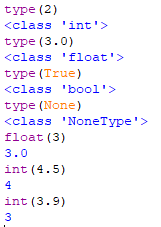

# Python Data Types

A quick reference on Python's built-in data types, based on the examples below.



## Checking a type with `type()`

The `type()` function returns the type (class) of any value.

```python
type(2)      # <class 'int'>
type(3.0)    # <class 'float'>
type(True)   # <class 'bool'>
type(None)   # <class 'NoneType'>
```

## Core built-in types

| Value | `type()` output | Description |
|---|---|---|
| `2` | `<class 'int'>` | Whole number, no decimal point |
| `3.0` | `<class 'float'>` | Number with a decimal point |
| `True` | `<class 'bool'>` | Boolean — `True` or `False` |
| `None` | `<class 'NoneType'>` | Represents "no value" / absence of a value |

### `int` — Integer
Whole numbers, positive or negative, with no fractional part.
```python
type(2)  # <class 'int'>
```

### `float` — Floating point number
Numbers that include a decimal point.
```python
type(3.0)  # <class 'float'>
```

### `bool` — Boolean
Only two possible values: `True` or `False`. In Python, `bool` is technically a subclass of `int` (`True == 1`, `False == 0`).
```python
type(True)  # <class 'bool'>
```

### `NoneType` — None
`None` is Python's null value, representing the absence of a value. Its type is `NoneType`.
```python
type(None)  # <class 'NoneType'>
```

## Type conversion (casting)

Python lets you convert between types using `int()`, `float()`, `str()`, `bool()`, etc.

```python
float(3)    # 3.0   — int to float
int(4.5)    # 4     — float to int (truncates, does NOT round)
int(3.9)    # 3     — truncates toward zero, not nearest
```

⚠️ **Important:** `int()` on a float **truncates** the decimal part rather than rounding.
- `int(4.5)` → `4` (not `5`)
- `int(3.9)` → `3` (not `4`)

If you need rounding instead of truncation, use `round()`:
```python
round(4.5)  # 4 (banker's rounding — rounds to even)
round(3.9)  # 4
```

## Summary

| Conversion | Behavior |
|---|---|
| `int → float` | Adds `.0`, no data lost |
| `float → int` | Truncates decimal part (drops it, doesn't round) |
| Any value → `type()` | Returns its class, e.g. `<class 'int'>` |
