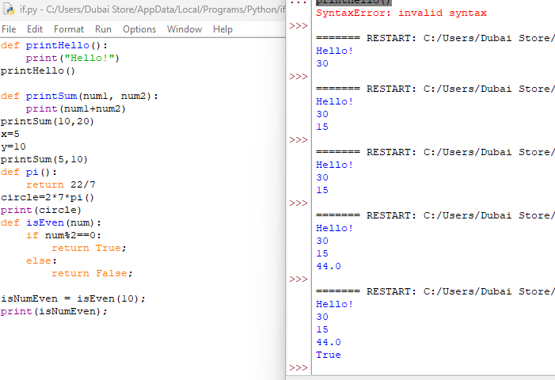

# Python Functions

A quick reference on defining and calling functions, based on the examples below.



## Defining and calling a function

```python
def printHello():
    print("Hello!")

printHello()
```
**Output:** `Hello!`

- `def` starts a function definition; `printHello` is the function's name.
- The indented block underneath is the function's **body** — the code that runs when the function is called.
- Defining a function doesn't run it. `printHello()` — with parentheses — is what actually **calls** (executes) it.

## Functions with parameters

```python
def printSum(num1, num2):
    print(num1 + num2)

printSum(10, 20)   # 30
printSum(5, 10)    # 15
```

- `num1` and `num2` are **parameters** — placeholders for values the caller supplies.
- `printSum(10, 20)` passes `10` and `20` as **arguments**, which fill in `num1` and `num2` inside the function.
- Note that `x = 5` and `y = 10` defined earlier in the file are unrelated to this call — `printSum(5, 10)` uses literal values, not those variables (though it happens to produce the same numbers by coincidence).

## Functions with `return`

```python
def pi():
    return 22/7

circle = 2 * 7 * pi()
print(circle)   # 44.0
```

- `return` sends a value **back** to wherever the function was called, so it can be used in further computation — unlike `print()`, which just displays something and gives nothing back to the code.
- `pi()` returns `22/7` (≈ `3.142857...`), and that returned value is used directly in the expression `2 * 7 * pi()`, then stored in `circle`.
- ⚠️ A function without `return` implicitly returns `None`. If you try to use its result in a calculation, you'll get an error or unexpected `None` value.

## Functions with conditional logic and `return`

```python
def isEven(num):
    if num % 2 == 0:
        return True
    else:
        return False

isNumEven = isEven(10)
print(isNumEven)   # True
```

- A function can contain full conditional logic, just like top-level code.
- `return` immediately exits the function with the given value — execution never reaches both `return True` and `return False` in the same call; only one branch runs.
- The returned value (`True`) is stored in `isNumEven` and can be reused, unlike a plain `print()` inside the function.

## Common mistake: missing parentheses

The syntax error at the top of the image (`printHello()` shown as `SyntaxError: invalid syntax`) is a reminder that function **definitions and calls both require parentheses** — even for functions that take no parameters, like `printHello()`. Leaving them off, mismatching them, or malforming the `def` line will break the script before it runs.

## Summary

| Concept | Purpose |
|---|---|
| `def name(params):` | Defines a reusable block of code |
| `name(args)` | Calls (executes) the function with specific values |
| Parameters vs. arguments | Parameters are placeholders in the definition; arguments are the actual values passed in |
| `return value` | Sends a result back to the caller for further use |
| No `return` statement | Function implicitly returns `None` |
| `print()` inside a function | Displays output but does **not** make the value usable elsewhere |
