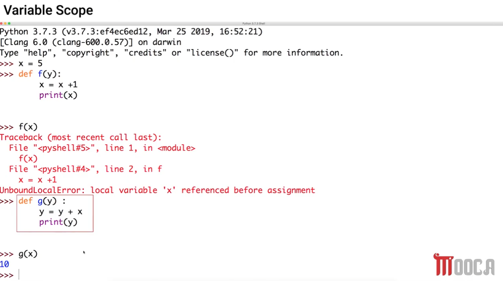

# Python Variable Scope

A quick reference on local vs. global variables, and the classic pitfall of assigning to a variable inside a function.

## Example 1 — A local variable shadows the global one


```python
def f(y):
    x = 1
    x += 1
    print(x)

x = 5
f(x)
print(x)
```

**Output:** `2`, then `5`

- Inside `f`, the line `x = 1` creates a **brand-new local variable** named `x`, living only inside `f`'s own memory space (its "function scope"). It has no connection to the global `x`.
- `x += 1` updates that local `x` to `2`, and `print(x)` (inside `f`) prints `2`.
- The global `x` (`5`) is never touched by anything happening inside `f` — it's a completely separate variable that just happens to share the same name.
- After `f(x)` returns, the outer `print(x)` refers to the **global** `x`, which is still `5`.

**Two separate memory boxes exist at the same time:**

| Global scope | `f`'s function scope |
|---|---|
| `x = 5` | `x = 2` |

## Example 2 — Reading a global variable (no local assignment)


```python
def g(y):
    print(x)
    print(x+1)

x = 5
g(x)
print(x)
```

**Output:** `5`, then `6`

- `g` never assigns to `x` — it only **reads** it. Since there's no local `x` created, Python looks it up in the **global scope** and finds `5`.
- `print(x)` prints `5`; `print(x+1)` prints `6`. The global `x` is unaffected either way.

**Key difference from Example 1:** reading a variable is always safe and falls back to the enclosing (global) scope. **Assigning** to a variable anywhere inside a function is what creates a new local variable instead.

## Example 3 — The `UnboundLocalError` trap



```python
x = 5

def f(y):
    x = x + 1
    print(x)

f(x)
```
```
UnboundLocalError: local variable 'x' referenced before assignment
```

This is the case that trips people up the most:

- Because the function body contains `x = x + 1` (an **assignment** to `x`), Python decides that `x` is **local to the whole function** — for *every* line in `f`, not just from the assignment line onward.
- That means when Python evaluates the **right-hand side** `x + 1`, it's already treating `x` as the (not-yet-created) local variable — not the global one — and fails because that local `x` doesn't have a value yet.
- ⚠️ This is a compile-time scoping decision, not a line-by-line one: Python decides a name is local based on whether it's assigned *anywhere* in the function, regardless of the order of the lines.

### The fix: read from an outer variable without reassigning it

```python
def g(y):
    y = y + x   # x is only read here, never assigned — stays global
    print(y)

g(x)   # 10
```

- `g` assigns to `y` (its own parameter — always local, no conflict) but only **reads** `x`. Since `x` is never assigned inside `g`, Python treats it as the global `x` and looks it up successfully.
- `g(x)` → `y = 5 + 5` → prints `10`.

## Summary

| Situation | Behavior |
|---|---|
| Variable is only **read** inside a function | Python falls back to the enclosing/global scope |
| Variable is **assigned** anywhere inside a function | Python treats it as local for the *entire* function body |
| Local variable assigned before being read | Works fine, independent of any global with the same name |
| Local variable **read before its assignment line runs** (but assigned later in the function) | `UnboundLocalError: local variable referenced before assignment` |
| Need to modify a global variable from inside a function | Requires the `global` keyword (not shown here) — otherwise assignment always creates a local |
