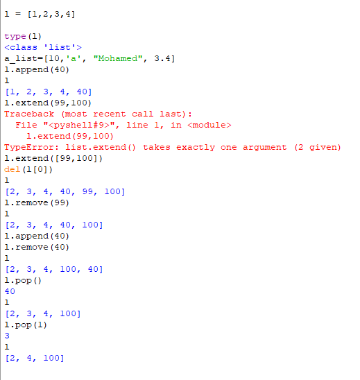
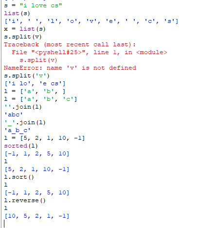
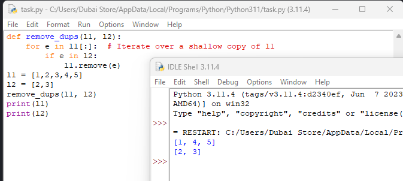
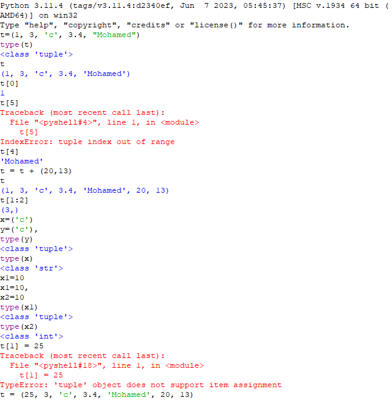
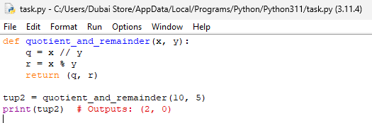
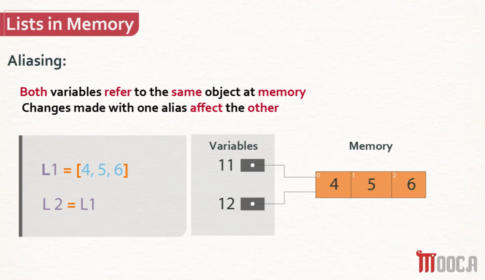
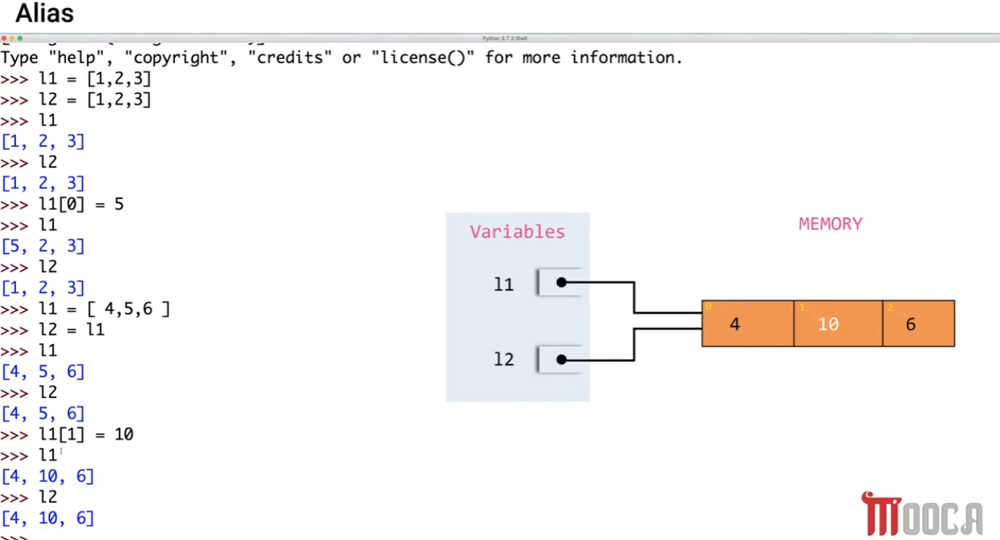
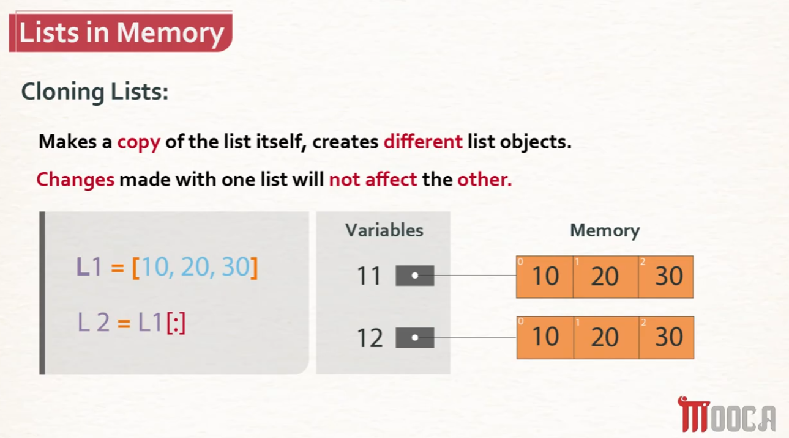

# Python Lists, Tuples, Aliasing & Cloning

A quick reference on list/tuple operations and one of Python's most important gotchas: the difference between **aliasing** (sharing the same list) and **cloning** (making an independent copy).

## Lists — basics and methods



```python
l = [1, 2, 3, 4]
type(l)          # <class 'list'>

a_list = [10, 'a', "Mohamed", 3.4]   # lists can mix types freely
```

### Common list methods



```python
l.append(40)          # [1, 2, 3, 4, 40]        — adds ONE item to the end

l.extend(99, 100)
# TypeError: list.extend() takes exactly one argument (2 given)

l.extend([99, 100])   # [1, 2, 3, 4, 40, 99, 100] — extend() needs an iterable (one argument)

del l[0]               # [2, 3, 4, 40, 99, 100]   — deletes by index

l.remove(99)           # [2, 3, 4, 40, 100]        — deletes by VALUE (first match)

l.append(40)            # [2, 3, 4, 40, 100, 40]
l.remove(40)            # [2, 3, 4, 100, 40]        — removes only the FIRST 40 found

l.pop()                 # returns 40, list becomes [2, 3, 4, 100]  — pop with no arg removes the LAST item
l.pop(1)                # returns 3, list becomes [2, 4, 100]      — pop(i) removes item at index i
```

| Method | What it does |
|---|---|
| `l.append(x)` | Adds a single item `x` to the end |
| `l.extend(iterable)` | Adds each item from an iterable (list, etc.) to the end — takes exactly **one** argument |
| `del l[i]` | Deletes the item at index `i` |
| `l.remove(x)` | Deletes the **first** occurrence of value `x` (raises an error if not found) |
| `l.pop()` | Removes and **returns** the last item |
| `l.pop(i)` | Removes and **returns** the item at index `i` |

## Strings ↔ lists, sorting


```python
s = "i love cs"
list(s)
# ['i', ' ', 'l', 'o', 'v', 'e', ' ', 'c', 's']

x = list(s)

s.split(v)
# NameError: name 'v' is not defined     — v needs to be a string, e.g. 'v'

s.split('v')
# ['i lo', 'e cs']    — splits on the given separator

l = ['a', 'b', ' ']
l = ['a', 'b', 'c']

''.join(l)     # 'abc'      — joins list items with no separator
'_'.join(l)    # 'a_b_c'    — joins list items with '_' between them

l = [5, 2, 1, 10, -1]

sorted(l)      # [-1, 1, 2, 5, 10]   — returns a NEW sorted list; l is unchanged
l              # [5, 2, 1, 10, -1]   — original still in original order

l.sort()       # sorts l IN PLACE — no return value
l              # [-1, 1, 2, 5, 10]

l.reverse()    # reverses l IN PLACE
l              # [10, 5, 2, 1, -1]
```

⚠️ **`sorted(l)` vs. `l.sort()`:**
- `sorted(l)` returns a new list and leaves `l` untouched.
- `l.sort()` sorts `l` in place and returns `None` — assigning `l2 = l.sort()` gives you `l2 = None`, not a sorted list! (See the aliasing section below for a live example of this exact mistake.)

## Removing duplicates between two lists



```python
def remove_dups(l1, l2):
    for e in l1[:]:      # Iterate over a shallow copy of l1
        if e in l2:
            l1.remove(e)

l1 = [1, 2, 3, 4, 5]
l2 = [2, 3]
remove_dups(l1, l2)
print(l1)   # [1, 4, 5]
print(l2)   # [2, 3]
```

⚠️ **Why `l1[:]` and not just `l1`?** The loop calls `l1.remove(e)`, which *modifies `l1` while iterating over it*. Looping directly over `l1` while removing from it can skip elements or behave unpredictably, because the list shrinks under the loop's feet. Looping over `l1[:]` (a **copy**) instead means the loop's sequence stays fixed length, while `l1.remove(e)` safely shrinks the real list.

## Tuples — immutable sequences



```python
t = (1, 3, 'c', 3.4, "Mohamed")
type(t)     # <class 'tuple'>

t[0]        # 1
t[5]
# IndexError: tuple index out of range

t[4]        # 'Mohamed'

t = t + (20, 13)
t           # (1, 3, 'c', 3.4, 'Mohamed', 20, 13)

t[1:2]      # (3,)     — slicing a tuple returns a tuple

x = ('c')          # this is just the STRING 'c' in parentheses
y = ('c',)         # the trailing comma makes this a real 1-element TUPLE
type(y)     # <class 'tuple'>
type(x)     # <class 'str'>
```

⚠️ **The trailing comma matters.** `('c')` is *not* a tuple — parentheses alone don't make a tuple, Python just sees a string in parentheses. `('c',)` — with the comma — is a genuine one-item tuple.

```python
x1 = 10
x1 = 10       # a tuple assignment shown for comparison
x2 = 10
type(x1)      # <class 'tuple'>
type(x2)      # <class 'int'>

t[1] = 25
# TypeError: 'tuple' object does not support item assignment
```

⚠️ **Tuples are immutable** — once created, you cannot change, add, or remove individual elements (`t[1] = 25` fails). You *can* build a brand-new tuple via concatenation (`t = t + (20, 13)`), but that creates a new tuple object rather than modifying the original in place.

### Returning multiple values with tuples



```python
def quotient_and_remainder(x, y):
    q = x // y
    r = x % y
    return (q, r)

tup2 = quotient_and_remainder(10, 5)
print(tup2)   # Outputs: (2, 0)
```

Returning a tuple like `(q, r)` is the standard Python way to return **multiple values** from a single function call — the caller can unpack it (`q, r = quotient_and_remainder(10, 5)`) or use it as a single tuple, as shown here.

## Lists in Memory: Aliasing vs. Cloning

This is the single most important concept for avoiding bugs with mutable data structures like lists.

### Aliasing — two names, ONE shared list



```python
L1 = [4, 5, 6]
L2 = L1        # L2 is now an ALIAS for L1 — same object, two names
```

**Both variables refer to the same object in memory. Changes made through one alias affect the other.**



```python
l1 = [1, 2, 3]
l2 = [1, 2, 3]     # a SEPARATE list that happens to have equal contents
l1[0] = 5
l1        # [5, 2, 3]
l2        # [1, 2, 3]   — unaffected, since l1 and l2 are different objects here

l1 = [4, 5, 6]
l2 = l1            # NOW l2 is an alias of l1 — same object
l1        # [4, 5, 6]
l2        # [4, 5, 6]
l1[1] = 10
l1        # [4, 10, 6]
l2        # [4, 10, 6]   — changed too! Same underlying list.
```



```python
l2[2] = 0
l2        # [4, 10, 0]
l1        # [4, 10, 0]   — l1 changed even though we modified l2!
```

⚠️ **Watch out for `.sort()` here too:**
```python
L1 = [5, -2, 10]
L2 = L1.sort()     # .sort() sorts L1 in place and returns None
L1        # [-2, 5, 10]
print(L2)          # None      — L2 is NOT the sorted list, it's None!
```
This is the same trap mentioned above: assigning the *result* of `.sort()` gives you `None`, because `.sort()`'s job is to mutate the list in place, not to hand back a new one.

### Cloning — two names, TWO independent lists


```python
L1 = [10, 20, 30]
L2 = L1[:]         # the [:] slice makes a COPY — a new, independent list
```

**Cloning makes a copy of the list itself, creating a different list object. Changes made through one list do NOT affect the other.**

```python
l1 = [10, 20, 30]
l2 = l1[:]         # clone via full slice
l1        # [10, 20, 30]
l2        # [10, 20, 30]

l1[0] = 99
l1        # [99, 20, 30]
l2        # [10, 20, 30]   — unchanged! l2 is a separate object.
```

## Aliasing vs. Cloning — Summary

| | `L2 = L1` (Aliasing) | `L2 = L1[:]` (Cloning) |
|---|---|---|
| Objects in memory | **One** shared list | **Two** independent lists |
| Modifying `L1` | Also changes `L2` | `L2` stays unchanged |
| Modifying `L2` | Also changes `L1` | `L1` stays unchanged |
| Use when | You want two names for the *same* data | You need an independent copy to modify safely |

| Concept | Key takeaway |
|---|---|
| `append` vs `extend` | `append` adds one item; `extend` merges in items from an iterable |
| `remove` vs `pop` vs `del` | `remove(value)` deletes by value; `pop(i)` deletes by index and returns it; `del l[i]` deletes by index, no return |
| `sorted()` vs `.sort()` | `sorted()` returns a new list; `.sort()` mutates in place and returns `None` |
| Tuples | Immutable — can't reassign elements, but can build new tuples via `+` |
| `(x,)` vs `(x)` | Trailing comma is required to make a genuine single-element tuple |
| Aliasing (`L2 = L1`) | Both names point to the **same** list — mutations through either name are visible via both |
| Cloning (`L2 = L1[:]`) | Creates an **independent** copy — mutations through one don't affect the other |
