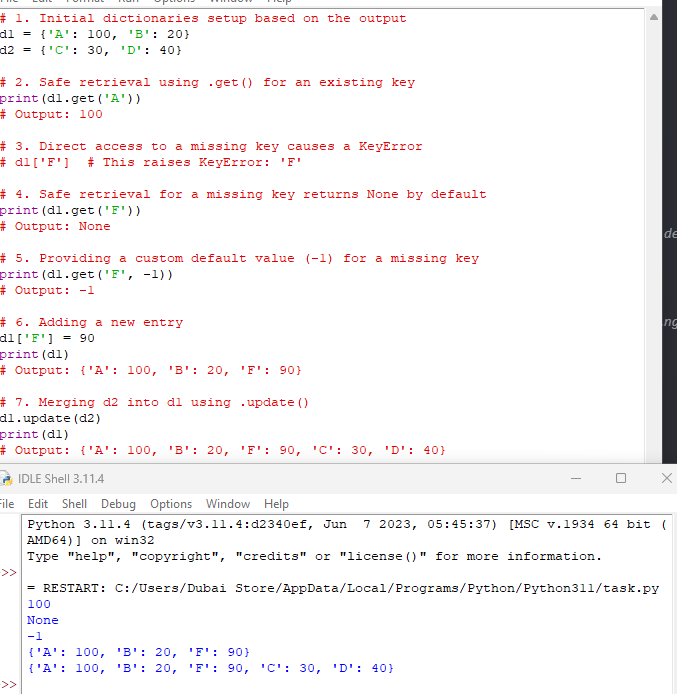
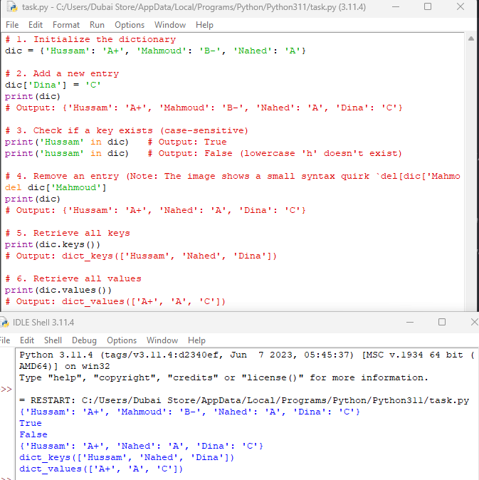

# Python Dictionaries

A quick reference on key-value storage: safe lookups, adding/removing entries, merging, and inspecting keys/values.

## Safe retrieval with `.get()`



```python
# 1. Initial dictionaries
d1 = {'A': 100, 'B': 20}
d2 = {'C': 30, 'D': 40}

# 2. Safe retrieval using .get() for an existing key
print(d1.get('A'))
# Output: 100

# 3. Direct access to a missing key causes a KeyError
d1['F']   # This raises KeyError: 'F'

# 4. Safe retrieval for a missing key returns None by default
print(d1.get('F'))
# Output: None

# 5. Providing a custom default value (-1) for a missing key
print(d1.get('F', -1))
# Output: -1
```

- `d1['A']` and `d1.get('A')` both return `100` for a key that exists.
- The difference shows up with a **missing key**: `d1['F']` raises a `KeyError` and crashes the program, while `d1.get('F')` returns `None` instead of erroring.
- `.get(key, default)` lets you supply your own fallback value (`-1` here) instead of `None`, which is handy for counting or aggregating without special-casing missing keys.

⚠️ **Use `.get()` whenever a key might not exist** — it's the safe alternative to `d[key]`, which crashes on a miss.

## Adding entries and merging dictionaries

```python
# 6. Adding a new entry
d1['F'] = 90
print(d1)
# Output: {'A': 100, 'B': 20, 'F': 90}

# 7. Merging d2 into d1 using .update()
d1.update(d2)
print(d1)
# Output: {'A': 100, 'B': 20, 'F': 90, 'C': 30, 'D': 40}
```

- Assigning to a new key (`d1['F'] = 90`) adds it to the dictionary — no special "add" method needed, unlike lists.
- `d1.update(d2)` merges all of `d2`'s key-value pairs into `d1`. If a key exists in both, `d2`'s value wins and overwrites `d1`'s.

## Checking, removing, and inspecting entries



```python
# 1. Initialize the dictionary
dic = {'Hussam': 'A+', 'Mahmoud': 'B-', 'Nahed': 'A'}

# 2. Add a new entry
dic['Dina'] = 'C'
print(dic)
# Output: {'Hussam': 'A+', 'Mahmoud': 'B-', 'Nahed': 'A', 'Dina': 'C'}

# 3. Check if a key exists (case-sensitive)
print('Hussam' in dic)   # Output: True
print('hussam' in dic)   # Output: False (lowercase 'h' doesn't exist)

# 4. Remove an entry
del dic['Mahmoud']
print(dic)
# Output: {'Hussam': 'A+', 'Nahed': 'A', 'Dina': 'C'}

# 5. Retrieve all keys
print(dic.keys())
# Output: dict_keys(['Hussam', 'Nahed', 'Dina'])

# 6. Retrieve all values
print(dic.values())
# Output: dict_values(['A+', 'A', 'C'])
```

- **`in`** checks membership against **keys only** by default, and it's case-sensitive — `'hussam' in dic` is `False` even though `'Hussam'` exists, because the casing doesn't match.
- **`del dic[key]`** removes a key-value pair entirely. Like direct indexing, `del` on a missing key raises a `KeyError`.
- **`.keys()`** and **`.values()`** return special `dict_keys` / `dict_values` view objects — not plain lists — but they behave like iterables and print in a list-like format. Wrap them in `list(...)` if you need an actual list.

## Summary

| Operation | Syntax | Notes |
|---|---|---|
| Direct access | `d[key]` | Raises `KeyError` if `key` is missing |
| Safe access | `d.get(key)` | Returns `None` if `key` is missing |
| Safe access with default | `d.get(key, default)` | Returns `default` instead of `None` |
| Add / update an entry | `d[key] = value` | Adds the key if new, overwrites if it exists |
| Merge another dict in | `d.update(other)` | `other`'s values win on key conflicts |
| Membership check | `key in d` | Checks keys, case-sensitive |
| Delete an entry | `del d[key]` | Raises `KeyError` if `key` is missing |
| Get all keys | `d.keys()` | Returns a `dict_keys` view |
| Get all values | `d.values()` | Returns a `dict_values` view |
