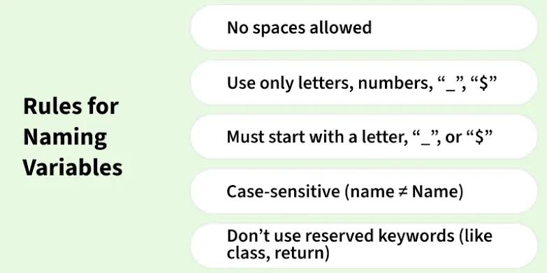
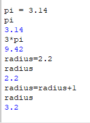

# Variables & Naming Rules

A quick reference on declaring variables and the rules for naming them.

## Rules for Naming Variables



| Rule | Example |
|---|---|
| No spaces allowed | `my var` ❌ → `my_var` ✅ |
| Use only letters, numbers, `_`, `$` | `total_1`, `$price` ✅ |
| Must start with a letter, `_`, or `$` | `1total` ❌ → `total1` ✅ |
| Case-sensitive | `name` ≠ `Name` — these are two different variables |
| Don't use reserved keywords | `class`, `return`, `if`, `for`, etc. are off-limits as names |

Breaking any of these rules will either raise a syntax error or silently create a different variable than intended (especially the case-sensitivity rule — a common source of bugs).

## Declaring and Updating Variables



```python
pi = 3.14
pi          # 3.14

3 * pi      # 9.42

radius = 2.2
radius      # 2.2

radius = radius + 1
radius      # 3.2
```

### What's happening here

1. **`pi = 3.14`** — creates a variable named `pi` and assigns it the value `3.14`.
2. **`3 * pi`** — you can use a variable directly in an expression; it's substituted with its current value (`3 * 3.14 = 9.42`).
3. **`radius = 2.2`** — a second, independent variable.
4. **`radius = radius + 1`** — the right-hand side is evaluated *first* using the variable's current value (`2.2 + 1 = 3.2`), then the result is stored back into `radius`. The variable now holds `3.2`, overwriting its old value.

⚠️ **Key idea:** `x = x + 1` isn't algebra — it's "take the current value of `x`, add 1, and store the result back in `x`." This pattern is common for counters and running totals.

## Summary

- Follow the naming rules or your code won't run (or worse, will run with a bug you don't expect).
- Assignment (`=`) always evaluates the right side first, then stores the result in the variable on the left.
- Reassigning a variable overwrites its previous value — the old value is gone once reassigned.
