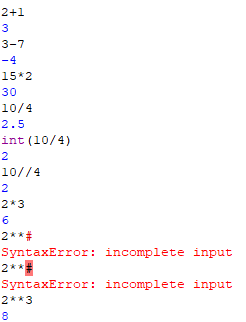

# Python Math Operators

A quick reference on arithmetic operators, based on the examples below.



## Basic arithmetic

```python
2 + 1     # 3     — addition
3 - 7     # -4    — subtraction
15 * 2    # 30    — multiplication
```

## Division

Python has **two** division operators that behave very differently:

```python
10 / 4    # 2.5   — true division, always returns a float
10 // 4   # 2     — floor division, rounds DOWN to the nearest whole number
```

`int(10 / 4)` also gives `2`, but for a different reason — `int()` truncates the float `2.5` down to `2`. `10 // 4` skips the float step entirely and does the floor division directly.

⚠️ **Floor division rounds toward negative infinity, not toward zero** — this matters with negative numbers:
```python
-7 // 2   # -4  (not -3)
```

## Multiplication vs. exponentiation

```python
2 * 3     # 6     — multiplication
2 ** 3    # 8     — exponentiation (2 to the power of 3)
```

⚠️ **`**` is exponentiation, not `2*3`.** A common mistake is typing `2**` on its own or forgetting the second operand:
```python
2 **
# SyntaxError: incomplete input
```
Python expects a number after `**`, since it needs both a base and an exponent. `2 ** 3` (with the exponent supplied) works fine and returns `8`.

## Operator Reference

| Operator | Name | Example | Result |
|---|---|---|---|
| `+` | Addition | `2 + 1` | `3` |
| `-` | Subtraction | `3 - 7` | `-4` |
| `*` | Multiplication | `15 * 2` | `30` |
| `/` | True division | `10 / 4` | `2.5` |
| `//` | Floor division | `10 // 4` | `2` |
| `**` | Exponentiation | `2 ** 3` | `8` |

## Summary

- `/` always returns a `float`, even if the result is a whole number (e.g. `4 / 2` → `2.0`).
- `//` returns the floored (rounded-down) result of division.
- `int(x / y)` and `x // y` often agree for positive numbers, but diverge for negatives.
- `**` needs two operands (base and exponent) — leaving it dangling raises a `SyntaxError`.
