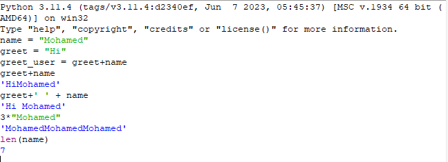
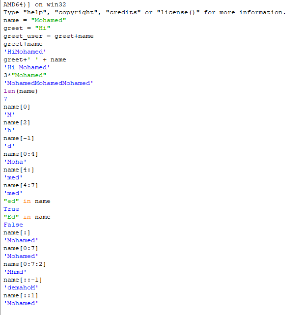

# Python Strings

A quick reference on string basics: concatenation, repetition, length, indexing, slicing, and membership testing.

## Creating & Concatenating Strings



```python
name = "Mohamed"
greet = "Hi"

greet_user = greet + name

greet + name        # 'HiMohamed'
greet + ' ' + name  # 'Hi Mohamed'
3 * "Mohamed"        # 'MohamedMohamedMohamed'
len(name)            # 7
```

- **`+`** concatenates (joins) strings together. It does **not** insert a space automatically — `greet + name` gives `'HiMohamed'`, not `'Hi Mohamed'`. You have to add the space yourself: `greet + ' ' + name`.
- **`*`** repeats a string a given number of times: `3 * "Mohamed"` repeats it 3 times back-to-back.
- **`len()`** returns the number of characters in a string.

## Indexing & Slicing



Given `name = "Mohamed"`, each character has a position (**index**), starting at `0`:

| Index | 0 | 1 | 2 | 3 | 4 | 5 | 6 |
|---|---|---|---|---|---|---|---|
| Char | M | o | h | a | m | e | d |
| Negative index | -7 | -6 | -5 | -4 | -3 | -2 | -1 |

### Indexing — get a single character

```python
name[0]    # 'M'   — first character
name[2]    # 'h'   — third character
name[-1]   # 'd'   — last character (negative counts from the end)
```

### Slicing — get a substring: `name[start:stop:step]`

```python
name[0:4]    # 'Moha'   — characters at index 0,1,2,3 (stop is EXCLUDED)
name[4:]     # 'med'    — from index 4 to the end
name[4:7]    # 'med'    — same result, explicit end
name[:]      # 'Mohamed' — the whole string (a copy)
name[0:7]    # 'Mohamed' — same as above, explicit bounds
name[0:7:2]  # 'Mhmd'    — every 2nd character (step = 2)
name[::-1]   # 'demahoM' — reversed string (step = -1)
name[::1]    # 'Mohamed' — every character, forward (step = 1, same as name[:])
```

⚠️ **`stop` is exclusive.** `name[0:4]` gives you indices `0, 1, 2, 3` — not index `4`.

### Membership — check if a substring exists: `in`

```python
"ed" in name    # True   — 'ed' is inside 'Mohamed'
"Ed" in name    # False  — case-sensitive! 'Ed' ≠ 'ed'
```

## Summary

| Operation | Syntax | Purpose |
|---|---|---|
| Concatenation | `a + b` | Join two strings (no auto-space) |
| Repetition | `n * s` | Repeat a string `n` times |
| Length | `len(s)` | Count characters |
| Indexing | `s[i]` | Get one character (0-based; negative = from end) |
| Slicing | `s[start:stop:step]` | Get a substring; `stop` is excluded |
| Reversing | `s[::-1]` | Reverse the string |
| Membership | `"x" in s` | Check if `x` is a substring (case-sensitive) |
