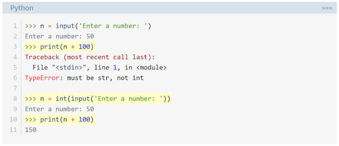

# Python Input & Output

A quick reference on reading user input and the type errors it commonly causes.



## `input()` always returns a string

```python
n = input('Enter a number: ')
# Enter a number: 50

print(n + 100)
# Traceback (most recent call last):
#   File "<stdin>", line 1, in <module>
# TypeError: must be str, not int
```

Even though the user typed `50`, `input()` hands it back as the **string** `'50'`, not the integer `50`. Trying to add a string and an integer with `+` raises a `TypeError` — Python won't silently guess what you meant.

## Fix: convert the input explicitly

```python
n = int(input('Enter a number: '))
# Enter a number: 50

print(n + 100)
# 150
```

Wrapping `input()` in `int()` converts the string `'50'` to the integer `50` immediately, so `n + 100` works as expected.

## Why this matters

- `input()` is designed to accept *any* text — names, sentences, numbers — so it always returns `str` regardless of what the user typed.
- You are responsible for converting it to the type you actually need:
  - `int(input(...))` — for whole numbers
  - `float(input(...))` — for decimal numbers
  - `input(...)` — leave as-is for text

```python
age = int(input("Age: "))
price = float(input("Price: "))
name = input("Name: ")   # already a string, no conversion needed
```

⚠️ **Common pitfall:** if the user types something that isn't a valid number (e.g. `"abc"`), `int(input(...))` will raise a `ValueError`. Validating input is a separate concern from this basic type conversion.

## Summary

| Function | Returns |
|---|---|
| `input()` | Always a `str`, no matter what's typed |
| `int(input())` | Converts to `int` — fails on non-numeric text |
| `float(input())` | Converts to `float` — fails on non-numeric text |
| `n + 100` where `n` is a string | `TypeError: must be str, not int` |
