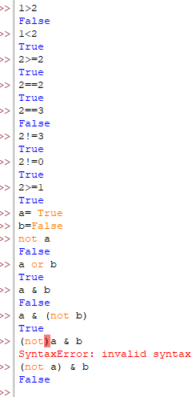

# Python Comparison & Logical Operators

A quick reference on comparing values and combining boolean conditions.



## Comparison Operators

These compare two values and always return a `bool` (`True` or `False`):

```python
1 > 2     # False
1 < 2     # True
2 >= 2    # True
2 == 2    # True   — equality check
2 == 3    # False
2 != 3    # True   — not-equal check
2 != 0    # True
2 >= 1    # True
```

| Operator | Meaning |
|---|---|
| `>` | Greater than |
| `<` | Less than |
| `>=` | Greater than or equal to |
| `<=` | Less than or equal to |
| `==` | Equal to (**comparison**, not assignment) |
| `!=` | Not equal to |

⚠️ **`==` vs `=`:** `==` *compares* two values; `=` *assigns* a value to a variable. Mixing them up is one of the most common beginner bugs.

## Logical Operators

Combine or invert boolean values:

```python
a = True
b = False

not a          # False   — inverts a
a or b         # True    — True if EITHER is True
a & b          # False   — True only if BOTH are True
a & (not b)    # True    — not b is True, and a is True, so both sides are True
```

| Operator | Meaning | True when... |
|---|---|---|
| `not x` | Negation | `x` is `False` |
| `x or y` | Logical OR | at least one of `x`, `y` is `True` |
| `x and y` (or `&`) | Logical AND | both `x` and `y` are `True` |

Python's standard keywords are **`and`**, **`or`**, and **`not`**. The `&` symbol shown here also works for combining plain booleans, but it's really the bitwise-AND operator borrowed for this purpose — `and`/`or` are the idiomatic choice in ordinary Python code.

## Watch your parentheses

```python
(not) a & b
# SyntaxError: invalid syntax

(not a) & b
# False
```

`not` needs an operand right after it — `not a`, not `not` on its own. Writing `(not)` with nothing inside the parentheses breaks the expression. Wrapping the full sub-expression correctly, `(not a) & b`, evaluates `not a` first (`False`), then combines it with `b` (`False`), giving `False`.

⚠️ Parentheses control **order of evaluation** — always make sure they wrap a complete, valid expression.

## Summary

| Category | Operators |
|---|---|
| Comparison (returns bool) | `> < >= <= == !=` |
| Logical | `not`, `or`, `and` (`&` also works for booleans) |
| Common mistakes | Confusing `=` with `==`; incomplete parentheses like `(not)` |
