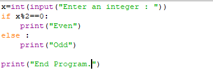
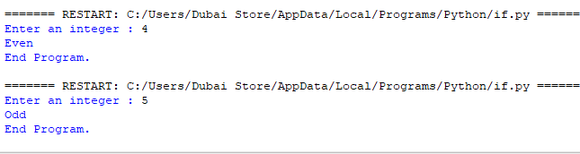
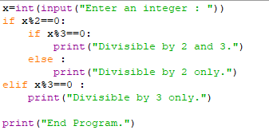
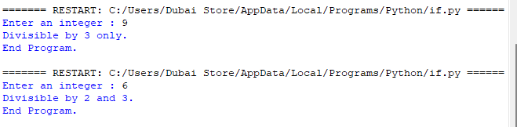
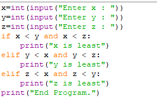

# Python Conditionals: if / elif / else

A quick reference on branching logic — `if`/`else`, `elif` chains, and combining conditions with `and`/`or`.

## Basic `if` / `else`



```python
x = int(input("Enter an integer : "))
if x % 2 == 0:
    print("Even")
else:
    print("Odd")

print("End Program.")
```

**Output:**



```
Enter an integer : 4
Even
End Program.

Enter an integer : 5
Odd
End Program.
```

- `x % 2 == 0` checks if `x` divides evenly by 2 (the `%` **modulo** operator gives the remainder).
- The `if` block runs when the condition is `True`; the `else` block runs when it's `False`. Exactly one of the two always runs.
- `print("End Program.")` sits **outside** both blocks (no indentation), so it always runs regardless of which branch was taken.
- ⚠️ **Indentation is not style in Python — it's syntax.** The indented lines define what belongs inside the `if`/`else` block.

## Nested `if` and `elif`



```python
x = int(input("Enter an integer : "))
if x % 2 == 0:
    if x % 3 == 0:
        print("Divisible by 2 and 3.")
    else:
        print("Divisible by 2 only.")
elif x % 3 == 0:
    print("Divisible by 3 only.")

print("End Program.")
```

**Output:**



```
Enter an integer : 9
Divisible by 3 only.
End Program.

Enter an integer : 6
Divisible by 2 and 3.
End Program.
```

### How the logic flows

1. First check: is `x` divisible by 2?
   - **If yes**, a *nested* `if` runs inside that block to further check divisibility by 3 — this is how you test a sub-condition only when the outer condition is already true.
   - **If no**, Python moves to `elif x % 3 == 0` to check divisibility by 3 on its own.
2. Note there's no final `else` here — if `x` is divisible by neither 2 nor 3, nothing prints except `"End Program."`.

**Tracing `x = 9`:** `9 % 2 == 0` → `False`, so skip to `elif x % 3 == 0` → `True` → prints `"Divisible by 3 only."`

**Tracing `x = 6`:** `6 % 2 == 0` → `True`, enter the nested block → `6 % 3 == 0` → `True` → prints `"Divisible by 2 and 3."`

⚠️ **Nesting vs. `elif` are different tools:**
- **Nesting** (`if` inside `if`) tests a sub-condition that only makes sense once the outer condition is true.
- **`elif`** tests an alternative, independent condition if the previous ones were false.

## Compound Boolean Conditions



```python
x = int(input("Enter x : "))
y = int(input("Enter y : "))
z = int(input("Enter z : "))

if x < y and x < z:
    print("x is least")
elif y < x and y < z:
    print("y is least")
elif z < x and z < y:
    print("z is least")
print("End Program.")
```

This finds the smallest of three numbers by checking each variable against **both** of the other two using `and`:

- `x < y and x < z` — `x` is only the smallest if it beats *both* `y` and `z`.
- Each `elif` repeats the same pattern for `y` and `z`.
- `and` requires **both** sides to be `True` — using `or` here would be wrong, since being smaller than just one other number doesn't make a value the overall smallest.

## Summary

| Concept | Purpose |
|---|---|
| `if` / `else` | Run one of two branches based on a condition |
| `elif` | Check an additional, independent condition if prior ones failed |
| Nested `if` | Test a sub-condition only relevant when the outer condition is true |
| `and` in a condition | Requires all sub-conditions to be `True` |
| Indentation | Defines which lines belong to which block — not optional in Python |
