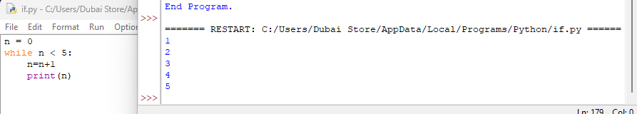

# Python `while` Loops

A quick reference on repeating code with `while`.



```python
n = 0
while n < 5:
    n = n + 1
    print(n)
```

**Output:**
```
1
2
3
4
5
```

## How it works

A `while` loop repeats its indented block **as long as** its condition stays `True`. Before each pass, Python re-checks the condition:

| Pass | Check `n < 5`? | `n = n + 1` | `print(n)` |
|---|---|---|---|
| 1 | `0 < 5` → True | `n` becomes `1` | prints `1` |
| 2 | `1 < 5` → True | `n` becomes `2` | prints `2` |
| 3 | `2 < 5` → True | `n` becomes `3` | prints `3` |
| 4 | `3 < 5` → True | `n` becomes `4` | prints `4` |
| 5 | `4 < 5` → True | `n` becomes `5` | prints `5` |
| 6 | `5 < 5` → **False** | loop stops | — |

The loop body never checks `n == 5` directly — it simply stops the *next* time the condition is tested and comes back `False`.

## The three parts of a `while` loop

1. **Initialization** — `n = 0`, set up the variable *before* the loop starts.
2. **Condition** — `n < 5`, checked at the start of every pass.
3. **Update** — `n = n + 1`, changes something the condition depends on, so the loop eventually ends.

⚠️ **Forgetting the update step is the #1 cause of infinite loops.** If `n` never changes, `n < 5` stays `True` forever and the loop never stops.

```python
# Infinite loop — n never changes!
n = 0
while n < 5:
    print(n)
```

## `while` vs. `for`

- Use **`while`** when you don't know in advance how many iterations you'll need — you're looping *until a condition changes* (e.g. waiting for valid input, running until a value crosses a threshold).
- Use **`for`** when looping a known, fixed number of times or over a sequence (e.g. `for i in range(5):`).

## Summary

| Concept | Role |
|---|---|
| `while <condition>:` | Repeats the block as long as the condition is `True` |
| Condition check | Happens *before* every iteration, including the first |
| Update inside the loop | Required to eventually make the condition `False` and stop |
| Missing update | Causes an infinite loop |
