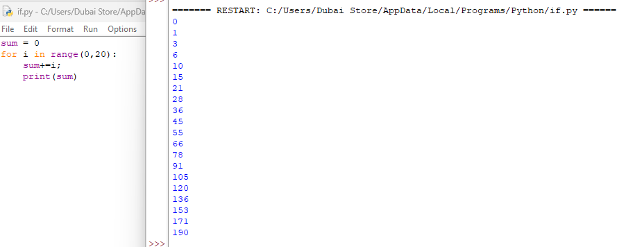
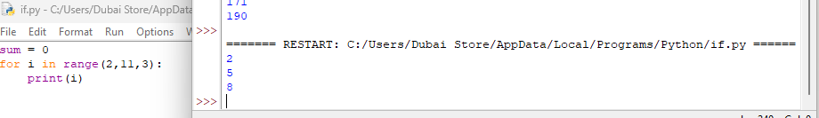
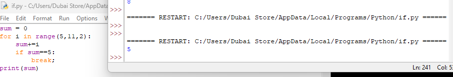
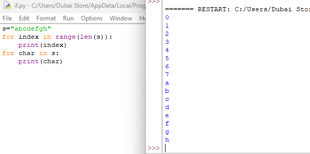
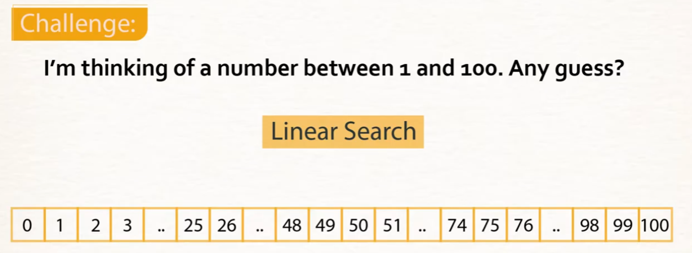
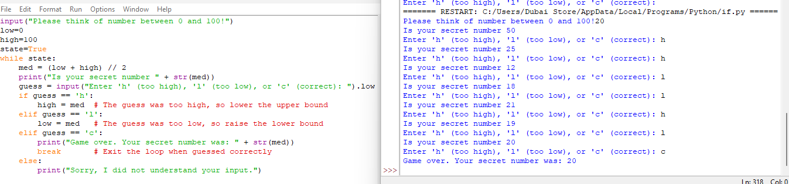

# Python `for` Loops, `range()`, `break`, and Bisection Search

A quick reference on iterating with `for`, controlling loops with `break`, and applying loops to a real search algorithm.

## `range()` basics



```python
sum = 0
for i in range(0, 20):
    sum += i
    print(sum)
```

**Output (running total):**
```
0, 1, 3, 6, 10, 15, 21, 28, 36, 45, 55, 66, 78, 91, 105, 120, 136, 153, 171, 190
```

- `range(0, 20)` produces the integers `0` through `19` — the **stop** value (`20`) is excluded, just like slicing.
- `for i in range(...)` runs the block once for each value, assigning it to `i` each time.
- `sum += i` is shorthand for `sum = sum + i`.

### `range()` with a step



```python
for i in range(2, 11, 3):
    print(i)
```
```
2
5
8
```

`range(start, stop, step)` — starts at `2`, adds `3` each time, and stops before reaching `11`. So: `2, 5, 8` (the next value, `11`, would hit the stop boundary and is excluded).

## `break` — exiting a loop early



```python
sum = 0
for i in range(5, 11, 2):
    sum += i
    if sum == 5:
        break
print(sum)
```

**Output:** `5`

- `range(5, 11, 2)` would normally produce `5, 7, 9`.
- On the first iteration, `i = 5`, so `sum` becomes `5`, the `if sum == 5` condition is met, and `break` exits the loop immediately — `i = 7` and `i = 9` never run.
- `break` stops the loop entirely (not just the current iteration) — useful when you've found what you're looking for and don't need to keep going.

## Looping over strings



```python
s = "abcdefgh"

for index in range(len(s)):
    print(index)

for char in s:
    print(char)
```

Two common patterns for working with strings:
- **`for index in range(len(s))`** — loop over the *positions*, useful when you need the index itself (e.g. to compare neighboring characters or modify by position).
- **`for char in s`** — loop directly over the *characters*, useful when you just need each value and don't care about its position.

## Applying loops: Bisection Search



**The challenge:** guess a hidden number between 0 and 100 as efficiently as possible. A **linear search** (checking 1, 2, 3, 4… one at a time) could take up to 100 guesses. **Bisection search** (binary search) does it in at most ~7 guesses by repeatedly cutting the search range in half.



```python
input("Please think of number between 0 and 100!")
low = 0
high = 100
state = True
while state:
    med = (low + high) // 2
    print("Is your secret number " + str(med))
    guess = input("Enter 'h' (too high), 'l' (too low), or 'c' (correct): ").lower()
    if guess == 'h':
        high = med   # The guess was too high, so lower the upper bound
    elif guess == 'l':
        low = med    # The guess was too low, so raise the lower bound
    elif guess == 'c':
        print("Game over. Your secret number was: " + str(med))
        break        # Exit the loop when guessed correctly
    else:
        print("Sorry, I did not understand your input.")
```

**Sample run** (secret number = 20):
```
Please think of number between 0 and 100!20
Is your secret number 50
Enter 'h' (too high), 'l' (too low), or 'c' (correct): h
Is your secret number 25
Enter 'h' (too high), 'l' (too low), or 'c' (correct): h
Is your secret number 12
Enter 'h' (too high), 'l' (too low), or 'c' (correct): l
Is your secret number 18
Enter 'h' (too high), 'l' (too low), or 'c' (correct): l
Is your secret number 21
Enter 'h' (too high), 'l' (too low), or 'c' (correct): h
Is your secret number 19
Enter 'h' (too high), 'l' (too low), or 'c' (correct): l
Is your secret number 20
Enter 'h' (too high), 'l' (too low), or 'c' (correct): c
Game over. Your secret number was: 20
```

### How bisection search works

1. Maintain a `low` and `high` bound — the number is guaranteed to fall within `[low, high]`.
2. Guess the **midpoint**: `med = (low + high) // 2`.
3. Based on feedback:
   - Too high → the number must be below `med`, so `high = med`.
   - Too low → the number must be above `med`, so `low = med`.
   - Correct → `break` out of the loop.
4. Each guess **halves** the remaining range, which is why it's dramatically faster than checking one number at a time — this is what makes it a bisection ("halving") algorithm, not a linear search.
5. `.lower()` on the input normalizes the answer so `'H'` and `'h'` are both accepted.

## Summary

| Concept | Purpose |
|---|---|
| `range(stop)` / `range(start, stop)` / `range(start, stop, step)` | Generates a sequence of numbers; `stop` is always excluded |
| `for x in range(...)` | Loop a known number of times |
| `for char in string` | Loop directly over characters |
| `for i in range(len(string))` | Loop over indices when position matters |
| `break` | Exit a loop immediately, skipping remaining iterations |
| Bisection (binary) search | Repeatedly halves the search space — far faster than linear search |
