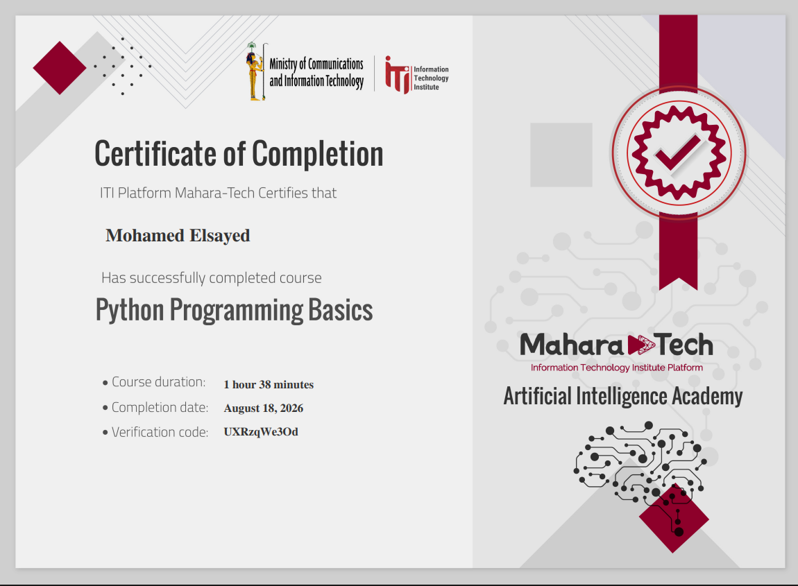

# Python Fundamentals — Course Notes

A set of hands-on Python notes covering the language fundamentals, from data types through dictionaries. Each topic has its own folder with a `README.md` and the corresponding annotated screenshots/examples.

## 🏆 Certificate



## 📚 Topics

| # | Topic | Covers |
|---|---|---|
| 1 | Python Data Types | `int`, `float`, `bool`, `NoneType`, `type()`, casting/truncation |
| 2 | Variables & Naming Rules | Valid variable names, case sensitivity, reserved keywords, reassignment |
| 3 | Python Math Operators | `+ - * / // **`, true vs. floor division, exponentiation syntax errors |
| 4 | Python Strings | Concatenation, repetition, `len()`, indexing, slicing, `in` |
| 5 | Python Input & Output | `input()` always returns `str`, type conversion, `TypeError` |
| 6 | Python Comparison & Logical Operators | `> < >= <= == !=`, `not`/`or`/`and`, common syntax pitfalls |
| 7 | Python Conditionals: if / elif / else | Branching, nested `if`, `elif` chains, compound boolean conditions |
| 8 | Python while Loops | Loop structure, condition checking, infinite loops |
| 9 | Python for Loops, range(), break, and Bisection Search | `range()`, `break`, looping over strings, binary search algorithm |
| 10 | Python Functions | `def`, parameters vs. arguments, `return` vs. `print` |
| 11 | Python Variable Scope | Local vs. global scope, `UnboundLocalError` |
| 12 | Python Lists, Tuples, Aliasing & Cloning | List/tuple methods, `sorted()` vs `.sort()`, aliasing vs. cloning in memory |
| 13 | Python Dictionaries | `.get()`, safe vs. unsafe key access, `.update()`, `.keys()`/`.values()` |

## 🗂 Suggested folder structure

```
Python Fundamentals/
├── README.md                                              (this file)
├── cert.png
├── 1. Python Data Types/
│   ├── README.md
│   └── data-types.png
├── 2. Variables & Naming Rules/
│   ├── README.md
│   ├── naming-rules.jpg
│   └── variables.png
├── 3. Python Math Operators/
│   ├── README.md
│   └── math-operators.png
├── 4. Python Strings/
│   ├── README.md
│   ├── strings.png
│   └── string-operators.png
├── 5. Python Input & Output/
│   ├── README.md
│   └── input-output.jpg
├── 6. Python Comparison & Logical Operators/
│   ├── README.md
│   └── logic-operators.png
├── 7. Python Conditionals if elif else/
│   ├── README.md
│   ├── if-else.png
│   ├── if-else-result.png
│   ├── nested-if.png
│   ├── nested-if-result.png
│   └── compound-booleans.png
├── 8. Python while Loops/
│   ├── README.md
│   └── while-loop.png
├── 9. Python for Loops, range(), break, and .../
│   ├── README.md
│   ├── for-loop.png
│   ├── for-loop-1.png
│   ├── break.png
│   ├── for-with-strings.png
│   ├── problem.png
│   └── bisection-algorithm.png
├── 10. Python Functions/
│   ├── README.md
│   └── functions.png
├── 11. Python Variable Scope/
│   ├── README.md
│   ├── variable-scope-1.png
│   ├── variable-scope-2.png
│   └── variable-scope-3.png
├── 12. Python Lists, Tuples, Aliasing & Cloni.../
│   ├── README.md
│   ├── lists.png
│   ├── lists-operations.png
│   ├── remove-duplicates-lists.png
│   ├── tuple.png
│   ├── tuple-2.png
│   ├── aliasing.png
│   ├── alias.png
│   ├── cloning.png
│   └── cloning-1.png
└── 13. Python Dictionaries/
    ├── README.md
    ├── dictionary-1.png
    └── dictionary.png
```

## How to use these notes

Each folder's `README.md` is self-contained: a short explanation, the annotated screenshot/example it's based on, a worked trace of the code's output, and a summary table. Work through them in order (1 → 13) if you're new to Python — later topics (functions, scope, lists/tuples) build on earlier ones (data types, operators, conditionals, loops).
